# Anwenderdokumentation

Fassung 1.1.0 · Stand 7. September 2026

Diese Anleitung richtet sich an alle, die mit der Oberfläche
`obfuskation-gui` arbeiten: Beispieldaten für eine KI vorbereiten, indem
Echtwerte durch Pseudodaten ersetzt werden, und die Antwort der KI wieder auf
die Echtwerte zurückführen. Sie führt einmal durch den vollständigen Ablauf
am mitgelieferten Demo-Bestand (`docs/beispiel/`) und dient danach als
Nachschlagewerk.

Für Hintergründe zur Funktionsweise, zum Bauen aus dem Quelltext und für
offene Befunde siehe `entwicklerdokumentation.md`.

## 1. Wozu das Werkzeug da ist — und wozu nicht

Fünf Dinge vorab, ausführlicher in der `README.md`:

1. **Das Werkzeug pseudonymisiert, es anonymisiert nicht.** Namen und
   Kontonummern verschwinden, Struktur und Verteilung bleiben. Eine
   Kombination aus Postleitzahl, Geburtsjahr und Kontostand kann weiterhin
   auf eine Person zurückführen. Ob das vertretbar ist, entscheidet der
   Datenschutzbeauftragte — nicht dieses Programm.
2. **Die Ersetzungstabelle (`mapping.json`) ist das schützenswerteste
   Artefakt des ganzen Vorgangs.** Sie enthält sämtliche Echtdaten in
   kompakter Form und gehört niemals in ein Repository, ein Backup nach
   außen oder ein Verzeichnis, aus dem Dateien weitergegeben werden.
3. **Textregeln sind ein Ausschlussverfahren.** IBAN, BIC, E-Mail und
   Telefonnummer lassen sich zuverlässig erkennen — Personennamen,
   Firmennamen und Adressen in Freitext praktisch nicht. Für Freitextfelder
   ist im Zweifel `redact` oder `drop` die richtige Wahl, nicht
   `scanText` (siehe Abschnitt 6).
4. **`Prüfen` vor jeder Weitergabe ausführen.** Nicht optional.
5. **Die Ausgabe erkennbar benennen** (`kunden.pseudo.csv`), damit Original
   und Pseudonymisat nicht verwechselt werden. Die Oberfläche schlägt diesen
   Namen beim Speichern von sich aus vor.

## 2. Installation

Fertige Programme für Windows und Linux liegen unter den Releases des
Projekts, je Plattform zwei Dateien ohne Installation: `obfuskation` (die
Kommandozeile) und `obfuskation-gui` (die Oberfläche, um die es hier geht).

Voraussetzung ist die .NET-8-Runtime. Wer sie nicht installieren möchte,
baut sich mit `./build-release.sh --self-contained` eine Fassung, die alles
mitbringt (siehe `entwicklerdokumentation.md`, Abschnitt „Bauen, testen,
freigeben“).

Unter Linux die Datei ausführbar machen:

```fish
chmod +x obfuskation-gui
```

Unter Windows warnt SmartScreen beim ersten Start, weil das Programm nicht
signiert ist — *Weitere Informationen* → *Trotzdem ausführen*.

Um die Oberfläche unter Linux ins Anwendungsmenü (GNOME) aufzunehmen, siehe
`packaging/README.md`. Dort steht die `.desktop`-Datei samt Symbol.

## 3. Der erste Durchgang, bebildert

Als durchgehendes Beispiel dient der Demo-Bestand aus `docs/beispiel/`:
`stammdaten.csv` mit 120 Datensätzen, die Spalten Personennummer, Nachname,
Vorname, Straße, PLZ, Ort, EMail, Telefon, Geburtsdatum und Notiz.

### Schritt 1 — Profil aus einer Datei ableiten

`obfuskation-gui` starten und über **Neu aus Datei…** `stammdaten.csv`
wählen. Es folgt der Anlegen-Dialog: **Name** (vorbelegt aus dem
Dateinamen, änderbar), **Beschreibung** (frei, optional) und der
**Ablageort**, der dem Namen live folgt, solange er nicht von Hand
überschrieben wird. Für den ersten Durchgang reicht es, den Namen `demo`
einzutragen und mit **Anlegen** zu bestätigen — Einzelheiten zu diesem
Dialog stehen in Abschnitt 5. Die Oberfläche liest daraufhin die
Spaltenköpfe und legt für jede eine Regel mit der Behandlung „offen“ an —
noch ist nichts entschieden.

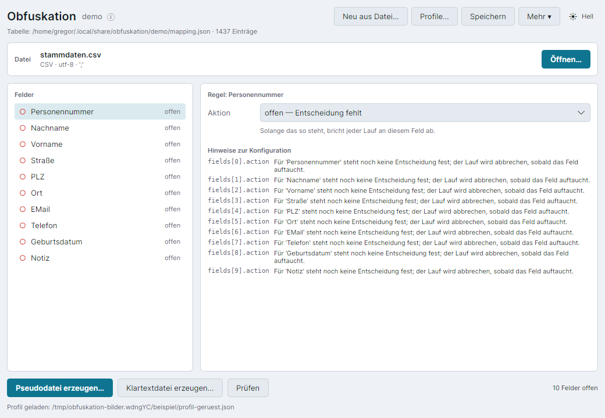
*Nach dem Ableiten aus stammdaten.csv: alle zehn Felder stehen offen, Format,
Zeichensatz und Trennzeichen wurden bereits erkannt.*

### Schritt 2 — Jedes Feld entscheiden

Für jedes Feld links in der Liste rechts im Regelbereich eine Behandlung
wählen: ersetzen, durchlassen, Freitext durchsuchen, schwärzen oder Feld
entfernen (Einzelheiten in Abschnitt 6). Bei „ersetzen“ zeigt die Vorschau
sofort, wie ein echter Wert aus der Datei aussehen würde. Erst wenn alle
Punkte türkis gefüllt sind, lässt sich die Pseudodatei erzeugen.

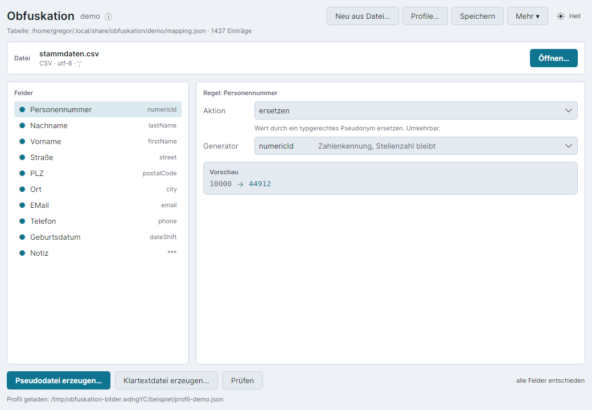
*Feld „Nachname“ auf ersetzen mit Generator `lastName` gestellt; die Vorschau
zeigt Grünwald → Eschenbach. Alle zehn Felder sind entschieden.*

### Schritt 3 — Pseudodatei erzeugen

Auf **Pseudodatei erzeugen…** klicken und im Speichern-Dialog den
vorgeschlagenen Namen (`stammdaten.pseudo.csv`) bestätigen. Die
Ergebniskarte zeigt Zähler je Generator sowie den Hinweis, vor der
Weitergabe zu prüfen.

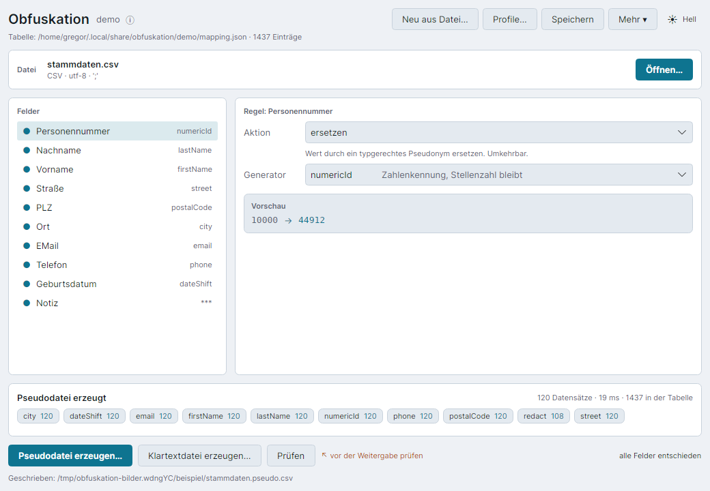
*Ergebniskarte nach dem Erzeugen der Pseudodatei: 120 Datensätze, 20 ms, 1437
Einträge in der Tabelle, davon 108 geschwärzte Notizen.*

### Schritt 4 — Prüfen

Die erzeugte Datei öffnen und auf **Prüfen** klicken. Das Werkzeug sucht
nach Restbeständen — Werten, die trotz der Regeln noch im Klartext stehen.
Bei der sauber pseudonymisierten Datei bleibt der Befund leer.

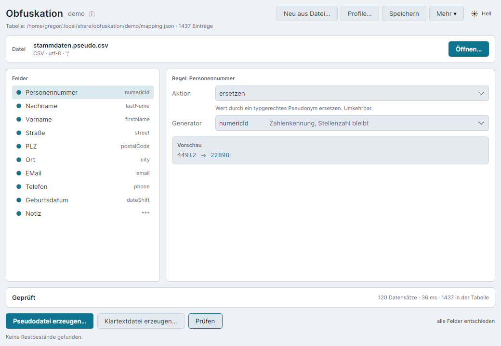
*„Keine Restbestände gefunden“ nach dem Prüfen der pseudonymisierten Datei.*

Fällt die Prüfung nicht sauber aus, siehe Abschnitt 6 zum Lehrbeispiel
Freitext und Abschnitt 8 zu den Meldungen im Einzelnen.

### Schritt 5 — Weitergeben

Erst jetzt geht `stammdaten.pseudo.csv` an die KI — als Anhang, eingefügter
Text oder wie auch immer die jeweilige Arbeitsweise es vorsieht. Dieser
Schritt findet außerhalb des Werkzeugs statt, es gibt dafür kein eigenes
Bild. Wichtig ist nur: nicht die Originaldatei verwechseln, und `Prüfen` war
vorher an der Reihe, nicht erst danach.

### Schritt 6 — Klartextdatei erzeugen

Die Antwort der KI (Text, Code, Tabellen — beliebig) als Datei öffnen und
**Klartextdatei erzeugen…** klicken. Alle bekannten Pseudonyme werden auf
ihre Echtwerte zurückgeführt, auch mitten in Fließtext oder Quelltext.

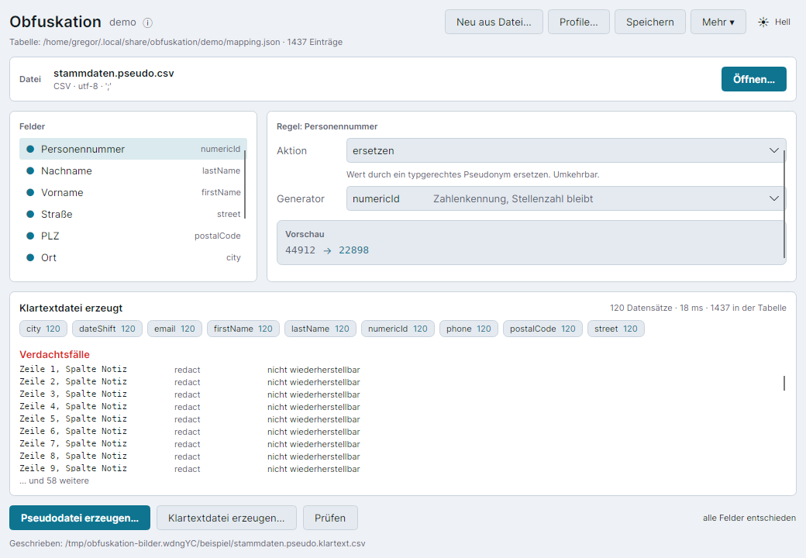
*Klartextdatei erzeugt: 120 Datensätze, 26 ms; Spalte Notiz bleibt als
„nicht wiederherstellbar“ gemeldet, weil sie beim Ersetzen geschwärzt
wurde.*

Dasselbe funktioniert mit einer Textdatei, die nur die Antwort der KI
enthält — dann arbeitet `Klartextdatei erzeugen…` über den gesamten
Fließtext, nicht spaltenweise. Das Verfahren dahinter zeigt Abschnitt 9 an
einem Kommandozeilenbeispiel mit echten Zahlen.

## 4. Die Oberfläche im Einzelnen

**Kopfzeile.** Links Programmname und Profilname (oder „kein Profil“),
rechts die Schaltflächen **Neu aus Datei…**, **Profile…**, **Speichern**,
**Mehr** und der Themenumschalter. Direkt darunter die geöffnete Datei mit
erkanntem Format, Zeichensatz und Trennzeichen.

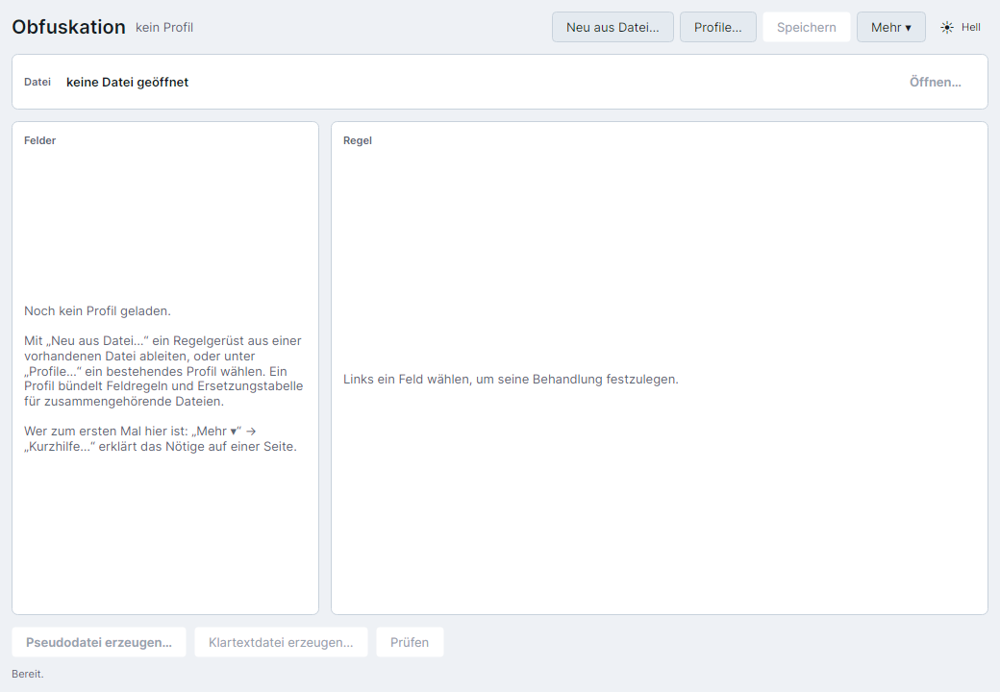
*Erststart ohne Profil: leere Feldliste mit Anleitung, alle drei Vorgänge
abgeblendet.*

Neben dem Profilnamen steht bei geladenem Profil ein kleines **ⓘ**. Ein
Klick öffnet ein Erklär-Flyout:

> Ein Profil bündelt die Feldregeln und die Ersetzungstabelle. Alle
> zusammengehörenden Dateien unter demselben Profil bearbeiten — nur dann
> bekommt derselbe Klartext in allen Dateien dasselbe Pseudonym. Die
> Reihenfolge, in der die Dateien geöffnet werden, spielt keine Rolle.

Direkt unter dem Profilnamen steht, sobald ein Profil geladen ist, eine
zweite, kleine Zeile mit der Beschreibung (falls eine hinterlegt ist) und
der Tabellenauskunft: `Beschreibung · Tabelle: <Pfad> · N Einträge`. Sie
zeigt auf einen Blick, wofür das Profil da ist und wie groß die zugehörige
Ersetzungstabelle bereits ist, ohne dass dafür erst das Fenster
„Ersetzungstabelle…“ geöffnet werden müsste.

**Dateikarte.** Zeigt Namen, Format, Zeichensatz und Trennzeichen der
geöffneten Datei. Läuft eine Datei zum ersten Mal unter dem gerade
geladenen Profil — sie steht also noch nicht im Nutzungs-Index dieses
Profils (Abschnitt 5) —, erscheint darunter zusätzlich der Hinweis „Diese
Datei war bisher nicht Teil des Profils — N neue Felder.“, sofern
mindestens ein Feld ohne eigene Regel dabei ist. Er soll verhindern, dass
ein neues Feld in einer bekannten Datenart unbemerkt auf die Vorgabe
`unknownField` zurückfällt, statt eine bewusste Regel zu bekommen.

**Feldliste mit Statuspunkten.** Links jedes Feld der geöffneten Datei mit
einem Punkt davor: gefüllt und türkis heißt *entschieden*, ein roter,
hohler Kreis heißt *offen*. Solange auch nur ein Feld offen ist, bricht
jeder Lauf ab (Abschnitt 3, Schritt 2).

**Regelbereich mit Vorschau.** Rechts die Behandlung des links gewählten
Feldes: die Auswahl der Aktion, bei „ersetzen“ zusätzlich der Generator, und
darunter die Vorschau an einem echten Wert aus der geöffneten Datei. Ohne
bestehende Ersetzungstabelle ist die Vorschau nur beispielhaft — ein
eigener Hinweis sagt das ausdrücklich, weil derselbe Klartext dann bei
jedem Blick ein anderes Pseudonym zeigen kann.

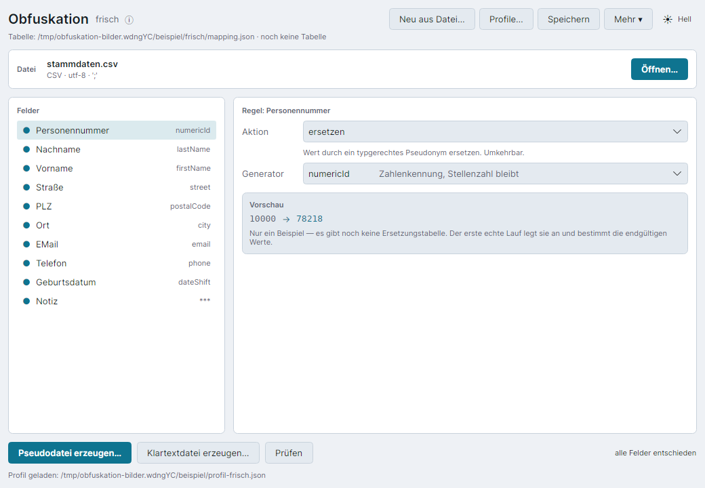
*Vorschau ohne bestehende Ersetzungstabelle: Grünwald → Bramkamp, mit dem
Hinweis, dass der erste echte Lauf die endgültigen Werte bestimmt.*

**Ergebniskarte.** Erscheint nach jedem der drei Vorgänge unterhalb von
Feldliste und Regelbereich: Kopfzeile mit Vorgang, Datensatzzahl, Dauer und
Tabellengröße, darunter Zähler je Generator beziehungsweise Textregel und,
falls vorhanden, die Liste der Verdachtsfälle.

**Aktionsleiste.** Die drei Schaltflächen **Pseudodatei erzeugen…**,
**Klartextdatei erzeugen…** und **Prüfen**, unten im Fenster. Die ersten
beiden nennen das Ergebnis statt der Tätigkeit: aus `kunden.csv` wird
`kunden.pseudo.csv`, die Eingabedatei bleibt dabei unangetastet. Der
frühere Name „Ersetzen“ war doppeldeutig, weil dasselbe Wort im
Regelbereich daneben bereits die Behandlung eines einzelnen Feldes
bezeichnet (Abschnitt 6) und außerdem nahelegte, die geöffnete Datei werde
überschrieben. Bei einer laufenden großen Datei weichen sie einem
Fortschrittsbalken samt Zählung und der Schaltfläche **Abbrechen**.


*Fortschritt bei einer großen Datei: Balken, laufende Zählung und die
Schaltfläche „Abbrechen“ anstelle der drei Vorgänge.*

Ein Abbruch schreibt weder eine Ausgabedatei noch Einträge in die
Ersetzungstabelle — nur die Statuszeile vermerkt ihn.

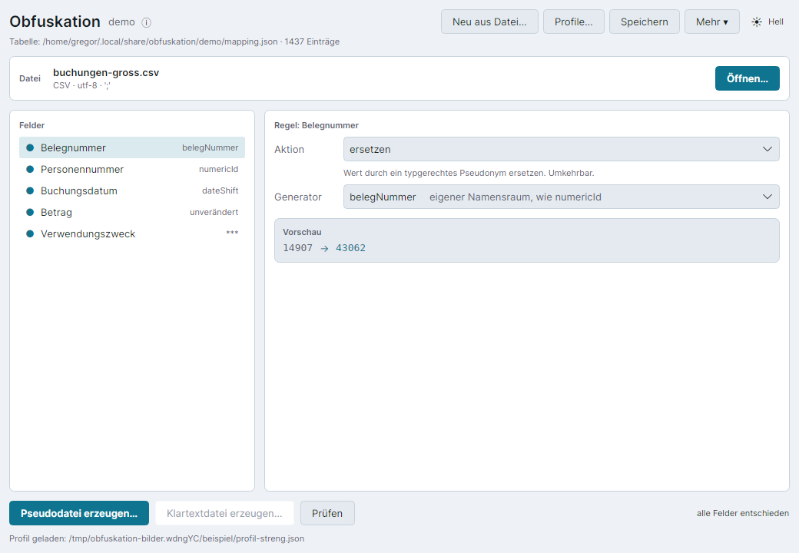
*Nach einem Abbruch: „Prüfen abgebrochen. Es wurde nichts geschrieben.“*

**Statuszeile.** Die unterste Zeile des Fensters meldet, was gerade
geschieht oder zuletzt geschah — vom schlichten „Bereit.“ bis zur Meldung
über offene Felder oder Verdachtsfälle.

**Die vier Nebenfenster**, über **Mehr** erreichbar:

- **Textregeln…** — die Muster für Freitext, mit einem Erprobungsfeld: ein
  Muster an echtem Text ausprobieren, bevor es auf Daten losgelassen wird.
- **Ersetzungstabelle…** — Pfad, Anzahl je Namensraum und die Dateirechte.
  Zeigt keinen einzigen Wert, genau wie `obfuskation mapping list`.
- **Kurzhilfe…** — sechs kurze Karten für den schnellen Einstieg, im Menü
  durch einen Trenner von den beiden vorigen Einträgen abgesetzt.
- **Über…** — Fassung, die fünf Hinweise aus Abschnitt 1 im Wortlaut und
  die verwendeten Pfade.

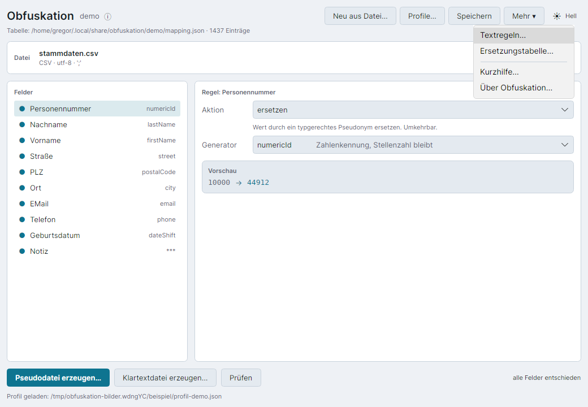
*Das Mehr-Menü: Textregeln…, Ersetzungstabelle…, Kurzhilfe… und Über
Obfuskation….*


*Die Ersetzungstabelle: Profil, Pfad und Dateirechte oben, darunter die
Anzahl der Einträge je Namensraum — kein einziger Wert sichtbar.*

**Kurzhilfe.** Fenster mit dem Titel „Kurzhilfe“ und dem Untertitel „Das
Wichtigste in zwei Minuten“, gegliedert in sechs Karten: wofür das Programm
überhaupt da ist, samt dem Warnhinweis, dass es sich um Pseudonymisierung
und nicht um Anonymisierung handelt; was ein Profil ist und wozu es gut
ist — in der Akzentfarbe hervorgehoben, mit dem Beispiel
stammdaten.csv/buchungen.csv, dem Hinweis, dass die Reihenfolge der
bearbeiteten Dateien keine Rolle spielt, und dem tatsächlichen Ablageort
der Profile auf diesem Rechner; der Weg durch das Programm in fünf
nummerierten Schritten; die Abgrenzung zweier leicht zu verwechselnder
Wörter — „ersetzen“ im Regelbereich betrifft nur das eine gewählte Feld,
die Schaltflächen unten betreffen die ganze Datei; der Schutz der
Ersetzungstabelle, in Fehlerfarbe abgesetzt; und, falls das nicht reicht,
der Verweis auf diese Anleitung und auf `obfuskation --help`.


*Das Fenster „Kurzhilfe“: sechs Karten von „Wofür dieses Programm da ist“
bis „Wenn das nicht reicht“, mit dem tatsächlichen Ablageort der Profile.*

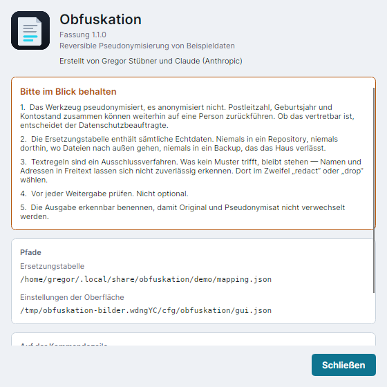
*Das Über-Fenster mit Fassung, den fünf Hinweisen und den verwendeten
Pfaden.*

**Themenumschalter.** Oben rechts, drei Zustände im Wechsel: Systemvorgabe,
Dunkel, Hell. Die Wahl merkt sich die Oberfläche zwischen zwei Starts.

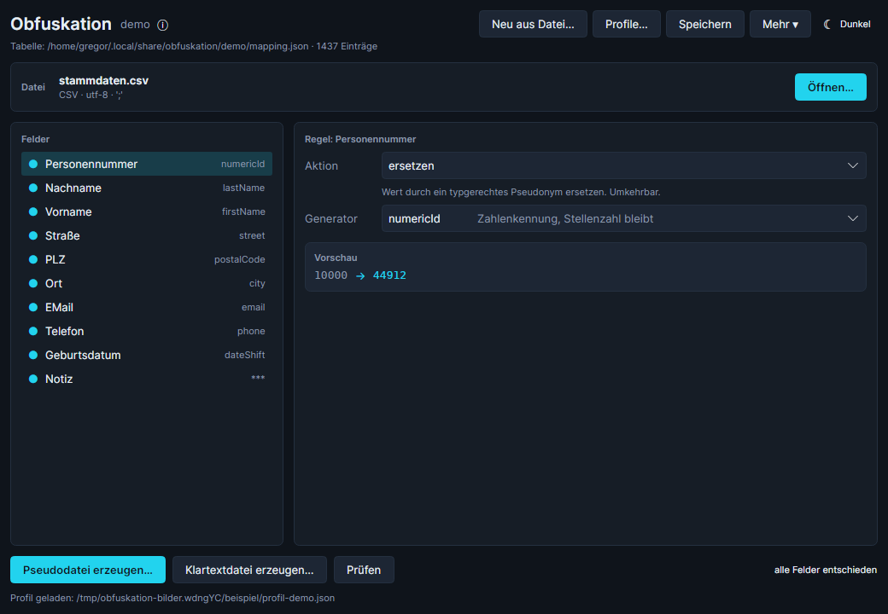
*Dunkles Thema: Vorschau und Statuspunkte bleiben lesbar, die Akzentfarbe
wechselt auf Hellblau.*

## 5. Profile verwalten

Ein Profil bündelt zwei Dinge, die zusammengehören: die Feldregeln (was mit
welcher Spalte geschieht) und den Bezug zur Ersetzungstabelle (welche
Pseudonyme dabei entstehen). Solange mehrere Dateien unter demselben Profil
laufen, bekommt derselbe Klartext überall dasselbe Pseudonym — das ist der
ganze Witz an einem Profil, und der Grund, warum es in der Kopfzeile eigens
erklärt wird (Abschnitt 4).

**Wo ein Profil liegt.** Neu angelegte Profile landen als Vorgabe unter
`~/.config/obfuskation/profile/<name>.json` — ein fester, zentraler Ort, den
die Übersicht (siehe unten) durchsuchen kann. Eine projektlokale
`obfuskation.json`, wie sie `obfuskation init` ohne weitere Angaben anlegt,
bleibt gleichwertig möglich; sie erscheint in der Übersicht über die
Zuletzt-Liste, sobald sie einmal geöffnet wurde.

### Anlegen

Der Dialog **Neues Profil** (über **Neu aus Datei…**, nach der Wahl der
Beispieldatei) fragt drei Dinge ab: den **Namen** (vorbelegt aus dem
Dateinamen der Beispieldatei, frei änderbar), eine freie **Beschreibung**
und den **Ablageort**. Der Ablageort folgt dem Namen live — wird der Name
geändert, läuft der vorgeschlagene Pfad automatisch mit —, es sei denn, über
**Anderer Ort…** wurde von Hand ein eigener Pfad gewählt; von da an folgt er
dem Namen nicht mehr. Eine Erklärzeile zeigt zusätzlich live, wo die
Ersetzungstabelle entstehen wird, denn dieser Pfad hängt am Namen und ändert
sich nicht mehr mit, sobald das Profil einmal existiert (siehe „Umbenennen“
unten).

Existiert am gewählten Ablageort bereits ein Profil, ist **Anlegen**
gesperrt — sonst ginge dessen Regelwerk kommentarlos verloren. Es bleiben
zwei Wege: **Stattdessen öffnen** lädt das vorhandene Profil, oder Name
beziehungsweise Ort werden geändert. Ein Klick auf **Anlegen** speichert das
neue Profil sofort — es hat damit von Anfang an einen Pfad, erscheint in der
Übersicht, und die Feldregeln stehen weiterhin alle auf „offen“, bis sie
durchgegangen werden (Abschnitt 3, Schritt 2).

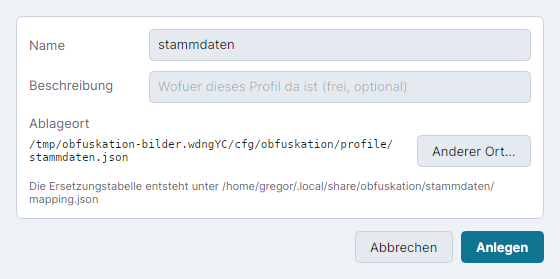
*Der Anlegen-Dialog: Name, Beschreibung, Ablageort mit Erklärzeile zur
Ersetzungstabelle.*

### Übersicht

Die Schaltfläche **Profile…** in der Kopfzeile öffnet das Fenster
**Profile**: alle Profile aus dem zentralen Ordner, dazu die zuletzt
geöffneten und die im Nutzungs-Index gemerkten. Die drei Spaltenköpfe
**Name**, **Zuletzt benutzt** und **Geändert** sind Sortierschaltflächen —
ein Klick sortiert danach, ein zweiter Klick dreht die Richtung um; die
Wahl bleibt über einen Neustart hinweg gemerkt. Das Suchfeld darüber filtert
über Name, Beschreibung und die Pfade der zugehörigen Dateien. Zur
ausgewählten Zeile zeigt eine Detailzeile darunter den vollen Pfad, die
Ersetzungstabelle samt Anzahl der Einträge und die zuletzt bearbeiteten
Dateien.

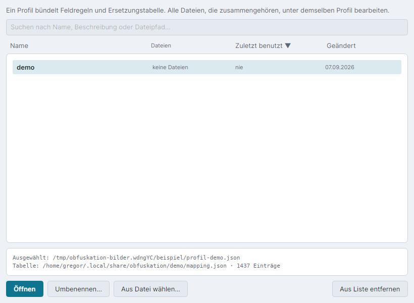
*Die Profilübersicht: sortierbare Liste, Suchfeld und Detailzeile zum
ausgewählten Profil.*

Ein Profil, das sich nicht laden lässt (kaputtes JSON, gelöschte Datei),
erscheint in Fehlerfarbe mit der Meldung im Klartext; **Öffnen** ist dafür
abgeblendet, **Aus Liste entfernen** bleibt möglich. Über **Aus Datei
wählen…** lässt sich außerdem, wie bisher, ein Profil über einen
gewöhnlichen Dateidialog öffnen — etwa eines, das (noch) nicht im zentralen
Ordner liegt.

**Aus Liste entfernen** löscht ausschließlich den Eintrag aus der Übersicht
— nie die Profildatei selbst. Der Grund für diese Schaltfläche liegt im
sogenannten Nutzungs-Index (`profil-index.json` im Konfigurationsverzeichnis):
er merkt sich, welche Datendateien zuletzt unter welchem Profil bearbeitet
wurden, damit die Übersicht überhaupt etwas zum Anzeigen hat. Dort stehen
ausschließlich **Pfade**, nie Inhalte oder Werte aus den bearbeiteten
Dateien — ein Pfad kann aber schon für sich verraten, woran gearbeitet
wurde. Wer das nicht möchte, entfernt den betreffenden Eintrag einfach über
diese Schaltfläche; an den Dateien selbst ändert sich dadurch nichts.

### Umbenennen

**Umbenennen…** in der Übersicht öffnet zunächst eine Rückfrage, die genau
sagt, was geschieht, bevor irgendetwas passiert: die Ersetzungstabelle
bleibt unter ihrem bisherigen Pfad stehen und behält **alle** Einträge —
ein Umbenennen erzeugt also keine neuen Pseudonyme und macht keine
bestehenden ungültig. Nur der Profilname selbst ändert sich, und zwar an
zwei Stellen zugleich: im Profil und, falls die Tabelle schon existiert,
auch in ihr — ohne diesen zweiten Schritt würde jeder folgende Lauf mit der
Meldung „Der Mapping-Store gehört zum Profil …“ warnen, weil Profilname und
der in der Tabelle hinterlegte Name dann auseinanderliefen.

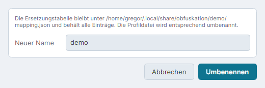
*Die Rückfrage vorm Umbenennen: sagt vorab, dass die Ersetzungstabelle
unverändert bleibt.*

Liegt die Profildatei im zentralen Ordner **und** trug ihr Dateiname bislang
den alten Profilnamen, wird sie passend mitbenannt. In zwei Fällen bleibt
der Dateiname dagegen unangetastet und nur der Name *im* Profil ändert
sich: wenn die Datei nicht im zentralen Ordner liegt (etwa eine
projektlokale `obfuskation.json`), oder wenn der neue Name im zentralen
Ordner bereits einer anderen Datei gehört — in diesem Fall würde ein
Mitbenennen sonst ein fremdes Profil überschreiben. Ist das gerade im
Hauptfenster geöffnete Profil betroffen, zieht die laufende Sitzung
automatisch nach.

### Ungespeicherte Änderungen

Sowohl das Schließen des Fensters als auch ein Profilwechsel — über
**Profile…**, **Neu aus Datei…** oder das Öffnen eines anderen Profils aus
der Übersicht — fragen nach, falls das gerade geladene Profil noch
ungespeicherte Änderungen hat. Die Rückfrage bietet drei Wege: **Speichern**
sichert zuerst und macht danach weiter, **Verwerfen** wirft die Änderungen
weg, **Abbrechen** hält am bisherigen Zustand fest, ohne dass irgendetwas
geschieht. Ohne bewusste Wahl (etwa beim Schließen über die Titelleiste)
gilt die vorsichtige Richtung: wie **Abbrechen**, nie wie **Verwerfen**.


*Die Rückfrage bei ungespeicherten Änderungen: Speichern, Verwerfen oder
Abbrechen.*

## 6. Behandlungen und Generatoren

Jedes Feld bekommt genau eine Behandlung:

| Behandlung | Wirkung | Umkehrbar |
|---|---|:--:|
| ersetzen (`pseudonymize`) | Wert durch ein typgerechtes Pseudonym ersetzen | ja |
| durchlassen (`passthrough`) | Wert unverändert übernehmen | — |
| Freitext durchsuchen (`scanText`) | Inhalt mit Textregeln durchsuchen und Treffer ersetzen | ja |
| schwärzen (`redact`) | durch `***` ersetzen | **nein** |
| Feld entfernen (`drop`) | Feld ganz aus der Ausgabe entfernen | **nein** |
| offen (`error`) | Entscheidung fehlt, Lauf bricht ab | — |

**Wann welche Wahl richtig ist:** „ersetzen“ für alles mit erkennbarem
Personen- oder Sachbezug und festem Format — Namen, Kontonummern, IBAN,
E-Mail. „durchlassen“ nur für Werte ohne Personenbezug, die für die
Auswertung gebraucht werden, etwa Beträge. „schwärzen“ oder „Feld
entfernen“, wenn der Inhalt nicht gebraucht wird oder sich nicht
zuverlässig erkennen lässt. „Freitext durchsuchen“ ist die Ausnahme, nicht
die Regel — dazu jetzt das Lehrbeispiel.

Generatoren stehen zur Auswahl, sobald ein Feld auf „ersetzen“ steht:

| Generator | Ergebnis |
|---|---|
| `personName`, `firstName`, `lastName` | Namen aus eingebetteten deutschen Wortlisten |
| `companyName` | Firmenname mit Rechtsform |
| `iban` | Ländercode und Länge des Originals, Prüfziffer nach ISO 7064 korrekt |
| `bic` | gültiges BIC-Format |
| `email` | Adresse unter `example.invalid` (per RFC 2606 reserviert) |
| `phone` | Ziffern ersetzt, Gliederung des Originals erhalten |
| `numericId` | Stellenzahl erhalten, führende Nullen bleiben |
| `dateShift` | alle Daten um denselben Betrag verschoben — Reihenfolge und Abstände bleiben |
| `street`, `city`, `postalCode` | Anschriftsbestandteile aus Wortlisten |
| `token` | generisch `TOK_A1B2C3D4` |
| `redact` | fest `***` |

### Lehrbeispiel: Freitext gehört auf `redact`, nicht auf `scanText`

Im Demo-Bestand steht `buchungen.csv` mit einer Spalte `Verwendungszweck`
zunächst auf `scanText` mit den Mustern für IBAN, E-Mail und Telefon. Nach
dem Ersetzen meldet `Prüfen`:

```
1112 Verdachtsfälle — die Datei nicht weitergeben, bevor sie geklärt sind.
```

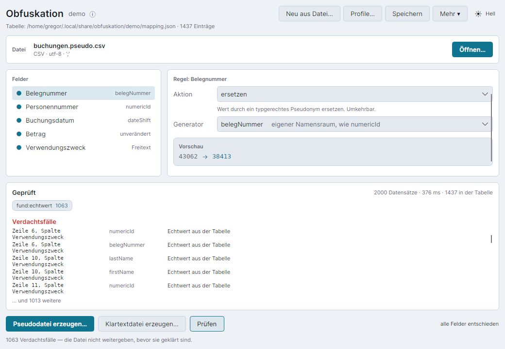
*Prüfen von `buchungen.pseudo.csv`: 1112 Verdachtsfälle, weil
Verwendungszweck auf `scanText` stand — Personennamen und Kundennummern im
Freitext blieben stehen.*

Grund: die Verwendungszwecke enthalten Sätze wie „Überweisung an Dieter
Grünwald“ — Personennamen und blanke Kundennummern erkennt kein Muster. Die
drei Muster fangen nur IBAN, E-Mail und Telefonnummer.

**Behebung:** `Verwendungszweck` auf `redact` umgestellt. Der nächste Lauf
ersetzt 2000 Datensätze ohne einen einzigen Verdachtsfall, und `Tabelle: 0
neu` bestätigt, dass dieselben Pseudonyme wie zuvor verwendet wurden — die
Verknüpfung zu den anderen Dateien bleibt bestehen. Als Faustregel: Freitext
mit möglichem Personenbezug auf `redact` oder `drop`, `scanText` nur für
Felder, in denen wirklich nur Muster wie IBAN oder E-Mail vorkommen können.

## 7. Mehrere zusammenhängende Dateien

Der übliche Fall: Stammdaten, Konten und Buchungen liegen in getrennten
Dateien und hängen über eine Personennummer zusammen. Diese Nummer muss in
allen Dateien gleich ersetzt werden, sonst zerfallen die Verknüpfungen.

**Das geschieht von selbst**, solange alle Dateien mit demselben Profil
verarbeitet werden: Profil einmal öffnen, dann die Dateien nacheinander
über **Öffnen…** hereinholen und je **Pseudodatei erzeugen…**. Das Profil
bleibt dabei geladen.

**Die Reihenfolge, in der die Dateien geöffnet werden, spielt dabei keine
Rolle.** Der Zusammenhang hängt am Profil und an seiner Ersetzungstabelle,
nicht am Dateinamen oder daran, welche Datei zuerst hereingeholt wurde: ob
zuerst `stammdaten.csv` und dann `konten.csv` bearbeitet wird oder
umgekehrt, ändert am Ergebnis nichts — dieselbe Personennummer bekommt in
beiden Fällen dasselbe Pseudonym, weil es aus dem Klartext und dem Salt der
Tabelle abgeleitet wird, nicht aus der Reihenfolge der Läufe. „Mehrere
Dateien bearbeiten“ heißt also schlicht: Profil einmal öffnen, Dateien
nacheinander hereinholen, in beliebiger Reihenfolge.

Am Demo-Bestand: aus der Personennummer `10000` wird in `stammdaten.csv`
und in `konten.csv` übereinstimmend `04745` — derselbe Wert in beiden
Dateien, weil das Pseudonym deterministisch aus dem Klartext abgeleitet
wird. Die Formtreue bleibt dabei erhalten: die fünfstellige Nummer bleibt
fünfstellig, die Telefongliederung `(079) 5540670` bleibt als `(095)
6310059` erhalten, und das Geburtsdatum verschiebt sich überall um denselben
Betrag.

### Der Fallstrick: Belegnummer

Im Demo-Bestand kommt die Zahl `10679` zweimal vor — einmal als Belegnummer,
einmal als Personennummer. Mit demselben Generator bekämen beide dasselbe
Pseudonym und täuschten eine Verbindung vor, die es nie gab. Tatsächlich
liefert das Demo-Profil zwei verschiedene Werte:

- als Belegnummer → `04063`
- als Personennummer → `86724`

Möglich wird das durch einen eigenen Namensraum: im Profil steht unter
`generators` ein Eintrag `"belegNummer": { "type": "numericId" }`, und die
Regel für die Spalte `Belegnummer` verweist auf diesen Namen statt auf
`numericId`. In der Generatorauswahl der Oberfläche erscheint `belegNummer`
danach als eigener Eintrag, gekennzeichnet als eigener Namensraum.

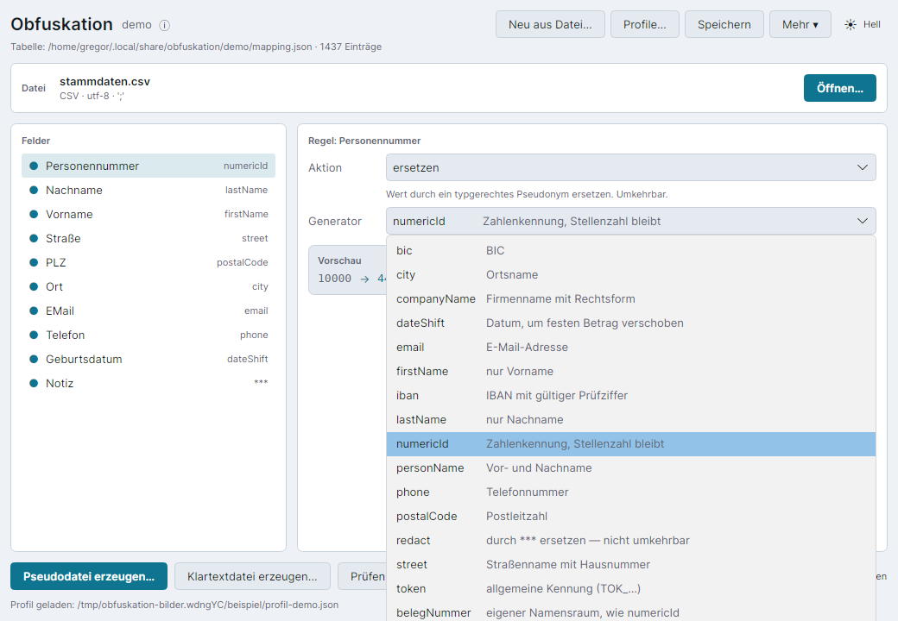
*Generatorauswahl mit dem im Profil selbst angelegten Namensraum
„belegNummer“ als letztem Eintrag.*

**Wichtig für die Rückabbildung:** `Klartextdatei erzeugen…` braucht
dasselbe Profil, weil es aus derselben Ersetzungstabelle liest. Ein anderes
Profil heißt: andere Tabelle, anderes Salt, keine Zuordnung.

## 8. Wenn etwas schiefgeht

Die folgende Tabelle sammelt die Meldungen, die bei falscher Bedienung oder
fehlerhafter Konfiguration tatsächlich beobachtet wurden. Die Meldungstexte
stammen von der Kommandozeile; die Oberfläche zeigt denselben Sachverhalt in
der Statuszeile, meist kürzer.

| Meldung (Wortlaut) | Ursache | Abhilfe |
|---|---|---|
| „Für folgende Felder steht noch keine Entscheidung fest: …“ | Mindestens ein Feld steht noch auf „offen“ | Jedes genannte Feld auf ersetzen, durchlassen, schwärzen oder entfernen stellen |
| „Ohne eigene Regel: EMail“ (Lauf läuft trotzdem durch) | `defaults.unknownField` steht auf „durchlassen“, ein Feld hat keine eigene Regel | Für das Feld eine eigene Regel anlegen; `unknownField` auf „offen“ (Vorgabe) belassen |
| „Der Mapping-Store soll unter … abgelegt werden, das liegt in einem Git-Arbeitsverzeichnis …“ | Die Ersetzungstabelle würde in ein Git-Verzeichnis geschrieben | Pfad der Ersetzungstabelle im Profil ändern (nicht `--allow-unsafe-store` setzen, außer bewusst) |
| „Der Mapping-Store wird bereits verwendet: …lock. Läuft ein anderer Vorgang, oder ist eine verwaiste Sperrdatei übrig?“ | Ein zweiter Lauf greift gleichzeitig auf dieselbe Ersetzungstabelle zu | Warten, bis der erste Lauf fertig ist; bei einer verwaisten Sperrdatei nach einem Absturz die `.lock`-Datei von Hand löschen |
| „Eingabedatei nicht gefunden: …“ | Der angegebene Pfad existiert nicht | Pfad prüfen |
| „X Verdachtsfälle. Die Datei nicht weitergeben, bevor sie geklärt sind.“ | `Prüfen` hat Restbestände gefunden | Ursache klären (siehe Lehrbeispiel Abschnitt 6); bei echtem Fund die betroffene Regel ändern, bei einem harmlosen Zufallstreffer (etwa ein Betrag, der zufällig wie eine vergebene Nummer aussieht) das Feld bei Bedarf auf `drop` stellen |
| „Das Profil „…“ hat ungespeicherte Änderungen. Speichern, bevor fortgefahren wird?“ | Fenster schließen oder Profil wechseln, während noch nicht gespeicherte Regeländerungen offen sind | Eine der drei Schaltflächen wählen: Speichern, Verwerfen oder Abbrechen (Abschnitt 5) |
| Profilzeile in Fehlerfarbe mit der Fehlermeldung im Klartext (Übersicht) | Die Profildatei ist nicht mehr lesbar — gelöscht, kein gültiges JSON, oder von Hand fehlerhaft bearbeitet | `Öffnen` ist gesperrt; entweder die Datei außerhalb reparieren oder den Eintrag über `Aus Liste entfernen` aus der Übersicht nehmen (löscht nur den Eintrag, nie die Datei) |
| „Es gibt bereits ein Profil an diesem Ort.“ | Beim Anlegen ist der gewählte Name im Ablageort schon vergeben | `Anlegen` bleibt gesperrt; entweder `Stattdessen öffnen` wählen oder einen anderen Namen beziehungsweise Ort setzen |

Zwei Eigenheiten verdienen besondere Aufmerksamkeit:

> **Bei fehlerhafter Konfiguration nennt die Oberfläche die Fehler nicht.**
> Die Statuszeile meldet nur „Die Konfiguration ist fehlerhaft — siehe
> Hinweise“, der Hinweisbereich bleibt aber leer, weil sich ohne gültiges
> Profil kein Feld auswählen lässt. In diesem Fall auf der Kommandozeile
> `obfuskation scan <datei> --config <profil>` ausführen — das nennt
> dieselben Fehler mit Feldpfad im Wortlaut.

> **Eine leere Generatorauswahl bei einem eigenen Namensraum ist kein
> Fehler, der zu korrigieren wäre.** Ist einem Feld ein selbst angelegter
> Generator zugewiesen (wie `belegNummer` im Beispiel oben), kann es
> vorkommen, dass die Generatorauswahl leer erscheint, obwohl die Regel
> korrekt arbeitet — die Vorschau zeigt dann trotzdem den richtigen Wert.
> **Keinesfalls** in diesem Fall einen Generator aus der Liste auswählen:
> das würde den eigenen Namensraum aufheben und Felder wie Belegnummer und
> Personennummer könnten wieder dasselbe Pseudonym bekommen. Einzelheiten
> zur Ursache stehen in `entwicklerdokumentation.md` unter den offenen
> Befunden.

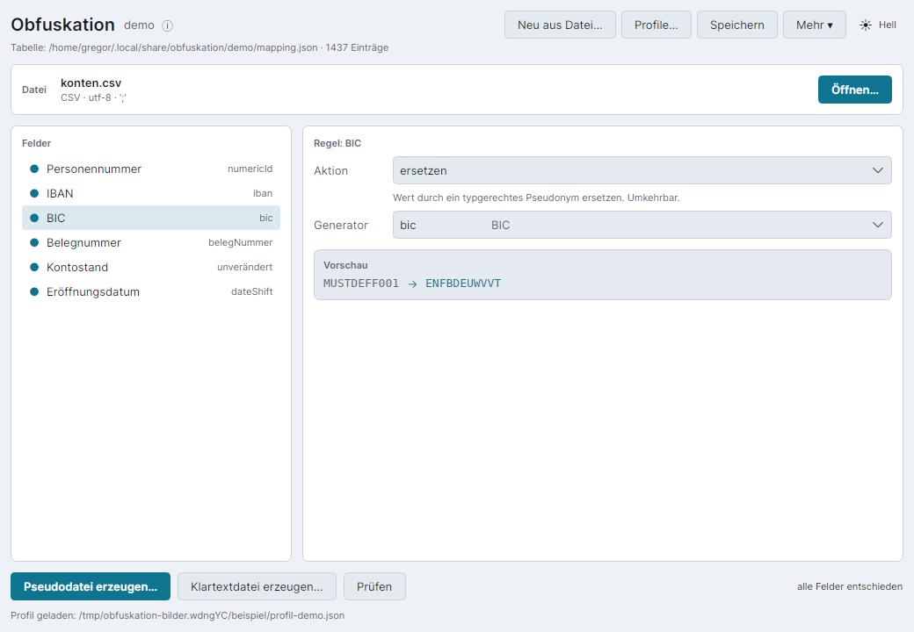
*Belegnummer korrekt auf den eigenen Namensraum „belegNummer“ gestellt
(Vorschau 13535 → 84512), die Generatorauswahl zeigt dabei nichts an.*

## 9. Für die Kommandozeile

Wer Abläufe automatisieren will, findet auf der Kommandozeile dieselbe
Bibliothek unter einer anderen Hülle — Oberfläche und Kommandozeile liefern
nachweislich dasselbe Ergebnis (siehe `entwicklerdokumentation.md`,
Abschnitt „Überblick“). Sechs Befehle:

```
obfuskation init [--profile <name>] [--from <datei>] [--description <text>]
                 [--central] [--force]
obfuskation obfuscate <datei> [-o <ziel>] [--strict] [--dry-run] [--json]
obfuskation deobfuscate [<datei>] [-o <ziel>] [--json]
obfuskation scan <datei> [--json]
obfuskation mapping list|path
obfuskation profile list [--sort name|used|changed] [--json]
```

**`--config` nimmt jetzt auch einen bloßen Profilnamen entgegen**, nicht
mehr nur einen Dateipfad: `--config demo` sucht zuerst wörtlich nach einer
Datei namens `demo`, und — findet sich keine, enthält der Wert kein
Verzeichnistrennzeichen und endet nicht auf `.json` — anschließend unter
`~/.config/obfuskation/profile/demo.json`, also demselben Ort, an dem die
Oberfläche zentral abgelegte Profile erwartet. Ein Pfad mit Trennzeichen
oder mit der Endung `.json` wird weiterhin ausschließlich wörtlich
genommen. Damit lässt sich ein zentral abgelegtes Profil von der
Kommandozeile aus genauso ansprechen wie in der Oberfläche:

```fish
obfuskation obfuscate stammdaten.csv -o stammdaten.pseudo.csv --config demo
```

**`obfuskation profile list`** zeigt alle bekannten Profile — den zentralen
Ordner sowie die im Nutzungs-Index gemerkten —, je Zeile Name, Anzahl der
zugehörigen Dateien, wann das Profil zuletzt benutzt und wann es zuletzt
geändert wurde, sowie den vollen Pfad. Die Zuletzt-Liste der Oberfläche
(`gui.json`) wird dabei bewusst nicht gelesen: die Kommandozeile kennt den
Begriff „zuletzt in der Oberfläche geöffnet“ nicht, nur den plattform- und
programmübergreifenden Nutzungs-Index. `--sort` wählt die Sortierung
(Vorgabe: nach Namen), `--json` liefert dieselbe Liste maschinenlesbar auf
der Standardausgabe.

**`obfuskation init --central`** legt das Regelgerüst nicht mehr als
`obfuskation.json` im aktuellen Verzeichnis an, sondern direkt am zentralen
Ablageort — demselben, den auch der Anlegen-Dialog der Oberfläche
vorschlägt — und meldet danach den vollständigen Zielpfad. `--description`
setzt gleich die freie Beschreibung, die auch die Oberfläche in der
Profilübersicht und der Kopfzeile anzeigt:

```fish
obfuskation init --profile demo --from stammdaten.csv --description "Q3-Stammdaten" --central
```

Rückgabewerte:

| Wert | Bedeutung |
|---|---|
| 0 | Erfolg |
| 1 | allgemeiner Fehler |
| 2 | Konfiguration fehlt oder ist fehlerhaft |
| 3 | Feld ohne Regel im strengen Modus |
| 4 | `scan` hat Verdachtsfälle gefunden |
| 5 | Ersetzungstabelle widersprüchlich oder gesperrt |

Ein Beispiel mit echten Zahlen — die Antwort einer KI von der
Standardeingabe zurückübersetzen:

```fish
cat antwort-der-ki.txt | obfuskation deobfuscate --config profil-demo.json
```

Vollständige Beschreibung der Befehle, Optionen und Rückgabewerte in
`entwicklerdokumentation.md`, Abschnitt „Rückgabewerte der CLI“.

---

Erstellt von Gregor Stübner und Claude (Anthropic).
