# Anwenderdokumentation

Fassung 1.13.0 · Stand 28. September 2026

Die Bilder zeigen teilweise noch den Stand 1.9.

Diese Anleitung richtet sich an alle, die mit der Oberfläche
`obfuskation-gui` arbeiten: Beispieldaten für eine KI vorbereiten, indem
Echtwerte durch Pseudodaten ersetzt werden, und die Antwort der KI wieder auf
die Echtwerte zurückführen. Sie führt einmal durch den vollständigen Ablauf
am mitgelieferten Demo-Bestand (`docs/beispiel/`) und dient danach als
Nachschlagewerk.

Für Hintergründe zur Funktionsweise, zum Bauen aus dem Quelltext und für
offene Befunde siehe `entwicklerdokumentation.md`.

## 1. Nur ein Text

Wer nur einen einzelnen Text säubern will — eine E-Mail, einen Absatz, die
Antwort einer KI —, muss weder ein Profil noch eine Tabelle verstehen. Dieses
Kapitel beschreibt den kürzesten Weg durch das Programm; wer mit CSV- oder
JSON-Dateien arbeitet, findet den vertrauten, tabellenbezogenen Ablauf ab
Kapitel 4.

### Die Startseite

`obfuskation-gui` öffnet auf der Startseite. Sie zeigt drei Karten:

- **Text säubern** — führt in die Textansicht, Richtung „säubern“.
- **Dateien pseudonymisieren** — führt in die Dateiansicht und stößt sofort
  „Neu aus Datei…“ an (oder, ist bereits ein Profil geladen, „Öffnen…“).
- **Antwort zurückholen** — dieselbe Textansicht, Richtung
  „zurückübersetzen“.

Wurde schon einmal mit einem Profil gearbeitet, steht darüber als erste Karte
**„Weiter mit …“** samt seinem Namen: ein Klick, und die Dateiansicht steht
mit dem gewohnten Projekt offen. Das Profil ist zu diesem Zeitpunkt bereits
geladen — die Karte wechselt nur die Ansicht und verwirft nichts, auch keine
geöffnete Datei.

Zurück zur Startseite führt aus jeder Ansicht „← Start“ oben links (oder ein
Klick auf „Obfuskation“ daneben), ebenfalls ohne ein geladenes Profil zu
verwerfen.

Unten zwei weitere Knöpfe: **„Regeln & Generatoren…“** öffnet dasselbe Fenster
wie der Knopf in der Kopfzeile (Kapitel 5), aber ausdrücklich ohne
Profilbezug — auch mit einem im Hintergrund geladenen Projekt zeigt es nur die
Regeln und Generatoren für alle Projekte, denn von der Startseite aus geht es
nicht um ein bestimmtes Projekt. **„Kurzhilfe…“** öffnet das gleichnamige
Fenster, siehe unten.

Übersprungen wird die Startseite nur dort, wo jemand ausdrücklich gesagt hat,
was er will: bei einem Profil oder einer Datei auf der Befehlszeile. Dann
öffnet sich sofort die Dateiansicht wie gewohnt.

### Die Textansicht

Zwei Spalten, Text links, Ergebnis rechts:

1. Text **einfügen** (aus der Zwischenablage), tippen, über **Datei…**
   öffnen oder in das Fenster ziehen.
2. Kurz nach der letzten Änderung erscheint rechts der gesäuberte Text,
   darunter die Fundliste — „Gefunden: 3× email · 1× iban“ — mit jedem
   einzelnen Fund, seinem Pseudonym und seiner **Herkunft**: „fw · dieses
   Projekt“ oder „fw · alle Projekte“, je nachdem, ob die getroffene Regel im
   geladenen Profil oder in der hauseigenen Erweiterungsdatei steht. Ein
   Häkchen je Fund schaltet ihn für diesen Durchgang ab; der Klartext bleibt
   dann an dieser Stelle stehen.
3. **Kopieren** legt das angezeigte Ergebnis in die Zwischenablage. Erst
   dieser Klick trägt neue Werte in die Ersetzungstabelle ein — bis dahin war
   alles Vorschau.

Die Vorschau ist dabei kein Näherungswert: beim Betreten der Textansicht legt
sie die Ersetzungstabelle einmal an, falls noch keine besteht, und von da an
liefert ein Probelauf exakt dieselben Pseudonyme wie der echte. Wer aus
dieser Ansicht kopiert, kopiert genau das, was er gesehen hat.

Der Richtungsumschalter oben („Text säubern“ / „Antwort zurückübersetzen“)
tauscht `Obfuscate` gegen `Deobfuscate`; in der Rückrichtung gibt es keine
Fundliste, weil die Rückübersetzung über die Ersetzungstabelle läuft, nicht
über Muster.

Ein Profil entsteht dabei im Hintergrund, ohne dass danach gefragt wird: ohne
bereits geladenes Profil legt die Textansicht ein Vorgabeprofil namens `text`
mit den eingebauten Textregeln (IBAN, E-Mail, BIC, Telefonnummer) an. Wer
später von hier in die Dateiansicht wechselt, arbeitet im selben Profil
weiter — dieselbe Ersetzungstabelle gilt für beides.

### Farbe zeigt, was erkannt wurde

Eingefügter Text erscheint links in der **Prüffassung**: grün hinterlegt, was
erkannt und ersetzt wird, orange, was per Häkchen bewusst im Klartext bleibt.
Rechts stehen dieselben Stellen in denselben Farben am Ersatzwert. **Ohne Farbe**
heißt: von keiner Regel erfasst — das ginge unverändert hinaus.

Das ist die eigentliche Aussage der Ansicht. Die eingebauten Textregeln erkennen
allgemeine Muster: IBAN, E-Mail, BIC, Telefonnummer. Namen, Anschriften,
Geburtsdaten, Steuer-IDs, Kennzeichen, Kunden- und Vertragsnummern sehen sie
**nicht**, und keine Regex der Welt fängt sie zuverlässig. Ohne die Farbe stünde
dort nur „Keine Funde im Text.“ — leicht als „nichts zu tun“ zu lesen.

Zum Tippen und Ändern schaltet **„Bearbeiten“** auf ein gewöhnliches Eingabefeld
um, **„Fertig“** zurück auf die Prüffassung. Auch das Eingabefeld zeigt die
Farben: Nach einer kurzen Tipp-Pause erscheinen sie unter dem Text, während des
Tippens verschwinden sie kurz, damit keine Farbe an einer verschobenen Stelle
steht. Text über „Einfügen“, „Datei…“ oder Ziehen landet sofort in der
Prüffassung.

### Übersehenes markieren — eigene Begriffe ohne regulären Ausdruck

Steht links noch etwas Vertrauliches ohne Farbe, wird daraus mit drei Fragen in
Alltagssprache eine dauerhafte Regel; einen regulären Ausdruck bekommt dabei
niemand zu sehen.

- **Textansicht**: die Stelle in der Prüffassung markieren, **rechte Maustaste**,
  Eintrag **„»…« immer ersetzen…“** — er nennt den markierten Wert. Alternativ
  **Strg+M**. Ohne Markierung steht der Eintrag ausgegraut da. Derselbe Dialog
  öffnet sich aus einem Eintrag der Fundliste heraus über „immer…“.

Diesen kleinen Dialog gibt es nur beim Markieren von Text — die Dateiansicht
kennt ihn nicht mehr: dort führt **„Regeln bearbeiten…“** neben „Felder
automatisch erkennen…“ direkt in das große Fenster „Regeln & Generatoren“
(siehe unten).

Der Dialog fragt:

1. **Was?** — vorbelegt mit der Auswahl, frei änderbar.
2. **Wie weit?** — „nur genau dieses eine Wort“, oder, sofern der Wert
   Ziffern enthält, „alles dieser Form“ (aus `FW123456` wird die Beschreibung
   „FW“ + 6 Ziffern — in Worten, nicht als `\bFW\d{6}\b`). Ein
   Vorschaustreifen zeigt sofort, wie oft das gewählte Muster im aktuellen
   Text zuträfe, mit den Fundstellen.
3. **Ersetzen durch** — der Generator, meist „token“ mit einer aus dem Wert
   abgeleiteten Kennzeichnung (`FW123456` → `FW~`). Der Knopf **„Neuer
   Generator…“** daneben öffnet denselben Generator-Dialog wie im Reiter
   „Eigene Generatoren“ (Kapitel 5) — wahlweise für dieses Projekt oder für
   alle, unabhängig davon, wo die Regel selbst landet.
4. **Bezeichnung** — unter diesem Namen erscheint die Regel in der Fundliste
   und in „Regeln & Generatoren“. Vorbelegt aus dem Wert (`FW123456` → `fw`,
   eine reine Ziffernfolge wie eine Kartennummer → `nummer`), aber frei
   änderbar, etwa zu „Kreditkartennummer“. Ist die Bezeichnung schon vergeben,
   sagt der Dialog vorher, mit welcher angehängten Nummer die Regel angelegt
   wird.
5. **Wo gilt das?** — „nur in diesem Projekt“ trägt die Regel in das offene
   Profil ein. „Immer, in allen Projekten“ schreibt sie stattdessen in die
   Erweiterungsdatei (Kapitel 11) — der Dialog nennt den Zielpfad vorher im
   Klartext und weist darauf hin, wenn dabei eine Sicherungskopie entsteht,
   weil die Datei von Hand gepflegte Kommentare enthält. Ist die
   Erweiterungsdatei kaputt oder schreibgeschützt, steht diese Wahl gar nicht
   erst zur Verfügung — der Dialog nennt den Grund. Verwendet die Regel einen
   Generator, den es bislang nur im Projekt gibt, wird er beim Übernehmen für
   alle Projekte mitkopiert, mit einem Hinweis darunter.

**„Regeln & Generatoren…“** führt bei Bedarf in die vollständige Fachansicht
mit Erprobungsfeld — das gleichnamige Fenster (Kapitel 5), Reiter
„Textregeln“, mit dem Filter „Zeigen“ auf der Reichweite, die unter „Wo gilt
das?“ gewählt war.

**Mehrere übersehene Stellen.** Eine Regel erledigt dabei oft mehr als eine
Fundstelle: „alles dieser Form“ macht aus `FW123456` das Muster „FW + 6
Ziffern“, und der Vorschaustreifen sagt vor dem Übernehmen, wie oft es im
aktuellen Text greift. Für mehrere wirklich verschiedene Begriffe — ein Name,
eine Kundennummer, ein Projektname — gibt es **„Übernehmen und weiter“**: die
Regel wird angelegt, der Dialog bleibt offen und zeigt an, was in diesem
Durchgang bereits entstanden ist.

**Eine Regel wieder loswerden oder ändern.** Ein zu weit geratenes Muster —
„alles dieser Form“ auf einem Datum ersetzt fortan jedes Datum — lässt sich in
der Fundliste über **„Regel entfernen“** wieder löschen; über **„bearbeiten…“**
öffnet sich stattdessen „Regeln & Generatoren“ mit ausgewählter Regel, um nur
das Muster anzupassen. Beide Knöpfe erscheinen dort anstelle von „immer…“, sobald
ein Fund aus einer selbst angelegten Regel stammt. Die vier eingebauten Regeln
bleiben davon unberührt: für sie ist das Häkchen der richtige Weg, denn es
gilt nur für den einen Durchgang. Bereits vergebene Pseudonyme bleiben beim
Löschen in der Ersetzungstabelle stehen — der Weg zurück zu den Echtwerten
geht dadurch nicht verloren.

## 2. Wozu das Werkzeug da ist — und wozu nicht

Fünf Dinge vorab, ausführlicher in der `README.md`:

1. **Das Werkzeug pseudonymisiert, es anonymisiert nicht.** Namen und
   Kontonummern verschwinden, Struktur und Verteilung bleiben. Eine
   Kombination aus Postleitzahl, Geburtsjahr und Kontostand kann weiterhin
   auf eine Person zurückführen. Ob das vertretbar ist, entscheidet der
   Datenschutzbeauftragte — nicht dieses Programm.
2. **Die Ersetzungstabelle (`mapping.json`) ist das schützenswerteste
   Artefakt des ganzen Vorgangs.** Sie enthält sämtliche Echtdaten in
   kompakter Form und gehört niemals in ein Repository, ein Backup nach
   außen oder ein Verzeichnis, aus dem Dateien weitergegeben werden.
3. **Textregeln sind ein Ausschlussverfahren.** IBAN, BIC, E-Mail und
   Telefonnummer lassen sich zuverlässig erkennen — Personennamen,
   Firmennamen und Adressen in Freitext praktisch nicht. Für Freitextfelder
   ist im Zweifel `redact` oder `drop` die richtige Wahl, nicht
   `scanText` (siehe Abschnitt 7).
4. **`Prüfen` vor jeder Weitergabe ausführen.** Nicht optional.
5. **Die Ausgabe erkennbar benennen** (`kunden.pseudo.csv`), damit Original
   und Pseudonymisat nicht verwechselt werden. Die Oberfläche schlägt diesen
   Namen beim Speichern von sich aus vor.

## 3. Installation

Fertige Programme für Windows und Linux liegen unter den Releases des
Projekts, je Plattform zwei Dateien ohne Installation: `obfuskation` (die
Kommandozeile) und `obfuskation-gui` (die Oberfläche, um die es hier geht).

Voraussetzung ist die .NET-8-Runtime. Wer sie nicht installieren möchte,
baut sich mit `./build-release.sh --self-contained` eine Fassung, die alles
mitbringt (siehe `entwicklerdokumentation.md`, Abschnitt „Bauen, testen,
freigeben“).

Unter Linux die Datei ausführbar machen:

```fish
chmod +x obfuskation-gui
```

Unter Windows warnt SmartScreen beim ersten Start, weil das Programm nicht
signiert ist — *Weitere Informationen* → *Trotzdem ausführen*.

Um die Oberfläche unter Linux ins Anwendungsmenü (GNOME) aufzunehmen, siehe
`packaging/README.md`. Dort steht die `.desktop`-Datei samt Symbol.

## 4. Der erste Durchgang, bebildert

Als durchgehendes Beispiel dient der Demo-Bestand aus `docs/beispiel/`:
`stammdaten.csv` mit 120 Datensätzen, die Spalten Personennummer, Nachname,
Vorname, Straße, PLZ, Ort, EMail, Telefon, Geburtsdatum und Notiz.

### Schritt 1 — Profil aus einer Datei ableiten

`obfuskation-gui` starten und über **Neu aus Datei…** `stammdaten.csv`
wählen. Der Dateidialog erlaubt dabei eine **Mehrfachauswahl**: hängen
mehrere Dateien über eine gemeinsame Spalte zusammen (Abschnitt 8), lassen
sie sich auf einmal auswählen — das Regelgerüst entsteht dann aus den
Feldern aller gewählten Dateien, der Namensvorschlag im folgenden Dialog
kommt von der ersten. Für den ersten Durchgang reicht eine einzelne Datei.
Es folgt der Anlegen-Dialog: **Name** (vorbelegt aus dem Dateinamen,
änderbar), **Beschreibung** (frei, optional) und der **Ablageort**, der dem
Namen live folgt, solange er nicht von Hand überschrieben wird. Für den
ersten Durchgang reicht es, den Namen `demo` einzutragen und mit
**Anlegen** zu bestätigen — Einzelheiten zu diesem Dialog stehen in
Abschnitt 6. Die Oberfläche liest daraufhin die Spaltenköpfe und legt für
jede eine Regel mit der Behandlung „offen“ an — noch ist nichts
entschieden.

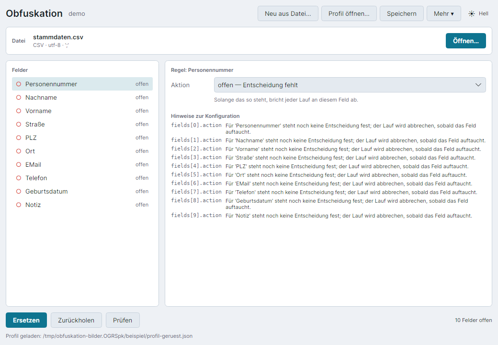
*Nach dem Ableiten aus stammdaten.csv: alle zehn Felder stehen offen, Format,
Zeichensatz und Trennzeichen wurden bereits erkannt.*

### Schritt 2 — Jedes Feld entscheiden

Für jedes Feld links in der Liste rechts im Regelbereich eine Behandlung
wählen: ersetzen, durchlassen, Freitext durchsuchen, schwärzen oder Feld
entfernen (Einzelheiten in Abschnitt 7). Bei „ersetzen“ zeigt die Vorschau
sofort, wie ein echter Wert aus der Datei aussehen würde. Erst wenn alle
Punkte türkis gefüllt sind, lässt sich die Pseudodatei erzeugen.

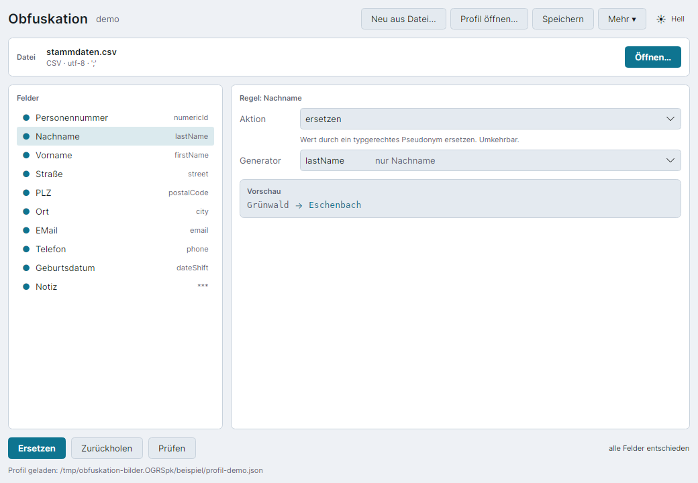
*Feld „Nachname“ auf ersetzen mit Generator `lastName` gestellt; die Vorschau
zeigt Grünwald → Eschenbach. Alle zehn Felder sind entschieden.*

### Schritt 3 — Pseudodatei erzeugen

Auf **Pseudodatei erzeugen…** klicken und im Speichern-Dialog den
vorgeschlagenen Namen (`stammdaten.pseudo.csv`) bestätigen. Die
Ergebniskarte zeigt Zähler je Generator sowie den Hinweis, vor der
Weitergabe zu prüfen.

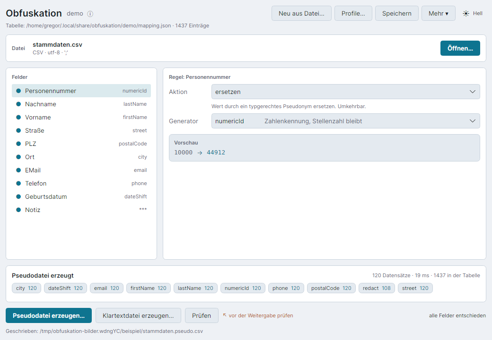
*Ergebniskarte nach dem Erzeugen der Pseudodatei: 120 Datensätze, 20 ms, 1437
Einträge in der Tabelle, davon 108 geschwärzte Notizen.*

### Schritt 4 — Prüfen

Die erzeugte Datei öffnen und auf **Prüfen** klicken. Das Werkzeug sucht
nach Restbeständen — Werten, die trotz der Regeln noch im Klartext stehen.
Bei der sauber pseudonymisierten Datei bleibt der Befund leer.

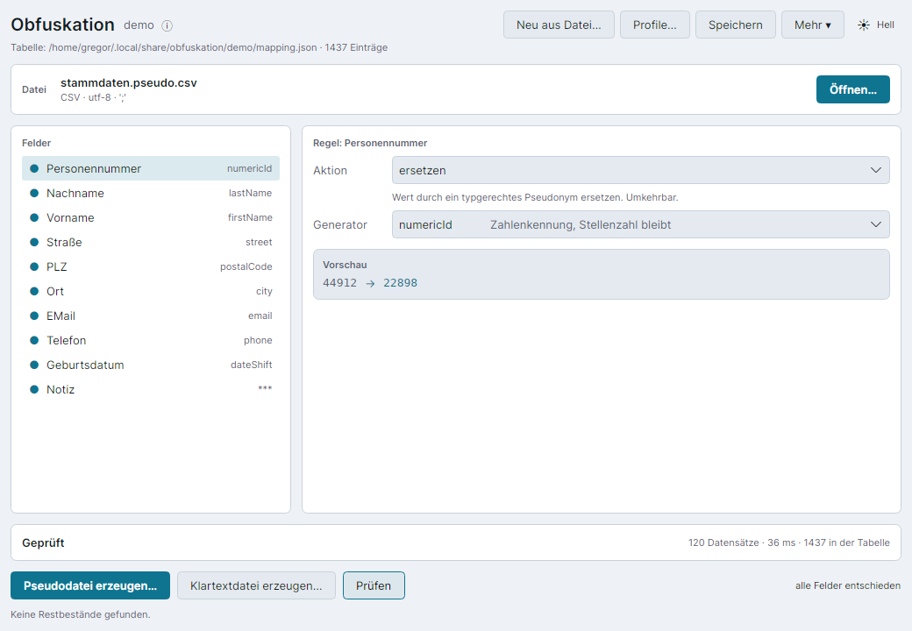
*„Keine Restbestände gefunden“ nach dem Prüfen der pseudonymisierten Datei.*

Fällt die Prüfung nicht sauber aus, siehe Abschnitt 7 zum Lehrbeispiel
Freitext und Abschnitt 9 zu den Meldungen im Einzelnen.

### Schritt 5 — Weitergeben

Erst jetzt geht `stammdaten.pseudo.csv` an die KI — als Anhang, eingefügter
Text oder wie auch immer die jeweilige Arbeitsweise es vorsieht. Dieser
Schritt findet außerhalb des Werkzeugs statt, es gibt dafür kein eigenes
Bild. Wichtig ist nur: nicht die Originaldatei verwechseln, und `Prüfen` war
vorher an der Reihe, nicht erst danach.

### Schritt 6 — Klartextdatei erzeugen

Die Antwort der KI (Text, Code, Tabellen — beliebig) als Datei öffnen und
**Klartextdatei erzeugen…** klicken. Alle bekannten Pseudonyme werden auf
ihre Echtwerte zurückgeführt, auch mitten in Fließtext oder Quelltext.

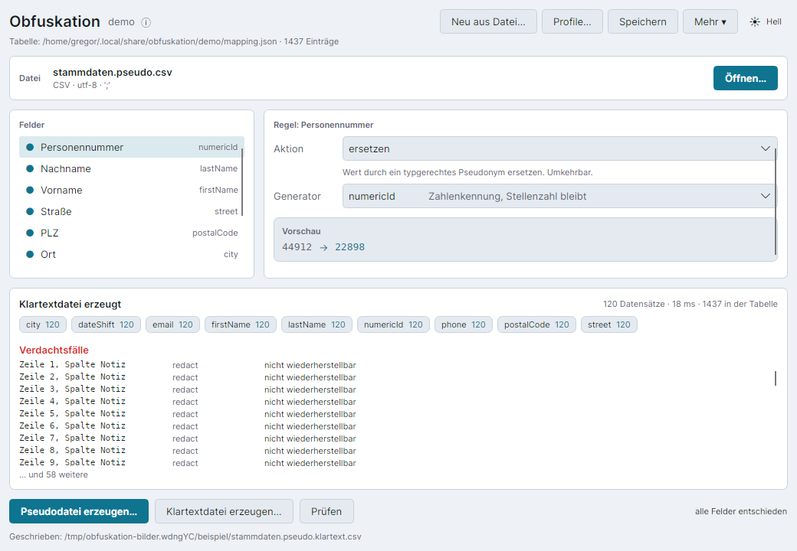
*Klartextdatei erzeugt: 120 Datensätze, 26 ms; Spalte Notiz bleibt als
„nicht wiederherstellbar“ gemeldet, weil sie beim Ersetzen geschwärzt
wurde.*

Dasselbe funktioniert mit einer Textdatei, die nur die Antwort der KI
enthält — dann arbeitet `Klartextdatei erzeugen…` über den gesamten
Fließtext, nicht spaltenweise. Das Verfahren dahinter zeigt Abschnitt 10 an
einem Kommandozeilenbeispiel mit echten Zahlen.

## 5. Die Oberfläche im Einzelnen

Dieses Kapitel beschreibt die **Dateiansicht** — erreichbar über die Karte
„Dateien pseudonymisieren“ der Startseite (Kapitel 1) oder automatisch, wenn
ein Profil oder eine Datei bereits beim Start angegeben ist. Die Kopfzeile
mit Profilname, „Profile…“, „Mehr“ und dem Themenumschalter ist in allen drei
Ansichten sichtbar; **Neu aus Datei…** und **Speichern** dagegen nur hier,
weil sie sich auf eine geöffnete Datendatei beziehen, die es in der
Text- oder Startansicht nicht gibt.

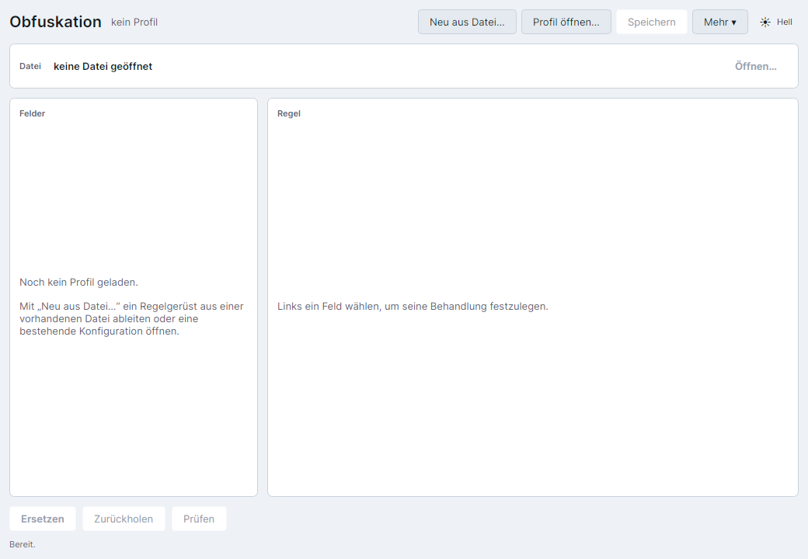
*Dieses Bild zeigt noch den Stand vor der Startseite (Kapitel 1) und wird
durch eines der Dateiansicht nach bewusstem Wechsel von der Startseite aus
ersetzt.*

Neben dem Profilnamen steht bei geladenem Profil ein kleines **ⓘ**. Ein
Klick öffnet ein Erklär-Flyout:

> Ein Profil bündelt die Feldregeln und die Ersetzungstabelle. Alle
> zusammengehörenden Dateien unter demselben Profil bearbeiten — nur dann
> bekommt derselbe Klartext in allen Dateien dasselbe Pseudonym. Die
> Reihenfolge, in der die Dateien geöffnet werden, spielt keine Rolle.

Direkt unter dem Profilnamen steht, sobald ein Profil geladen ist, eine
zweite, kleine Zeile mit der Beschreibung (falls eine hinterlegt ist) und
der Tabellenauskunft: `Beschreibung · Tabelle: <Pfad> · N Einträge`. Sie
zeigt auf einen Blick, wofür das Profil da ist und wie groß die zugehörige
Ersetzungstabelle bereits ist, ohne dass dafür erst das Fenster
„Ersetzungstabelle…“ geöffnet werden müsste.

**Dateikarte.** Zeigt Namen, Format, Zeichensatz und Trennzeichen der
geöffneten Datei. Läuft eine Datei zum ersten Mal unter dem gerade
geladenen Profil — sie steht also noch nicht im Nutzungs-Index dieses
Profils (Abschnitt 6) —, erscheint darunter zusätzlich der Hinweis „Diese
Datei war bisher nicht Teil des Profils — N neue Felder.“, sofern
mindestens ein Feld ohne eigene Regel dabei ist. Er soll verhindern, dass
ein neues Feld in einer bekannten Datenart unbemerkt auf die Vorgabe
`unknownField` zurückfällt, statt eine bewusste Regel zu bekommen.

**Schnellwahl „Zuletzt ▾“.** Neben **Öffnen…** erscheint diese Schaltfläche,
sobald das geladene Profil mindestens eine Datendatei kennt — sie listet die
dem Profil bereits bekannten Dateien, mit einem Punkt vor der gerade
geöffneten. Ein Klick auf einen Eintrag lädt die Datei sofort neu auf, ohne
den Weg über den Öffnen-Dialog; ist sie inzwischen verschoben oder gelöscht
worden, bleibt der Eintrag sichtbar, aber ausgegraut — so bleibt erkennbar,
dass das Programm die Datei kannte, statt dass sie stillschweigend
verschwindet. Am Ende der Liste steht immer ein Eintrag **Öffnen…** als
Rückfallweg für neue Dateien. Eine Rückfrage gibt es beim Wechsel bewusst
nicht: Eingabedateien werden nie geschrieben, es gibt nichts zu verlieren.

**Hinweise zur Konfiguration.** Lässt sich aus dem geladenen Profil keine
gültige Engine aufbauen — etwa weil eine Feldregel einen unbekannten
Generator nennt —, erscheint oberhalb der Feldliste eine eigene Karte mit
genau den Befunden, die sonst nur die Kommandozeile mit Feldpfad nennt. Sie
steht unabhängig von einer Feldauswahl, denn ohne gültiges Profil gibt es
keine Felder zum Auswählen und der Hinweisbereich im Regelbereich (unten)
bliebe sonst unerreichbar.

**Feldliste mit Statuspunkten.** Links jedes Feld der geöffneten Datei mit
einem Punkt davor: gefüllt und türkis heißt *entschieden*, ein roter,
hohler Kreis heißt *offen*. Solange auch nur ein Feld offen ist, bricht
jeder Lauf ab (Abschnitt 4, Schritt 2). Daneben stehen zwei Schaltflächen:
**»Regeln bearbeiten…«** führt in das Fenster „Regeln & Generatoren“ (Reiter
„Textregeln“, siehe unten) — derselbe Weg wie in der Textansicht, ohne den
Umweg über den kleinen Dialog „Immer ersetzen…“, den es in der Dateiansicht
nicht mehr gibt; **»Felder automatisch erkennen…«** (vormals „Muster
erkennen…“) schlägt für offene Felder anhand der tatsächlichen Werte einen
passenden Generator vor (Kapitel 11).

**Mehrfachauswahl.** Breite Tabellen haben oft ganze Gruppen gleichartiger
Spalten. Sie lassen sich zusammen wählen — Strg-Klick für einzelne Felder,
Umschalt-Klick für einen Bereich von… bis, Strg+A für alle. Die Überschrift
des Regelbereichs nennt dann die Zahl der gewählten Felder, und eine Zeile
darunter sagt ausdrücklich, dass die Einstellung für alle davon gilt.

**Regelbereich mit Feldinhalt, Vorschau und Aktion.** Rechts, bei einem
einzeln gewählten Feld, zuerst der **Feldinhalt** — bis zu drei
Beispielwerte aus der geöffneten Datei — und erst darunter die Auswahl der
Aktion und, bei „ersetzen“, des Generators: erst sehen, was im Feld steht,
dann entscheiden, welche Behandlung passt. Der Feldinhalt erscheint dabei in
jedem Zustand des Feldes, auch solange die Aktion noch auf „offen“ steht
oder der gewählte Generator keine Vorschau liefert — gerade dann ist er am
wichtigsten, weil die Entscheidung noch aussteht. Sobald ersetzt wird, tritt
neben den Beispielwerten zusätzlich ein Pfeil mit dem Pseudonym des ersten
Wertes auf. Die Stichprobe funktioniert für CSV (mit dem erkannten
Zeichensatz und Trennzeichen, auch bei Anführungszeichen oder dem
Trennzeichen selbst im Wert) und für JSON; Textdateien haben keine Felder,
dort entfällt sie. Aktion und Generator wirken auf die ganze Auswahl; der
Generator dabei nur auf die Felder, die tatsächlich ersetzt werden — ein
durchgelassenes Feld in der Auswahl bleibt unberührt. Der Feldinhalt bleibt
der Einzelauswahl vorbehalten: ein Beispielwert aus einem von zwölf Feldern
ließe offen, wozu er gehört. Ohne bestehende Ersetzungstabelle ist die
Vorschau nur beispielhaft — ein eigener Hinweis sagt das ausdrücklich, weil
derselbe Klartext dann bei jedem Blick ein anderes Pseudonym zeigen kann.

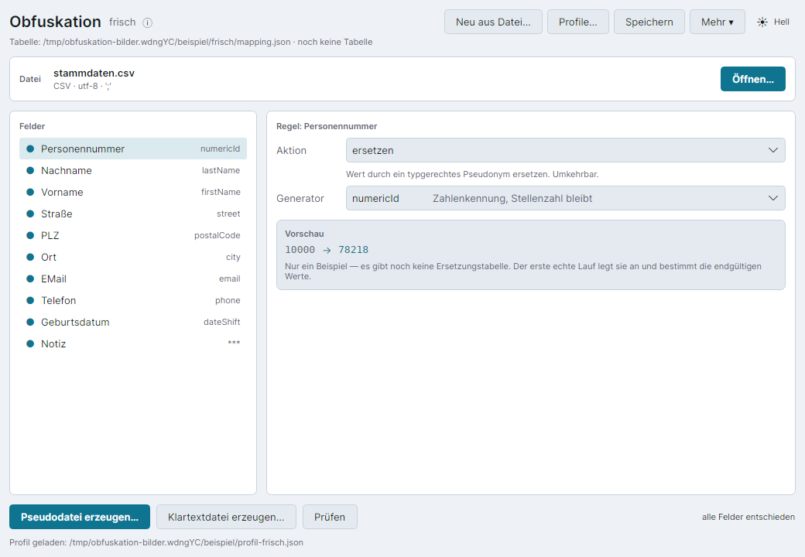
*Vorschau ohne bestehende Ersetzungstabelle: Grünwald → Bramkamp, mit dem
Hinweis, dass der erste echte Lauf die endgültigen Werte bestimmt.*

**Ergebniskarte.** Erscheint nach jedem der drei Vorgänge unterhalb von
Feldliste und Regelbereich: Kopfzeile mit Vorgang, Datensatzzahl, Dauer und
Tabellengröße, darunter Zähler je Generator beziehungsweise Textregel und,
falls vorhanden, die Liste der Verdachtsfälle.

**Aktionsleiste.** Die drei Schaltflächen **Pseudodatei erzeugen…**,
**Klartextdatei erzeugen…** und **Prüfen**, unten im Fenster. Die ersten
beiden nennen das Ergebnis statt der Tätigkeit: aus `kunden.csv` wird
`kunden.pseudo.csv`, die Eingabedatei bleibt dabei unangetastet. Der
frühere Name „Ersetzen“ war doppeldeutig, weil dasselbe Wort im
Regelbereich daneben bereits die Behandlung eines einzelnen Feldes
bezeichnet (Abschnitt 7) und außerdem nahelegte, die geöffnete Datei werde
überschrieben. Bei einer laufenden großen Datei weichen sie einem
Fortschrittsbalken samt Zählung und der Schaltfläche **Abbrechen**.

Daneben das Flyout **Alle ▾** mit den Einträgen **Alle Pseudodateien
erzeugen…** und **Alle Klartextdateien erzeugen…** — der Sammellauf über
alle dem Profil bekannten, noch vorhandenen Dateien (Abschnitt 8). Anders
als bei den Einzelläufen erscheint dabei **nur eine einzige Rückfrage**
für den ganzen Lauf, nicht eine je Datei; sie nennt die Anzahl der Dateien,
das Namensmuster der Ausgabe und ausdrücklich, wie viele schon vorhandene
Zieldateien dabei überschrieben würden. **Wichtig:** nach dieser einen
Bestätigung überschreibt der Sammellauf ohne weitere Rückfrage — vor dem
Klick lohnt sich deshalb ein Blick auf die genannte Anzahl. Jede Ausgabe
entsteht neben ihrer Eingabedatei, mit demselben Namenszusatz
(`.pseudo`/`.klartext`) wie beim Einzellauf. Ein Abbruch währenddessen
wirkt vor der nächsten Datei: schon geschriebene Dateien bleiben stehen und
werden in der Abschlussmeldung mitgezählt, eine Datei, die nicht mehr
existiert oder an der die Verarbeitung scheitert (etwa ein Feld ohne
Entscheidung), wird übersprungen und in derselben Meldung namentlich
genannt — nichts davon geht unbemerkt unter. Trägt eine bekannte Datei den
Zusatz bereits im Namen (`kunden.pseudo.csv` bei **Alle Pseudodateien
erzeugen…**), bleibt sie außen vor: ihr Ausgabename wäre ihr eigener, der
Lauf schriebe also über seine eigene Eingabe. Auch das steht in der
Abschlussmeldung.


*Fortschritt bei einer großen Datei: Balken, laufende Zählung und die
Schaltfläche „Abbrechen“ anstelle der drei Vorgänge.*

Ein Abbruch schreibt weder eine Ausgabedatei noch Einträge in die
Ersetzungstabelle — nur die Statuszeile vermerkt ihn.

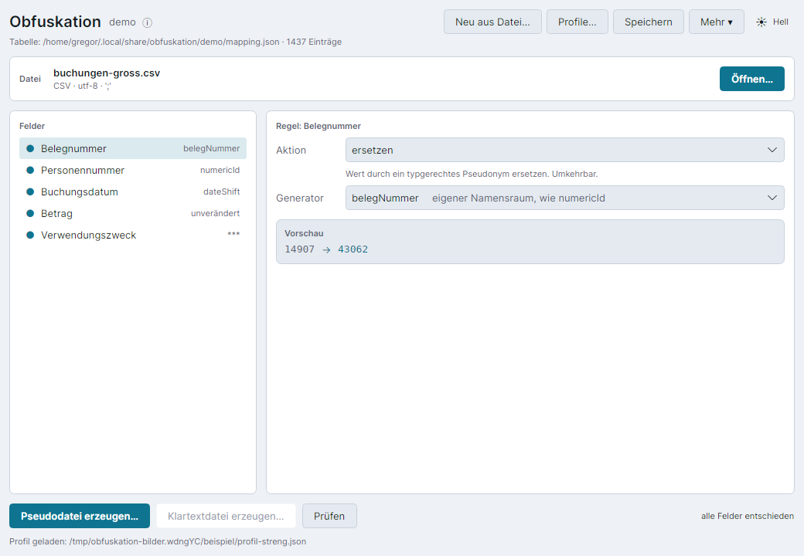
*Nach einem Abbruch: „Prüfen abgebrochen. Es wurde nichts geschrieben.“*

**Statuszeile.** Die unterste Zeile des Fensters meldet, was gerade
geschieht oder zuletzt geschah — vom schlichten „Bereit.“ bis zur Meldung
über offene Felder oder Verdachtsfälle.

**Die Nebenfenster**, über **Mehr** erreichbar:

- **Regeln & Generatoren…** — öffnet dasselbe Fenster wie der Knopf „⚙ Regeln
  & Generatoren“ in der Kopfzeile (Strg+,), im Reiter „Textregeln“. Siehe
  unten.
- **Ersetzungstabelle…** — Pfad, Anzahl je Namensraum und die Dateirechte,
  seit dieser Fassung auch bearbeitbar. Siehe unten.
- **Kurzhilfe…** — kurze Karten für den schnellen Einstieg, im Menü durch
  einen Trenner von den beiden vorigen Einträgen abgesetzt.
- **Über…** — Fassung, die fünf Hinweise aus Abschnitt 2 im Wortlaut und
  die verwendeten Pfade.

Die früheren Einträge „Textregeln…“ und „Hauseigene Muster…“ (nur lesend)
sind schon länger entfallen; seit dieser Fassung heißt auch das Fenster selbst
nicht mehr „Einstellungen“, sondern **„Regeln & Generatoren“** — ein Name, der
sagt, was drinsteht, statt eine Verlegenheitsbezeichnung zu sein.

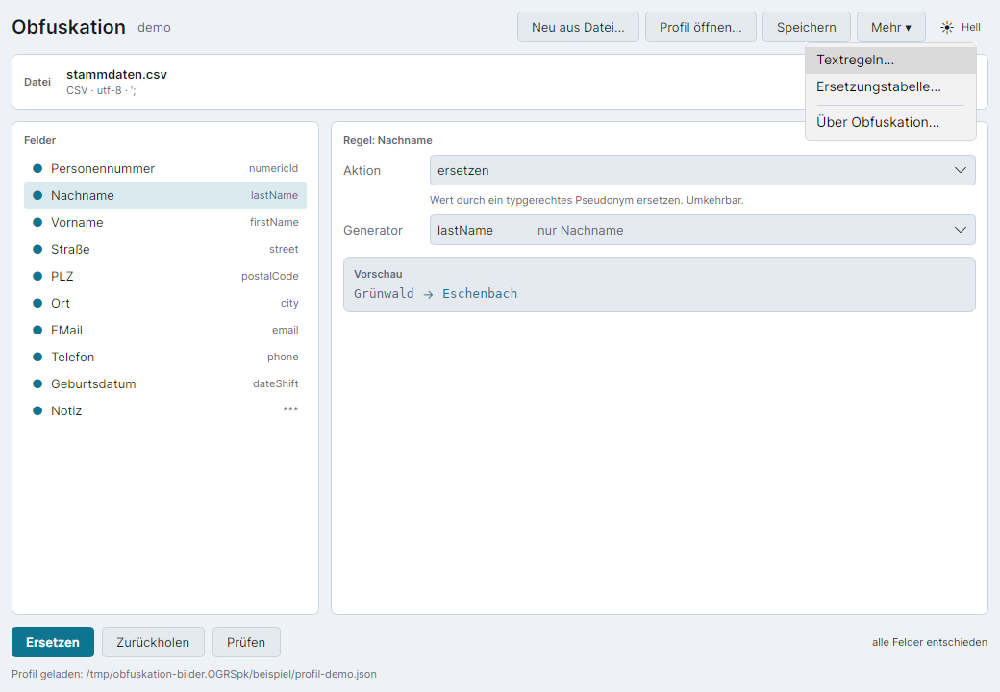
*Das Mehr-Menü, neu aufzunehmen: zeigt noch den Stand vor dieser Fassung.*

### Regeln & Generatoren: Textregeln, eigene Generatoren und Spaltenmuster an einem Ort

Erreichbar über den Knopf **„⚙ Regeln & Generatoren“** in der Kopfzeile
(immer sichtbar; bei schmalem Fenster, unter 900 Punkten Breite, zeigt er
nur noch das Zahnrad ⚙, und der Themen-Knopf daneben nur sein Symbol, damit
die Zeile nicht überläuft), das
Tastenkürzel **Strg+,**, „Mehr → Regeln & Generatoren…“ oder — ohne
geöffnetes Profil — die Startseite, deren Knopf **„Regeln & Generatoren…“**
denselben Reiter zeigt, dann aber nur mit den Regeln und Generatoren für alle
Projekte: eine Hinweiszeile über den Reitern sagt das, und der Fenstertitel
endet auf „– alle Projekte“ statt auf den Profilnamen. In der Dateiansicht und
der Textansicht führt **„Regeln bearbeiten…“** ebenfalls hierher, in den
Reiter „Textregeln“. Vier Reiter, nach **Thema** statt nach Ablageort — anders
als in der Vorfassung
gibt es keinen eigenen Reiter mehr für „Projekt“ und „Alle Projekte“:

1. **„Textregeln“** — eine gemeinsame Liste aus den Regeln des geladenen
   Profils und der hauseigenen Erweiterungsdatei, zuerst die Projektregeln,
   dann die globalen. Ohne Profil bleibt der Filter „Zeigen: alle / dieses
   Projekt / alle Projekte“ verborgen — es gibt dann nur globale Regeln.
   Jede Zeile nennt Namen, Bereich und, bei einer hauseigenen Regel, ein 🔒,
   wenn die Erweiterungsdatei gesperrt ist; eine globale Regel, die eine
   gleichnamige Projektregel gerade nicht greifen lässt, erscheint blass.

   **Eine neue Regel** entsteht über **„+ Neue Regel“** aus einem
   Beispielwert, ganz ohne regulären Ausdruck: ins Feld „Was wird gesucht?“
   tippen, dann **„Alles dieser Form“** (aus `FW123456` wird „FW“ + 6
   Ziffern, nur zur Wahl, wenn der Wert Ziffern enthält) oder **„Genau
   dieser Wert“** wählen. Die **Bezeichnung** ganz oben im Formular folgt
   dabei dem Beispielwert (`FW123456` → `fw`), bis sie von Hand geändert
   wird — etwa ein vorgeschlagenes `nummer` zu „Kreditkartennummer“. Heißt
   eine andere Regel genauso, steht darunter sofort ein Hinweis: im selben
   Bereich ist der Name doppelt vergeben, über die Bereichsgrenze hinweg
   ersetzt die Projektregel die gleichnamige Regel für alle Projekte.
   Wählt ein Freitextfeld (Aktion „Freitext durchsuchen“) Regeln namentlich
   aus, zieht „Übernehmen“ eine Umbenennung dort automatisch nach. Andere
   Projekte, die eine Regel für alle Projekte namentlich auswählen, müssen
   das selbst nachziehen. Wer einen regulären Ausdruck
   selbst schreiben will oder muss, wählt **„Eigener Ausdruck (für
   Profis)“** — der „?“-Knopf daneben öffnet einen Spickzettel mit den
   häufigsten Kürzeln, zwei Beispielen und dem Hinweis, dass eine
   KI-Anwendung wie Claude oder ChatGPT einen solchen Ausdruck zuverlässig
   schreibt, samt **„Anfrage für die KI kopieren“** — die Vorlage verlangt
   ausdrücklich **ausgedachte** Beispiele, nie echte Werte. Ein unpassendes
   oder zu weit gefasstes Muster wird sofort gemeldet: leer oder ungültig
   als Fehlertext, „trifft auch leeren Text“ als Warnung.

   **„Gilt für“** entscheidet zwischen „Dieses Projekt“ und „Alle Projekte“
   und lässt sich jederzeit umschalten (nutzt die Regel einen eigenen
   Generator, der im Ziel noch nicht existiert, wird er mitkopiert statt
   verschoben, damit die Quelle funktionsfähig bleibt). Das Gleiche gilt, wenn
   eine schon globale Regel nachträglich einen Generator wählt, den es
   bislang nur im Projekt gibt — ein Hinweis unter der Generator-Auswahl sagt
   das vorher, mitkopiert wird er beim „Übernehmen“ des Fensters. Ist die
   Erweiterungsdatei gesperrt, ist die Wahl „Alle Projekte“ gesperrt, mit
   dem Grund im Tooltip. Eine gesperrte hauseigene Regel trägt zusätzlich
   den Knopf **„Für dieses Projekt anpassen“**: er legt eine bearbeitbare
   Kopie mit demselben Namen im Profil an, die die hauseigene Regel für
   dieses Projekt ersetzt, ohne die Erweiterungsdatei anzufassen.

   Unter „Erweitert“ stehen Priorität (höhere gewinnt bei Überlappung),
   „Groß-/Kleinschreibung egal“ und **„Ersetzte Gruppe“**: `0` ersetzt den
   ganzen Treffer, eine höhere Zahl nur die genannte Gruppe des Musters —
   bei einem eigenen Ausdruck wie `IBAN:\s*(\S+)` mit Gruppe 1 bleibt
   „IBAN:“ stehen. Hat das Muster diese Gruppe gar nicht, warnt das Feld
   sofort: die Regel fände sonst nie etwas. Die **Erprobung** darunter
   zeigt sofort, was im Probetext greift — dieselbe Vereinigung aus Profil-
   und Erweiterungsregeln wie ein echter Lauf.
2. **„Eigene Generatoren“** — wie zuvor die Abschnitte „Dieses Projekt“ und
   „Alle Projekte“ (🔒 bei gesperrter Erweiterungsdatei), jetzt aber nur noch
   zum Lesen: Name, Art (in Worten, etwa „allgemeine Kennung (TOK_…), mit
   Kennzeichnung davor“) und eine Kurzfassung der wichtigsten Optionen, etwa
   „Kennzeichnung FW~“ oder „bis ± 30 Tage · 2 eigene Formate“. Ein Eintrag,
   der einen eingebauten Generator umstellt (Kapitel 11), trägt zusätzlich
   „· stellt den eingebauten Generator um“. Oben der Knopf **„+ Neuer
   Generator…“**, an jeder Zeile **„Bearbeiten…“** und **„Entfernen“** —
   Name, Art und alle Optionen ändert man jetzt ausschließlich im
   Generator-Dialog (siehe unten), nicht mehr in der Zeile selbst.
   „Entfernen“ ist gesperrt, solange noch eine Regel oder ein Feld den
   Generator nutzt, mit einem Tooltip, der sie nennt — außer bei einer
   Umstellung: dort setzt „Entfernen“ nur die eingebaute Vorgabe zurück und
   bleibt darum auch bei Verwendung möglich. „Bearbeiten…“ bleibt bei
   Verwendung ebenfalls möglich, sperrt in diesem Fall aber Name und Art im
   Dialog.
3. **„Spalten-Vorschläge“** — die **Spaltenmuster** (`fieldRules`, Kapitel
   11) der Erweiterungsdatei: Muster für den Spaltennamen (mit demselben
   „?“-Knopf, hier mit Beispielen für Spaltennamen wie `.*iban.*`),
   Generator, „Groß-/Kleinschreibung egal“ und Kommentar. Jede Zeile hat
   „↑“/„↓“ (die erste passende Zeile gewinnt) und „Entfernen“; unten
   „Hinzufügen“. Gesperrt, wenn die Erweiterungsdatei nicht beschreibbar ist.
4. **„Ablageort“** — Pfad der geltenden Datei, ihre Reichweite (neben der
   Programmdatei oder im persönlichen Konfigurationsordner) und Zustand
   („bearbeitbar“ oder der Grund der Sperre — die Datei ist schreibgeschützt,
   ihr Ordner ist es, oder sie ist kaputt), dazu die Liste aller geprüften
   Fundorte. Die Knöpfe **„Ordner öffnen“** und **„Im Editor öffnen“** führen
   direkt zur Datei.

**Der Generator-Dialog** (neu, „+ Neuer Generator…“ bzw. „Bearbeiten…“) fragt
Bezeichnung, **Grundlage** und die zur Grundlage passenden Optionen ab. Die
Grundlage ist **nicht** dieselbe Liste wie unter „Ersetzen durch“: dort stehen
alle eingebauten Generatoren, hier nur die zwölf, die überhaupt eigene
Einstellungen haben — `token`, `expression`, `pattern`, `wordlist`,
`partialMask`, `redact`, `email`, `iban`, `bic`, `dateShift`, `dateRange` und
`dateGeneralize`, jede Zeile mit Titel und Beispielwert. Drei eigene Blöcke
dazu: **„Domain“** (nur `email`, Vorgabe `example.invalid`), **„Land“** (nur
`iban`/`bic`, zweistelliger Ländercode, Vorgabe `DE`) und **„Eigene
Datumsformate“** (für alle drei Datumsarten, ein Format je Zeile, geprüft vor
den eingebauten). Eine Domain, die nicht erkennbar reserviert ist (etwa nicht
auf `.test` oder `.invalid` endet), bekommt eine Warnung: die erzeugten
Adressen könnten sonst echten Postfächern gehören. Bei „Datum verschoben“
(`dateShift`) stellt man zusätzlich die **höchste Verschiebung** in Tagen ein
(1 bis 36 500, Vorgabe 400); die tatsächliche Verschiebung wird daraus je
Projekt fest ausgewürfelt. Achtung beim Bearbeiten: Diese Art hat keine
Ersetzungstabelle, sie rechnet nur zurück. Wer den Wert eines schon
benutzten Generators ändert, kann ältere Pseudodateien danach nicht mehr
korrekt zurückführen — der Dialog warnt davor, sobald der Wert abweicht. Für
die drei Datumsarten nimmt die Vorschau ein Datum als Beispiel, für `email`,
`iban` und `bic` einen passenden Musterwert. Die übrigen eingebauten
Generatoren (etwa `numericId`) lassen sich weiterhin als eigener Namensraum
nutzen, aber nur noch über die Konfigurationsdatei anlegen; ein so
angelegter Generator bekommt beim Bearbeiten einen eigenen Listeneintrag mit
dem Hinweis „Diese Art hat hier keine Einstellungen – sie trennt nur die
Ersetzungstabelle.“ Ein Eintrag, der stattdessen einen eingebauten
Generator **umstellt** (Kapitel 11), öffnet mit fest stehender Bezeichnung
und Grundlage, samt Hinweis, dass beides am Namen hängt; „Entfernen“ setzt
in diesem Fall nur die eingebaute Vorgabe zurück und bleibt darum auch dann
möglich, wenn noch Regeln den Namen verwenden. Darunter „Gilt für“ (beim
Anlegen wählbar, beim Bearbeiten nur als Text) und eine **Vorschau**: zu
einem Beispielwert bis zu drei Ergebnisse, eines je Zeile, mit
gleichbleibendem Zufall während des Tippens, dazu der Hinweis „Nur Beispiele
– die echten Werte entstehen beim Lauf.“ Wird der Generator schon irgendwo
verwendet, sperrt der Dialog Bezeichnung und Grundlage, mit einem Hinweis,
wer ihn verwendet — nur die Optionen bleiben änderbar. Derselbe Dialog
öffnet sich auch aus dem Formular einer Textregel heraus („Neuer
Generator…“ neben „Ersetzen durch“) und aus dem Dialog „Immer ersetzen…“.

Ist die Erweiterungsdatei gesperrt, erscheint zusätzlich eine **Sperrleiste**
oben im Fenster, auf jeder Seite: „🔒 Regeln für alle Projekte sind nur
lesbar: ‹Grund›“ mit dem Knopf „Details“, der zum Reiter „Ablageort“ führt.
Trägt die Datei von Hand gepflegte Kommentare, entsteht beim Speichern eine
Sicherungskopie (`.bak`), wie beim Dialog „Immer ersetzen…“ — der Hinweis
dazu steht in der Fußzeile.

Das Fenster arbeitet auf **Kopien** von Profil und Erweiterung. **Abbrechen**
verwirft sie einfach. **Übernehmen** prüft zuerst — Fehler erscheinen als
Liste, bei einer Textregel mit Name und Bereich statt eines rohen Pfads
(„Regel „fw“ (Dieses Projekt): …“), und blockieren — und schreibt bei Erfolg
beide geänderten Bereiche zurück: die Erweiterungsdatei auf die Platte, das
Profil in die laufende Sitzung (Sternchen im Titel wie bei jeder anderen
Änderung). Schließen des Fensters mit ungespeicherten Änderungen (über die
Titelleiste) fragt nach: „Übernehmen / Verwerfen / Weiter bearbeiten“.

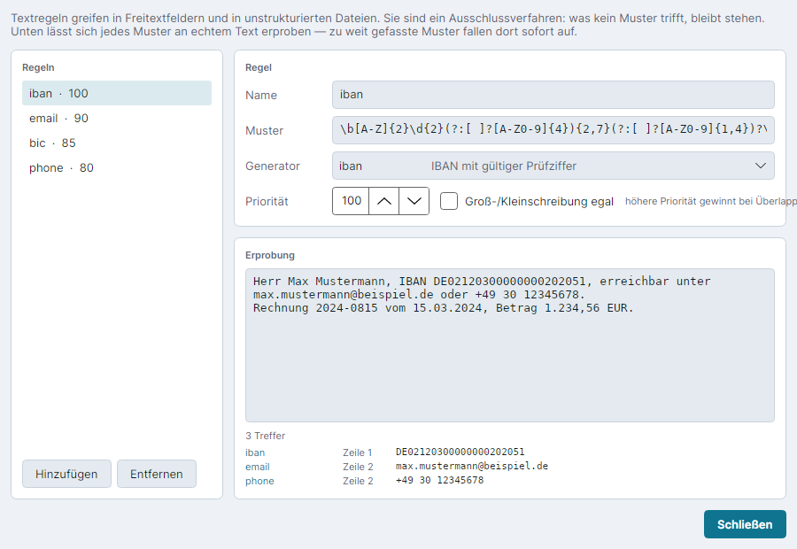
*Das Fenster „Regeln & Generatoren“, neu aufzunehmen — der Dateiname ist aus
einer Vorfassung übernommen (damals das Fenster „Textregeln“, dann
„Einstellungen“), das Bild selbst zeigt noch einen älteren Stand.*

### Ersetzungstabelle: Werte gezielt einsehen und löschen

Wie zuvor stehen Pfad, Dateirechte und die Anzahl je Namensraum oben — kein
Wert ist zu sehen, solange niemand ausdrücklich nachfragt. Neu:

- An jedem Namensraum ein Knopf **„Leeren…“**, der alle seine Einträge auf
  einmal löscht.
- Der Knopf **„Werte anzeigen“** (immer aus beim Öffnen), davor der
  Warnhinweis „Die Tabelle enthält alle Echtdaten. Nur einblenden, wenn
  niemand mitliest.“ Eingeblendet erscheinen ein Suchfeld (filtert über
  Klartext *und* Pseudonym, ohne Rücksicht auf Groß-/Kleinschreibung), eine
  Namensraum-Auswahl („alle“ oder ein bestimmter) und die Tabelle selbst,
  mit Mehrfachauswahl und dem Knopf **„Ausgewählte löschen…“**.

Vor jedem Löschen (einzeln oder „Leeren…“) eine Rückfrage: bereits erzeugte
Pseudodateien mit diesen Pseudonymen lassen sich an den betroffenen Stellen
nicht mehr zurückübersetzen; ein neuer Lauf vergibt für denselben Klartext
voraussichtlich wieder dasselbe Pseudonym, weil Salt und Berechnung
unverändert bleiben. Pseudonyme selbst lassen sich **nicht ändern**, nur
löschen — ein geändertes Pseudonym hätte mit bereits erzeugten Pseudodateien
nichts mehr zu tun. Läuft parallel ein anderer Vorgang auf derselben
Tabelle, meldet das Löschen „Die Tabelle ist gerade durch einen Lauf
gesperrt“, statt etwas zu verändern.


*Die Ersetzungstabelle, neu aufzunehmen: zeigt noch den älteren,
rein lesenden Stand ohne „Werte anzeigen“, Suche und Löschen.*

**Kurzhilfe.** Fenster mit dem Titel „Kurzhilfe“ und dem Untertitel „Das
Wichtigste in zwei Minuten“, gegliedert in sechs Karten: wofür das Programm
überhaupt da ist, samt dem Warnhinweis, dass es sich um Pseudonymisierung
und nicht um Anonymisierung handelt; was ein Profil ist und wozu es gut
ist — in der Akzentfarbe hervorgehoben, mit dem Beispiel
stammdaten.csv/buchungen.csv, dem Hinweis, dass die Reihenfolge der
bearbeiteten Dateien keine Rolle spielt, und dem tatsächlichen Ablageort
der Profile auf diesem Rechner; der Weg durch das Programm in fünf
nummerierten Schritten; die Abgrenzung zweier leicht zu verwechselnder
Wörter — „ersetzen“ im Regelbereich betrifft nur das eine gewählte Feld,
die Schaltflächen unten betreffen die ganze Datei; der Schutz der
Ersetzungstabelle, in Fehlerfarbe abgesetzt; und, falls das nicht reicht,
der Verweis auf diese Anleitung und auf `obfuskation --help`.


*Das Fenster „Kurzhilfe“: sechs Karten von „Wofür dieses Programm da ist“
bis „Wenn das nicht reicht“, mit dem tatsächlichen Ablageort der Profile.*

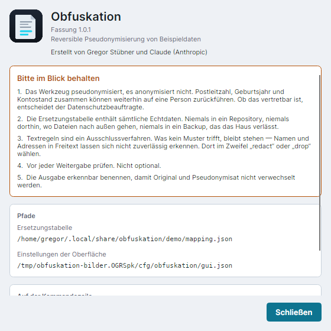
*Das Über-Fenster mit Fassung, den fünf Hinweisen und den verwendeten
Pfaden.*

**Themenumschalter.** Oben rechts, drei Zustände im Wechsel: Systemvorgabe,
Dunkel, Hell. Die Wahl merkt sich die Oberfläche zwischen zwei Starts.

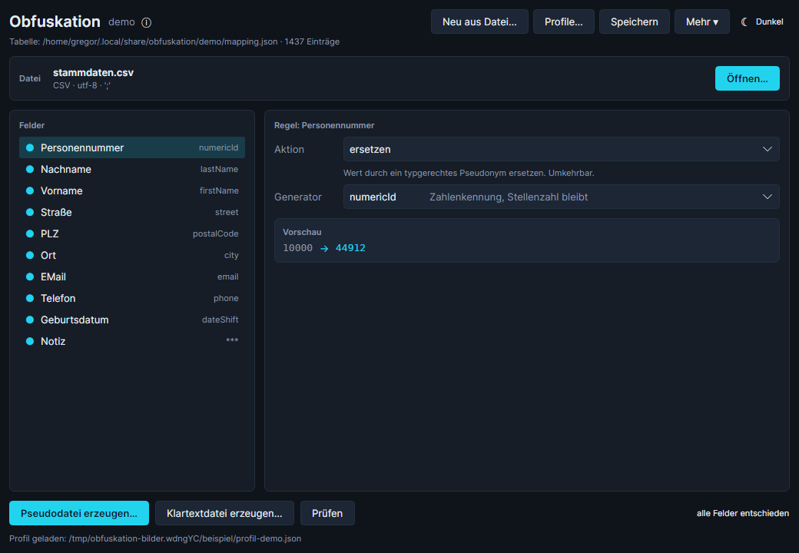
*Dunkles Thema: Vorschau und Statuspunkte bleiben lesbar, die Akzentfarbe
wechselt auf Hellblau.*

## 6. Profile verwalten

Ein Profil bündelt zwei Dinge, die zusammengehören: die Feldregeln (was mit
welcher Spalte geschieht) und den Bezug zur Ersetzungstabelle (welche
Pseudonyme dabei entstehen). Solange mehrere Dateien unter demselben Profil
laufen, bekommt derselbe Klartext überall dasselbe Pseudonym — das ist der
ganze Witz an einem Profil, und der Grund, warum es in der Kopfzeile eigens
erklärt wird (Abschnitt 5).

**Wo ein Profil liegt.** Neu angelegte Profile landen als Vorgabe unter
`~/.config/obfuskation/profile/<name>.json` — ein fester, zentraler Ort, den
die Übersicht (siehe unten) durchsuchen kann. Eine projektlokale
`obfuskation-projekt.json`, wie sie `obfuskation init` ohne weitere Angaben
anlegt, bleibt gleichwertig möglich; sie erscheint in der Übersicht über die
Zuletzt-Liste, sobald sie einmal geöffnet wurde. Eine vorhandene
`obfuskation.json` mit Profilinhalt (`profileName` oder `fields`) wird
weiterhin unter ihrem alten Namen gefunden.

### Anlegen

Der Dialog **Neues Profil** (über **Neu aus Datei…**, nach der Wahl der
Beispieldatei) fragt drei Dinge ab: den **Namen** (vorbelegt aus dem
Dateinamen der Beispieldatei, frei änderbar), eine freie **Beschreibung**
und den **Ablageort**. Der Ablageort folgt dem Namen live — wird der Name
geändert, läuft der vorgeschlagene Pfad automatisch mit —, es sei denn, über
**Anderer Ort…** wurde von Hand ein eigener Pfad gewählt; von da an folgt er
dem Namen nicht mehr. Eine Erklärzeile zeigt zusätzlich live, wo die
Ersetzungstabelle entstehen wird, denn dieser Pfad hängt am Namen und ändert
sich nicht mehr mit, sobald das Profil einmal existiert (siehe „Umbenennen“
unten).

Existiert am gewählten Ablageort bereits ein Profil, ist **Anlegen**
gesperrt — sonst ginge dessen Regelwerk kommentarlos verloren. Es bleiben
zwei Wege: **Stattdessen öffnen** lädt das vorhandene Profil, oder Name
beziehungsweise Ort werden geändert. Ein Klick auf **Anlegen** speichert das
neue Profil sofort — es hat damit von Anfang an einen Pfad, erscheint in der
Übersicht, und die Feldregeln stehen weiterhin alle auf „offen“, bis sie
durchgegangen werden (Abschnitt 4, Schritt 2).

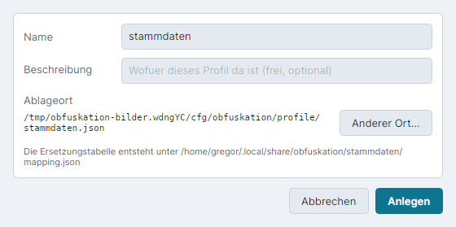
*Der Anlegen-Dialog: Name, Beschreibung, Ablageort mit Erklärzeile zur
Ersetzungstabelle.*

### Übersicht

Die Schaltfläche **Profile…** in der Kopfzeile öffnet das Fenster
**Profile**: alle Profile aus dem zentralen Ordner, dazu die zuletzt
geöffneten und die im Nutzungs-Index gemerkten. Die drei Spaltenköpfe
**Name**, **Zuletzt benutzt** und **Geändert** sind Sortierschaltflächen —
ein Klick sortiert danach, ein zweiter Klick dreht die Richtung um; die
Wahl bleibt über einen Neustart hinweg gemerkt. Das Suchfeld darüber filtert
über Name, Beschreibung und die Pfade der zugehörigen Dateien. Zur
ausgewählten Zeile zeigt eine Detailzeile darunter den vollen Pfad, die
Ersetzungstabelle samt Anzahl der Einträge und die zuletzt bearbeiteten
Dateien.

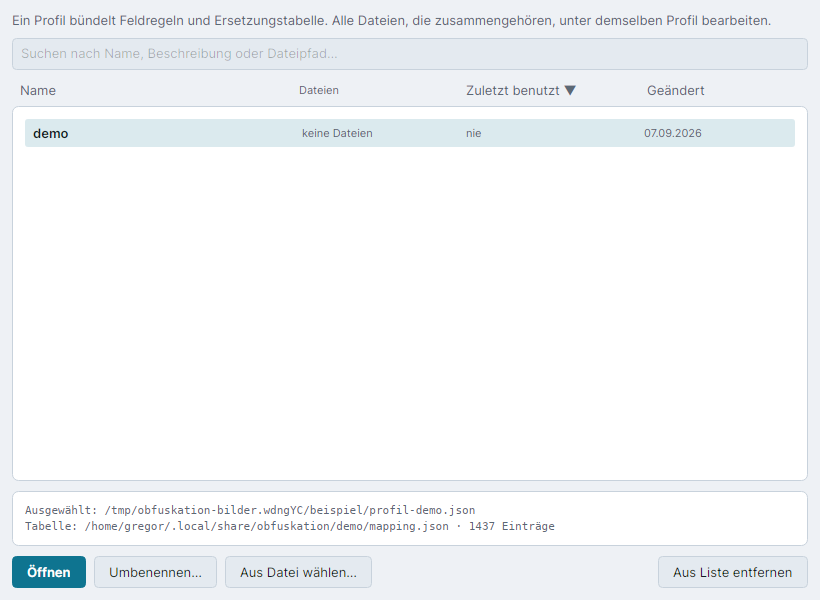
*Die Profilübersicht: sortierbare Liste, Suchfeld und Detailzeile zum
ausgewählten Profil.*

Ein Profil, das sich nicht laden lässt (kaputtes JSON, gelöschte Datei),
erscheint in Fehlerfarbe mit der Meldung im Klartext; **Öffnen** ist dafür
abgeblendet, **Aus Liste entfernen** bleibt möglich. Über **Aus Datei
wählen…** lässt sich außerdem, wie bisher, ein Profil über einen
gewöhnlichen Dateidialog öffnen — etwa eines, das (noch) nicht im zentralen
Ordner liegt.

**Aus Liste entfernen** blendet den Eintrag **dauerhaft** aus der Übersicht
aus — die Profildatei selbst bleibt dabei unangetastet. Der Grund für diese
Schaltfläche liegt im sogenannten Nutzungs-Index (`profil-index.json` im
Konfigurationsverzeichnis): er merkt sich, welche Datendateien zuletzt unter
welchem Profil bearbeitet wurden, damit die Übersicht überhaupt etwas zum
Anzeigen hat. Dort stehen ausschließlich **Pfade**, nie Inhalte oder Werte
aus den bearbeiteten Dateien — ein Pfad kann aber schon für sich verraten,
woran gearbeitet wurde. Wer das nicht möchte, blendet den betreffenden
Eintrag einfach über diese Schaltfläche aus; an der Datei selbst ändert
sich dadurch nichts, und der zentrale Profilordner wird bei jedem Aufbau
der Übersicht weiterhin vollständig durchsucht — ohne dieses dauerhafte
Ausblenden käme ein entfernter Eintrag darüber sofort zurück, nur ohne
seine Nutzungsdaten. Über **Aus Datei wählen…** lässt sich ein ausgeblendetes
Profil jederzeit wieder erreichen.

**Profil löschen…** geht einen Schritt weiter und entfernt die Profildatei
**endgültig** von der Platte. Eine Rückfrage sagt vorab ausdrücklich, dass
die zugehörige Ersetzungstabelle sämtliche Echtwerte enthält und ihr
Verlust den Rückweg zu den Originaldaten unmöglich macht; zur Wahl stehen
**Nur Profil** und **Profil und Tabelle**. Das gerade im Hauptfenster
geöffnete Profil lässt sich auf diesem Weg nicht löschen — die laufende
Sitzung würde sonst mit einer verschwundenen Datei weiterarbeiten.

### Umbenennen

**Umbenennen…** in der Übersicht öffnet zunächst eine Rückfrage, die genau
sagt, was geschieht, bevor irgendetwas passiert: die Ersetzungstabelle
bleibt unter ihrem bisherigen Pfad stehen und behält **alle** Einträge —
ein Umbenennen erzeugt also keine neuen Pseudonyme und macht keine
bestehenden ungültig. Nur der Profilname selbst ändert sich, und zwar an
zwei Stellen zugleich: im Profil und, falls die Tabelle schon existiert,
auch in ihr — ohne diesen zweiten Schritt würde jeder folgende Lauf mit der
Meldung „Der Mapping-Store gehört zum Profil …“ warnen, weil Profilname und
der in der Tabelle hinterlegte Name dann auseinanderliefen.

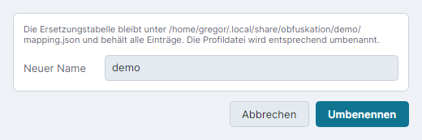
*Die Rückfrage vorm Umbenennen: sagt vorab, dass die Ersetzungstabelle
unverändert bleibt.*

Liegt die Profildatei im zentralen Ordner **und** trug ihr Dateiname bislang
den alten Profilnamen, wird sie passend mitbenannt. In zwei Fällen bleibt
der Dateiname dagegen unangetastet und nur der Name *im* Profil ändert
sich: wenn die Datei nicht im zentralen Ordner liegt (etwa eine
projektlokale `obfuskation-projekt.json`), oder wenn der neue Name im zentralen
Ordner bereits einer anderen Datei gehört — in diesem Fall würde ein
Mitbenennen sonst ein fremdes Profil überschreiben. Ist das gerade im
Hauptfenster geöffnete Profil betroffen, zieht die laufende Sitzung
automatisch nach.

### Ungespeicherte Änderungen

Sowohl das Schließen des Fensters als auch ein Profilwechsel — über
**Profile…**, **Neu aus Datei…** oder das Öffnen eines anderen Profils aus
der Übersicht — fragen nach, falls das gerade geladene Profil noch
ungespeicherte Änderungen hat. Die Rückfrage bietet drei Wege: **Speichern**
sichert zuerst und macht danach weiter, **Verwerfen** wirft die Änderungen
weg, **Abbrechen** hält am bisherigen Zustand fest, ohne dass irgendetwas
geschieht. Ohne bewusste Wahl (etwa beim Schließen über die Titelleiste)
gilt die vorsichtige Richtung: wie **Abbrechen**, nie wie **Verwerfen**.


*Die Rückfrage bei ungespeicherten Änderungen: Speichern, Verwerfen oder
Abbrechen.*

## 7. Behandlungen und Generatoren

Jedes Feld bekommt genau eine Behandlung:

| Behandlung | Wirkung | Umkehrbar |
|---|---|:--:|
| ersetzen (`pseudonymize`) | Wert durch ein typgerechtes Pseudonym ersetzen | ja |
| durchlassen (`passthrough`) | Wert unverändert übernehmen | — |
| Freitext durchsuchen (`scanText`) | Inhalt mit Textregeln durchsuchen und Treffer ersetzen | ja |
| schwärzen (`redact`) | durch `***` ersetzen | **nein** |
| Feld entfernen (`drop`) | Feld ganz aus der Ausgabe entfernen | **nein** |
| offen (`error`) | Entscheidung fehlt, Lauf bricht ab | — |

**Wann welche Wahl richtig ist:** „ersetzen“ für alles mit erkennbarem
Personen- oder Sachbezug und festem Format — Namen, Kontonummern, IBAN,
E-Mail. „durchlassen“ nur für Werte ohne Personenbezug, die für die
Auswertung gebraucht werden, etwa Beträge. „schwärzen“ oder „Feld
entfernen“, wenn der Inhalt nicht gebraucht wird oder sich nicht
zuverlässig erkennen lässt. „Freitext durchsuchen“ ist die Ausnahme, nicht
die Regel — dazu jetzt das Lehrbeispiel.

Generatoren stehen zur Auswahl, sobald ein Feld auf „ersetzen“ steht:

| Generator | Ergebnis |
|---|---|
| `personName`, `firstName`, `lastName` | Namen aus eingebetteten deutschen Wortlisten |
| `companyName` | Firmenname mit Rechtsform |
| `iban` | Ländercode und Länge des Originals, Prüfziffer nach ISO 7064 korrekt |
| `bic` | gültiges BIC-Format |
| `email` | Adresse unter `example.invalid` (per RFC 2606 reserviert) |
| `phone` | Ziffern ersetzt, Gliederung des Originals erhalten |
| `numericId` | Stellenzahl erhalten, führende Nullen bleiben |
| `dateShift` | alle Daten um denselben Betrag verschoben — Reihenfolge und Abstände bleiben |
| `dateRange` | zufälliges Datum aus einem Zeitraum; ohne Angabe bleibt das Kalenderjahr des Originals erhalten |
| `dateGeneralize` | auf Monats-, Quartals- oder Jahresanfang gerundet — **nicht umkehrbar** |
| `pattern` | Wert nach Zeichenmaske, ohne Angabe formaterhaltend aus dem Original abgeleitet — Einzelheiten in Kapitel 11 |
| `expression` | Wert nach einem RegEx-ähnlichen Ausdruck, etwa ein KFZ-Kennzeichen — Einzelheiten in Kapitel 11 |
| `wordlist` | Wert aus einer eigenen Werteliste |
| `partialMask` | teilweise maskiert, Anfang und Ende bleiben sichtbar — **nicht umkehrbar** |
| `street`, `city`, `postalCode` | Anschriftsbestandteile aus Wortlisten |
| `token` | generisch `TOK_A1B2C3D4` |
| `redact` | fest `***`, oder ein eigener Platzhalter für diesen Namensraum |

### Lesbare Tokens: Präfix

Für Felder, die keinem eingebauten Generator entsprechen, bleibt `token` als
generische Kennung übrig — `TOK_A1B2C3D4` sagt aber nichts darüber aus,
wofür der Wert steht. Ein Präfix schafft das:

```jsonc
"generators": {
  "artikelKategorie": { "type": "token", "prefix": "Artikelkategorie~" }
},
"fields": [
  { "match": "Artikelkategorie", "action": "pseudonymize", "generator": "artikelKategorie" }
]
```

Aus `TOK_A1B2C3D4` wird `Artikelkategorie~TOK_A1B2C3D4`. Erlaubt sind
Buchstaben, Ziffern, `_` und `-`, abgeschlossen mit `~` oder `_`, höchstens
32 Zeichen — jede Verletzung meldet die Profilprüfung als Befund. **Das
Präfix gilt nur für `token`**, weil jeder andere Generator das Format seines
Wertes trägt (eine gültige IBAN, ein verschobenes Datum); ein Präfix würde
das zerstören.

`init` schlägt für Spalten ohne passenden eingebauten Generator automatisch
einen solchen Namensraum vor — die Regel steht trotzdem auf `error`, bis ein
Mensch sie bestätigt. In der Oberfläche lässt sich das Präfix direkt an der
Regelkarte im Feld „Kennzeichnung" setzen, sobald die Behandlung auf
„ersetzen" und der Generator auf `token` (oder einen eigenen, darauf
aufbauenden Namensraum) steht.

**Drei Dinge, auf die zu achten ist:**

- **Präfix nachträglich setzen, wenn schon ein Mapping existiert:** Alte
  Einträge bleiben ohne Präfix, neue bekommen eines. Die Rückübersetzung
  funktioniert für beide, weil gegen die gespeicherten Pseudonyme
  nachgeschlagen wird — der Bestand liest sich dann aber gemischt.
  **Empfehlung: das Präfix vor dem ersten Lauf festlegen.**
- **Präfix als Datenwert:** `scan` prüft per Substring, ob Klartexte noch
  irgendwo stehen. Ist das Präfix selbst ein Wert des Bestands, gäbe es
  Fehlalarme. In der Praxis ausgeschlossen, wenn das Präfix aus dem
  Feldnamen stammt.
- **Lesbarkeit der `mapping.json`** sinkt leicht, weil die Pseudonyme das
  Präfix tragen. Akzeptabel: die Datei ist das sensibelste Artefakt und
  nicht zum Lesen gedacht.

### Lehrbeispiel: Freitext gehört auf `redact`, nicht auf `scanText`

Im Demo-Bestand steht `buchungen.csv` mit einer Spalte `Verwendungszweck`
zunächst auf `scanText` mit den Mustern für IBAN, E-Mail und Telefon. Nach
dem Ersetzen meldet `Prüfen`:

```
1112 Verdachtsfälle — die Datei nicht weitergeben, bevor sie geklärt sind.
```

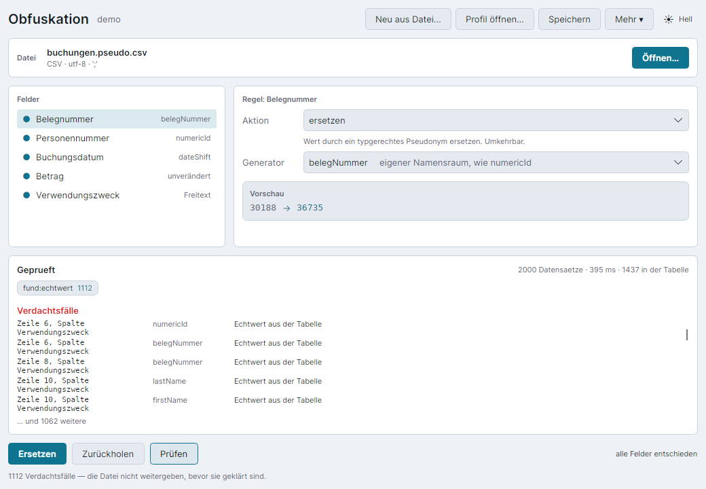
*Prüfen von `buchungen.pseudo.csv`: 1112 Verdachtsfälle, weil
Verwendungszweck auf `scanText` stand — Personennamen und Kundennummern im
Freitext blieben stehen.*

Grund: die Verwendungszwecke enthalten Sätze wie „Überweisung an Dieter
Grünwald“ — Personennamen und blanke Kundennummern erkennt kein Muster. Die
drei Muster fangen nur IBAN, E-Mail und Telefonnummer.

**Behebung:** `Verwendungszweck` auf `redact` umgestellt. Der nächste Lauf
ersetzt 2000 Datensätze ohne einen einzigen Verdachtsfall, und `Tabelle: 0
neu` bestätigt, dass dieselben Pseudonyme wie zuvor verwendet wurden — die
Verknüpfung zu den anderen Dateien bleibt bestehen. Als Faustregel: Freitext
mit möglichem Personenbezug auf `redact` oder `drop`, `scanText` nur für
Felder, in denen wirklich nur Muster wie IBAN oder E-Mail vorkommen können.

## 8. Mehrere zusammenhängende Dateien

Der übliche Fall: Stammdaten, Konten und Buchungen liegen in getrennten
Dateien und hängen über eine Personennummer zusammen. Diese Nummer muss in
allen Dateien gleich ersetzt werden, sonst zerfallen die Verknüpfungen.

**Das geschieht von selbst**, solange alle Dateien mit demselben Profil
verarbeitet werden: Profil einmal öffnen, dann die Dateien nacheinander
über **Öffnen…** hereinholen und je **Pseudodatei erzeugen…**. Das Profil
bleibt dabei geladen. Wurde das Profil über **Neu aus Datei…** mit
Mehrfachauswahl aus genau diesen Dateien angelegt (Abschnitt 4), sind sie
bereits alle bekannt und stehen sofort unter **Zuletzt ▾** bereit. Für den
ganzen Stapel auf einmal siehe **Alle ▾** in Abschnitt 5: **Alle
Pseudodateien erzeugen…** verarbeitet dann alle dem Profil bekannten,
noch vorhandenen Dateien mit einer einzigen Rückfrage.

**Die Reihenfolge, in der die Dateien geöffnet werden, spielt dabei keine
Rolle.** Der Zusammenhang hängt am Profil und an seiner Ersetzungstabelle,
nicht am Dateinamen oder daran, welche Datei zuerst hereingeholt wurde: ob
zuerst `stammdaten.csv` und dann `konten.csv` bearbeitet wird oder
umgekehrt, ändert am Ergebnis nichts — dieselbe Personennummer bekommt in
beiden Fällen dasselbe Pseudonym, weil es aus dem Klartext und dem Salt der
Tabelle abgeleitet wird, nicht aus der Reihenfolge der Läufe. „Mehrere
Dateien bearbeiten“ heißt also schlicht: Profil einmal öffnen, Dateien
nacheinander hereinholen, in beliebiger Reihenfolge.

Am Demo-Bestand: aus der Personennummer `10000` wird in `stammdaten.csv`
und in `konten.csv` übereinstimmend `04745` — derselbe Wert in beiden
Dateien, weil das Pseudonym deterministisch aus dem Klartext abgeleitet
wird. Die Formtreue bleibt dabei erhalten: die fünfstellige Nummer bleibt
fünfstellig, die Telefongliederung `(079) 5540670` bleibt als `(095)
6310059` erhalten, und das Geburtsdatum verschiebt sich überall um denselben
Betrag.

### Der Fallstrick: Belegnummer

Im Demo-Bestand kommt die Zahl `10679` zweimal vor — einmal als Belegnummer,
einmal als Personennummer. Mit demselben Generator bekämen beide dasselbe
Pseudonym und täuschten eine Verbindung vor, die es nie gab. Tatsächlich
liefert das Demo-Profil zwei verschiedene Werte:

- als Belegnummer → `04063`
- als Personennummer → `86724`

Möglich wird das durch einen eigenen Namensraum: im Profil steht unter
`generators` ein Eintrag `"belegNummer": { "type": "numericId" }`, und die
Regel für die Spalte `Belegnummer` verweist auf diesen Namen statt auf
`numericId`. In der Generatorauswahl der Oberfläche erscheint `belegNummer`
danach als eigener Eintrag, gekennzeichnet als eigener Namensraum.

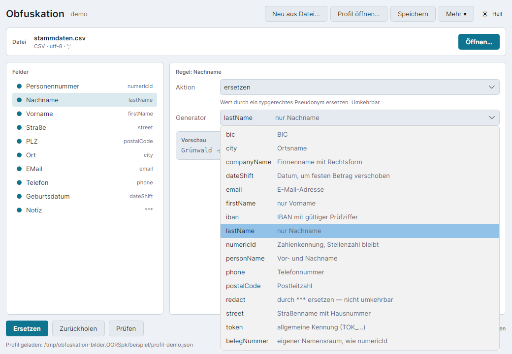
*Generatorauswahl mit dem im Profil selbst angelegten Namensraum
„belegNummer“ als letztem Eintrag.*

**Wichtig für die Rückabbildung:** `Klartextdatei erzeugen…` braucht
dasselbe Profil, weil es aus derselben Ersetzungstabelle liest. Ein anderes
Profil heißt: andere Tabelle, anderes Salt, keine Zuordnung.

## 9. Wenn etwas schiefgeht

Die folgende Tabelle sammelt die Meldungen, die bei falscher Bedienung oder
fehlerhafter Konfiguration tatsächlich beobachtet wurden. Die Meldungstexte
stammen von der Kommandozeile; die Oberfläche zeigt denselben Sachverhalt in
der Statuszeile, meist kürzer.

| Meldung (Wortlaut) | Ursache | Abhilfe |
|---|---|---|
| „Für folgende Felder steht noch keine Entscheidung fest: …“ | Mindestens ein Feld steht noch auf „offen“ | Jedes genannte Feld auf ersetzen, durchlassen, schwärzen oder entfernen stellen |
| „Ohne eigene Regel: EMail“ (Lauf läuft trotzdem durch) | `defaults.unknownField` steht auf „durchlassen“, ein Feld hat keine eigene Regel | Für das Feld eine eigene Regel anlegen; `unknownField` auf „offen“ (Vorgabe) belassen |
| „Der Mapping-Store soll unter … abgelegt werden, das liegt in einem Git-Arbeitsverzeichnis …“ | Die Ersetzungstabelle würde in ein Git-Verzeichnis geschrieben | Pfad der Ersetzungstabelle im Profil ändern (nicht `--allow-unsafe-store` setzen, außer bewusst) |
| „Der Mapping-Store wird bereits verwendet: …lock. Läuft ein anderer Vorgang, oder ist eine verwaiste Sperrdatei übrig?“ | Ein zweiter Lauf greift gleichzeitig auf dieselbe Ersetzungstabelle zu | Warten, bis der erste Lauf fertig ist; bei einer verwaisten Sperrdatei nach einem Absturz die `.lock`-Datei von Hand löschen |
| „Eingabedatei nicht gefunden: …“ | Der angegebene Pfad existiert nicht | Pfad prüfen |
| „X Verdachtsfälle. Die Datei nicht weitergeben, bevor sie geklärt sind.“ | `Prüfen` hat Restbestände gefunden | Ursache klären (siehe Lehrbeispiel Abschnitt 7); bei echtem Fund die betroffene Regel ändern, bei einem harmlosen Zufallstreffer (etwa ein Betrag, der zufällig wie eine vergebene Nummer aussieht) das Feld bei Bedarf auf `drop` stellen |
| „Das Profil „…“ hat ungespeicherte Änderungen. Speichern, bevor fortgefahren wird?“ | Fenster schließen oder Profil wechseln, während noch nicht gespeicherte Regeländerungen offen sind | Eine der drei Schaltflächen wählen: Speichern, Verwerfen oder Abbrechen (Abschnitt 6) |
| Profilzeile in Fehlerfarbe mit der Fehlermeldung im Klartext (Übersicht) | Die Profildatei ist nicht mehr lesbar — gelöscht, kein gültiges JSON, oder von Hand fehlerhaft bearbeitet | `Öffnen` ist gesperrt; entweder die Datei außerhalb reparieren oder den Eintrag über `Aus Liste entfernen` dauerhaft ausblenden (rührt die Datei selbst nicht an) |
| „Es gibt bereits ein Profil an diesem Ort.“ | Beim Anlegen ist der gewählte Name im Ablageort schon vergeben | `Anlegen` bleibt gesperrt; entweder `Stattdessen öffnen` wählen oder einen anderen Namen beziehungsweise Ort setzen |

Eine Eigenheit verdient besondere Aufmerksamkeit:

> **Eine leere Generatorauswahl bei einem eigenen Namensraum ist kein
> Fehler, der zu korrigieren wäre.** Ist einem Feld ein selbst angelegter
> Generator zugewiesen (wie `belegNummer` im Beispiel oben), kann es
> vorkommen, dass die Generatorauswahl leer erscheint, obwohl die Regel
> korrekt arbeitet — die Vorschau zeigt dann trotzdem den richtigen Wert.
> **Keinesfalls** in diesem Fall einen Generator aus der Liste auswählen:
> das würde den eigenen Namensraum aufheben und Felder wie Belegnummer und
> Personennummer könnten wieder dasselbe Pseudonym bekommen. Einzelheiten
> zur Ursache stehen in `entwicklerdokumentation.md` unter den offenen
> Befunden.

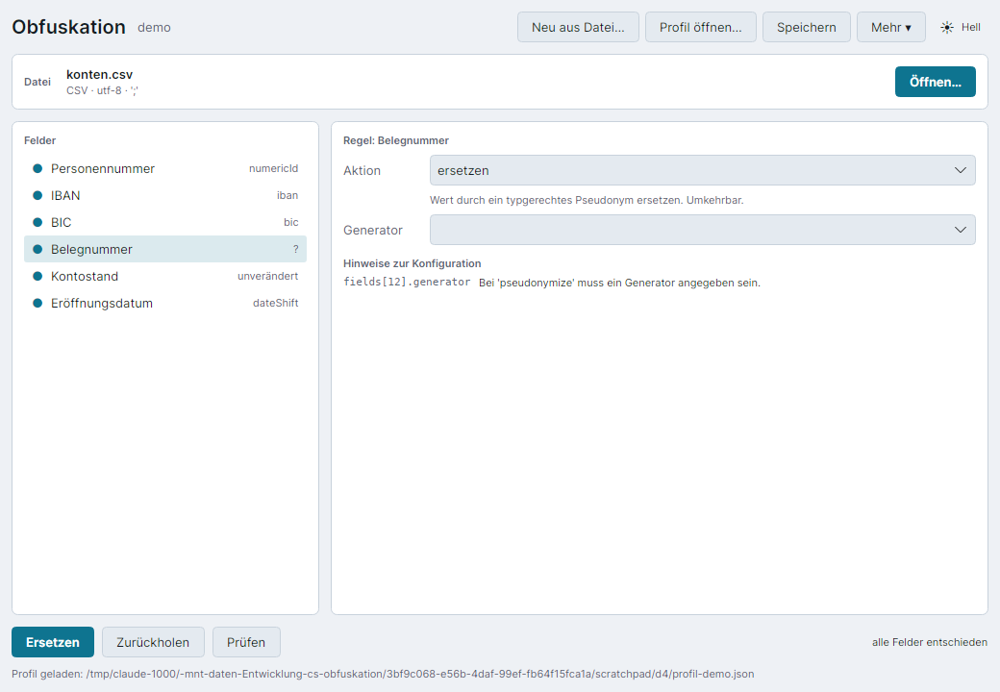
*Belegnummer korrekt auf den eigenen Namensraum „belegNummer“ gestellt
(Vorschau 13535 → 84512), die Generatorauswahl zeigt dabei nichts an.*

## 10. Für die Kommandozeile

Wer Abläufe automatisieren will, findet auf der Kommandozeile dieselbe
Bibliothek unter einer anderen Hülle — Oberfläche und Kommandozeile liefern
nachweislich dasselbe Ergebnis (siehe `entwicklerdokumentation.md`,
Abschnitt „Überblick“). Sieben Befehle:

```
obfuskation init [--profile <name>] [--from <datei>] [--description <text>]
                 [--central] [--force]
obfuskation obfuscate <datei> [-o <ziel>] [--strict] [--dry-run] [--json]
obfuskation deobfuscate [<datei>] [-o <ziel>] [--json]
obfuskation scan <datei> [--json]
obfuskation mapping list|path
obfuskation profile list [--sort name|used|changed] [--json]
obfuskation extensions list|path
```

**`--config` nimmt jetzt auch einen bloßen Profilnamen entgegen**, nicht
mehr nur einen Dateipfad: `--config demo` sucht zuerst wörtlich nach einer
Datei namens `demo`, und — findet sich keine, enthält der Wert kein
Verzeichnistrennzeichen und endet nicht auf `.json` — anschließend unter
`~/.config/obfuskation/profile/demo.json`, also demselben Ort, an dem die
Oberfläche zentral abgelegte Profile erwartet. Ein Pfad mit Trennzeichen
oder mit der Endung `.json` wird weiterhin ausschließlich wörtlich
genommen. Damit lässt sich ein zentral abgelegtes Profil von der
Kommandozeile aus genauso ansprechen wie in der Oberfläche:

```fish
obfuskation obfuscate stammdaten.csv -o stammdaten.pseudo.csv --config demo
```

**`obfuskation profile list`** zeigt alle bekannten Profile — den zentralen
Ordner sowie die im Nutzungs-Index gemerkten —, je Zeile Name, Anzahl der
zugehörigen Dateien, wann das Profil zuletzt benutzt und wann es zuletzt
geändert wurde, sowie den vollen Pfad. Die Zuletzt-Liste der Oberfläche
(`gui.json`) wird dabei bewusst nicht gelesen: die Kommandozeile kennt den
Begriff „zuletzt in der Oberfläche geöffnet“ nicht, nur den plattform- und
programmübergreifenden Nutzungs-Index. `--sort` wählt die Sortierung
(Vorgabe: nach Namen), `--json` liefert dieselbe Liste maschinenlesbar auf
der Standardausgabe.

**`obfuskation extensions list`** zeigt die Schlüssel der
Erweiterungsdatei, ihren Basistyp und die Namen ihrer Textregeln und
Spaltenmuster, Muster eingeschlossen — anders als bei der Ersetzungstabelle
sind das keine Echtdaten, nur Konfiguration. Zusätzlich nennt der Befehl,
welcher der beiden Fundorte greift. **`obfuskation extensions path`** zeigt
diesen Ort, oder beide geprüften Orte, wenn keiner eine Datei hergibt. Die
Option **`--no-extensions`** lässt einen Lauf ohne die Erweiterungsdatei
arbeiten, etwa zur Fehlersuche oder für ein Ergebnis, das unabhängig von
der lokalen Konfiguration des Rechners reproduzierbar bleibt. Einzelheiten
und das Inventarnummer-Rezept in Kapitel 11.

**`obfuskation init --central`** legt das Regelgerüst nicht mehr als
`obfuskation-projekt.json` im aktuellen Verzeichnis an, sondern direkt am zentralen
Ablageort — demselben, den auch der Anlegen-Dialog der Oberfläche
vorschlägt — und meldet danach den vollständigen Zielpfad. `--description`
setzt gleich die freie Beschreibung, die auch die Oberfläche in der
Profilübersicht und der Kopfzeile anzeigt:

```fish
obfuskation init --profile demo --from stammdaten.csv --description "Q3-Stammdaten" --central
```

Rückgabewerte:

| Wert | Bedeutung |
|---|---|
| 0 | Erfolg |
| 1 | allgemeiner Fehler |
| 2 | Konfiguration fehlt oder ist fehlerhaft |
| 3 | Feld ohne Regel im strengen Modus |
| 4 | `scan` hat Verdachtsfälle gefunden |
| 5 | Ersetzungstabelle widersprüchlich oder gesperrt |

Ein Beispiel mit echten Zahlen — die Antwort einer KI von der
Standardeingabe zurückübersetzen:

```fish
cat antwort-der-ki.txt | obfuskation deobfuscate --config profil-demo.json
```

Vollständige Beschreibung der Befehle, Optionen und Rückgabewerte in
`entwicklerdokumentation.md`, Abschnitt „Rückgabewerte der CLI“.

---

## 11. Eigene Muster (Erweiterungsdatei)

Wer in einem festen Umfeld arbeitet, hat oft wiederkehrende hauseigene
Muster: interne Inventarnummern, Ticketnummern, eigene Kennungen, und dazu, welche
Spalte welchen Generator braucht. Diese Muster gehören weder in ein Profil,
das eventuell weitergegeben wird, noch sollen sie in jedem neuen Profil
erneut eingetippt werden. Dafür gibt es die **Erweiterungsdatei**,
`obfuskation.json`, gesucht an einem von zwei festen Orten — in dieser
Reihenfolge, die zuerst gefundene Datei gilt vollständig:

1. neben der laufenden Programmdatei
2. `~/.config/obfuskation`

Sie fließt beim Start automatisch in jedes Profil ein, wird aber **nie** in
eine Profildatei zurückgeschrieben — eine Änderung an der Erweiterungsdatei
betrifft also nie den Inhalt eines Profils.

Die Datei darf von Hand mit `//`- und `/* */`-Kommentaren versehen werden —
seit dieser Fassung wirken sie auch tatsächlich (vorher wurde eine
kommentierte Datei fälschlich für ein Profil gehalten und stillschweigend
übergangen, ihre Muster griffen dann nie; `obfuskation extensions path`
zeigte dazu „dort liegt ein Profil, übergangen“). Ist die Datei dagegen
wirklich kaputt (ungültiges JSON), meldet das Programm jetzt einen klaren
Fehler mit Pfad, statt die Datei ebenso still zu übergehen — in der Kommandozeile
mit dem Konfigurationsfehler-Exitcode, in der Oberfläche als Sperre mit der
Fehlermeldung in der Kopfzeile von „Regeln & Generatoren“.

Bearbeiten lässt sie sich seit Fassung 1.8.0 auch ohne Texteditor, im Reiter
„Textregeln“, „Eigene Generatoren“ bzw. „Spalten-Vorschläge“ von **„Regeln &
Generatoren“** (Kapitel 5), erkennbar an „Alle Projekte“ bzw. dem 🔒.
Wer eine globale Regel ändern darf, ergibt sich allein aus Ablageort und
Schreibrecht: Geschrieben wird immer nur die geltende Datei selbst — liegt
sie neben der Programmdatei und ist dort schreibgeschützt (etwa bei einer
Installation aus einem Paket), bleiben die globalen Regeln gesperrt, mit der
Ursache in der Sperrleiste und im Reiter „Ablageort“, statt heimlich eine
zweite Datei im Konfigurationsordner anzulegen, die beim nächsten Start
ohnehin nicht gelesen würde. Dasselbe gilt, wenn die Datei zwar selbst
beschreibbar ist, ihr Ordner aber nicht — dort ließe sich weder die
Zwischendatei noch eine nötige Sicherungskopie anlegen.

### Aufbau der Datei: alle Einträge

Die Datei hat vier Einträge auf oberster Ebene. Die Spalte „Oberfläche“
nennt, ob sich ein Wert in **„Regeln & Generatoren“** einstellen lässt;
„nur Datei“ heißt: nur mit einem Texteditor.

| Eintrag | Bedeutung | Oberfläche |
|---|---|---|
| `version` | Format der Datei, derzeit immer `1` | – |
| `generators` | eigene Generatoren; der Schlüssel ist ihr Name | Reiter „Eigene Generatoren“ |
| `textRules` | Regeln, die Werte im Freitext finden | Reiter „Textregeln“ |
| `fieldRules` | Spalten-Vorschläge anhand des Spaltennamens | Reiter „Spalten-Vorschläge“ |

**Generatoren (`generators`).** Der Schlüssel eines Eintrags ist zugleich
sein Namensraum in der Ersetzungstabelle: Zwei Generatoren derselben Art
unter verschiedenen Namen vergeben voneinander unabhängige Pseudonyme.
`type` nennt die Grundlage, also einen eingebauten Generator. Fehlt `type`
oder gleicht er dem Schlüssel, ist der Schlüssel selbst die Grundlage — ein
Eintrag wie `"email": { "domain": "firma.test" }` stellt so den eingebauten
Generator „email“ für alle Projekte um: Er gilt überall, wo „email“ gewählt
ist. Eine solche Umstellung lässt sich im Reiter „Eigene Generatoren“
bearbeiten und entfernen (Entfernen setzt dabei nur den eingebauten
Generator auf seine Vorgaben zurück); **anlegen** geht weiterhin nur in der
Datei, der Generator-Dialog lässt beim Anlegen keinen eingebauten Namen zu.

| Eintrag | gilt für | Bedeutung, Vorgabe | Oberfläche |
|---|---|---|---|
| `type` | alle | Grundlage, siehe oben | ja für die zwölf einstellbaren Arten; `numericId`, `firstName` und die übrigen nur Datei |
| `prefix` | `token` | Kennzeichnung vor dem Pseudonym, etwa `FW~`; endet auf `~` oder `_`, höchstens 32 Zeichen (Kapitel 7) | ja |
| `placeholder` | `redact` | eigener Ersatztext; ohne Angabe gilt der Platzhalter des Projekts (`***`) | ja |
| `from`, `to` | `dateRange` | Zeitraum, beide oder keiner, als JJJJ-MM-TT; ohne Angabe bleibt das Kalenderjahr des Originals | ja |
| `granularity` | `dateGeneralize` | `month`, `quarter` oder `year`; Vorgabe `month` | ja |
| `pattern` | `pattern` | Zeichenmaske (unten); ohne Angabe aus dem Original abgeleitet | ja |
| `values` | `wordlist` | Werteliste, Pflicht; unter fünf Werten warnt die Prüfung | ja |
| `keepFirst`, `keepLast` | `partialMask` | sichtbare Zeichen am Anfang bzw. Ende; stehen beide auf 0, bleiben die letzten vier sichtbar | ja |
| `maskChar` | `partialMask` | Maskierungszeichen, genau ein Zeichen; Vorgabe `*` | ja |
| `expression`, `tables` | `expression` | Ausdruck und Tabellen (unten) | ja |
| `maxDays` | `dateShift` | höchste Verschiebung in Tagen, 1 bis 36 500; Vorgabe 400. Nachträglich geändert, lassen sich ältere Pseudodateien nicht mehr zurückführen (Kapitel 5) | ja |
| `formats` | `dateShift`, `dateRange`, `dateGeneralize` | zusätzliche Datumsformate, etwa `["dd.MM.yy"]`; sie werden vor den eingebauten geprüft | ja, Block „Eigene Datumsformate“ |
| `country` | `iban`, `bic` | Ländercode für Originale ohne erkennbaren Ländercode; Vorgabe `DE` | ja, Block „Land“ |
| `domain` | `email` | Domain der erzeugten Adressen; Vorgabe `example.invalid` | ja, Block „Domain“ |

Eine Option an der falschen Grundlage — etwa `values` an einem
`pattern`-Generator, oder `country` an einem `token` — meldet die Prüfung
als Fehler.

**Textregeln (`textRules`).**

| Eintrag | Bedeutung, Vorgabe | Oberfläche |
|---|---|---|
| `name` | Bezeichnung, erscheint in der Fundliste; eine Projektregel gleichen Namens verdrängt in ihrem Projekt die Regel für alle Projekte | ja |
| `pattern` | Suchausdruck (regulärer Ausdruck) | ja — „Alles dieser Form“, „Genau dieser Wert“ oder „Eigener Ausdruck“ |
| `generator` | Generator für die Treffer; Vorgabe `token` | ja, „Ersetzen durch“ |
| `priority` | bei überlappenden Treffern gewinnt der höhere Wert; Vorgabe 50, neue Regeln aus der Oberfläche bekommen 60 | ja, unter „Erweitert“ |
| `ignoreCase` | Groß-/Kleinschreibung egal; Vorgabe `false` | ja, unter „Erweitert“ |
| `captureGroup` | nur diese Gruppe des Treffers ersetzen, `0` heißt der ganze Treffer — so bleibt etwa ein vorangestelltes „IBAN:“ stehen | ja, unter „Erweitert“, Feld „Ersetzte Gruppe“ |

**Spalten-Vorschläge (`fieldRules`)**, Einzelheiten weiter unten:

| Eintrag | Bedeutung, Vorgabe | Oberfläche |
|---|---|---|
| `pattern` | regulärer Ausdruck für den **ganzen** Spaltennamen | ja |
| `generator` | vorgeschlagener Generator, oder `scanText` für Freitext | ja |
| `ignoreCase` | Groß-/Kleinschreibung egal; Vorgabe `true`, anders als bei Textregeln | ja |
| `comment` | Notiz ohne Wirkung | ja |

Die erste passende Regel gewinnt; die Reihenfolge lässt sich in der
Oberfläche verschieben.

**Nur mit dem Texteditor** gehen damit noch: Generatoren auf Basis der neun
übrigen, nicht einstellbaren Arten (etwa ein eigener Namensraum mit
`"type": "numericId"` oder `"type": "firstName"`), und das **Anlegen** einer
Umstellung eines eingebauten Generators über seinen Namen — Bearbeiten und
Entfernen gehen jetzt im Reiter „Eigene Generatoren“.

**Vorgabewerte in der Datei.** Die Oberfläche speichert nur, was jemand
tatsächlich eingestellt hat: `maxDays`, `keepFirst`, `keepLast`,
`captureGroup` und `ignoreCase` stehen nur dann in der Datei, wenn ihr Wert
von der Vorgabe abweicht. Eine ältere Datei mit `"maxDays": 400` oder
`"ignoreCase": false` an jedem Eintrag wird beim nächsten Speichern aus der
Oberfläche entsprechend aufgeräumt — die Werte wirken unverändert weiter,
nur ihre Erwähnung verschwindet. Kommentare in der Datei gehen beim
Speichern aus der Oberfläche verloren; vorher legt sie eine Sicherungskopie
`obfuskation.json.bak` an.

### Was eine Maske ist

Der Generator `pattern` erzeugt Werte nach einer **Zeichenmaske**: `A` steht
für einen Großbuchstaben, `a` für einen Kleinbuchstaben, `9` für eine
Ziffer, `X` für ein beliebiges alphanumerisches Zeichen, und `\` schützt das
folgende Zeichen davor, als Platzhalter gelesen zu werden — es bleibt dann
wörtlich stehen. Alles andere in der Maske bleibt ohnehin wörtlich stehen.
Ohne gesetzte Maske leitet der Generator sie selbst aus dem Original ab
(Ziffer → `9`, Großbuchstabe → `A`, Kleinbuchstabe → `a`, Rest wörtlich) —
dann ist er ein allgemeiner, formaterhaltender Ersatz etwa für Vertrags-,
Beleg- oder Auftragsnummern, ohne dass dafür eine eigene Maske nötig wäre.

### Ausdruck: Werte nach Muster mit eigenen Tabellen

Reicht eine Zeichenmaske nicht — weil zum Beispiel je nach Stelle
verschieden viele Zeichen stehen dürfen, oder ein Teil des Werts aus einer
festen Liste kommen soll —, erzeugt der Generator `expression` Werte nach
einem **Ausdruck**, angelehnt an reguläre Ausdrücke (RegEx), aber nur zum
**Erzeugen** gedacht, nicht zum Suchen. Ein Tabellenverweis darin lautet
`{name}` und schlägt in einer eigenen Tabelle nach, die im selben
`generators`-Eintrag unter `tables` steht — der Generator ist damit in sich
vollständig und lässt sich samt seinen Tabellen unverändert in ein anderes
Projekt übernehmen.

| Schreibweise | Bedeutung |
|---|---|
| `x` | wörtliches Zeichen |
| `\x` | ein Sonderzeichen wörtlich, etwa `\.`, `\{`, `\\` |
| `\d` | eine Ziffer |
| `[A-Z0-9ÄÖÜ]` | ein Zeichen aus der angegebenen Menge, Bereiche mit `-` |
| `(a\|b)`, `(?:…)` | eine der Alternativen |
| `{2}`, `{2,3}` | genau 2-mal, bzw. 2- bis 3-mal — höchstens 64 |
| `?` | kann fehlen (entspricht `{0,1}`) |
| `{kreis}` | ein Wert aus der Tabelle „kreis“ |

Nicht unterstützt sind `*`, `+` (unbegrenzt — stattdessen `{n,m}` mit fester
Obergrenze) und `.` für ein beliebiges Zeichen (stattdessen eine Klasse wie
`[A-Z0-9]`). Ein fehlerhafter Ausdruck meldet die Stelle im Text, an der das
Problem beginnt.

Am Beispiel eines KFZ-Kennzeichens (1–3 Zeichen aus einer Tabelle für
Kreis/Stadt, zwei zufällige Buchstaben, 2 oder 3 Ziffern, optional ein „E“
für Elektrofahrzeuge):

```json
"kfz": { "type": "expression", "expression": "{kreis}-[A-Z]{2} \\d{2,3}E?",
         "tables": { "kreis": ["B", "HH", "M"] } }
```

Der Rückwärtsschrägstrich ist in JSON doppelt zu schreiben. Im
Generator-Dialog (siehe oben) steht dieselbe Schreibweise-Tabelle immer
sichtbar unter dem Eingabefeld, dazu der Knopf „Beispiel einsetzen ▾“ mit
drei vorgefertigten Ausdrücken (KFZ-Kennzeichen, Kundennummer,
Artikelnummer) und eine Verwaltung der Tabellen, die auf eine im Ausdruck
verwendete, aber noch nicht angelegte Tabelle mit einem Knopf „Anlegen“
hinweist.

### Rezept: ein eigener Namensraum für ein hauseigenes Muster

Für einen Wert wie `FW123456`, der als Textregel gelten soll, übernimmt
seit dieser Fassung „Immer ersetzen…“ (Kapitel 1) alle Schritte dieses
Rezepts — Muster ableiten, Namensraum mit Präfix anlegen, in die
Erweiterungsdatei schreiben — geführt und ohne Texteditor. Das Rezept hier
bleibt für die Fälle, die dieser Dialog nicht abdeckt: Spaltenmuster
(`fieldRules`) und ein Generator, dessen Feinheiten über Präfix und Form
eines Beispielwerts hinausgehen.

Am Beispiel einer internen Inventarnummer der Form `INV123456` (drei feste
Buchstaben, sechs Ziffern), die sowohl in einer eigenen Spalte als auch im
Fließtext vorkommen kann:

1. **Erweiterungsdatei anlegen oder öffnen**, entweder neben der
   Programmdatei oder unter `~/.config/obfuskation/obfuskation.json`, mit
   einem beliebigen Texteditor.
2. **Generator und Textregel eintragen:**

   ```jsonc
   {
     "version": 1,
     "generators": {
       "assetTag": { "type": "pattern", "pattern": "INV999999" }
     },
     "textRules": [
       { "name": "assetTag", "priority": 95, "pattern": "\\bINV\\d{6}\\b", "generator": "assetTag" }
     ]
   }
   ```

   Ein lauffähiges (aber inhaltlich harmloses) Beispiel derselben Form liegt
   unter `docs/beispiel/obfuskation-erweiterung-beispiel.json` — Inhalt
   anpassen und an einen der beiden Fundorte kopieren, dort schlicht als
   `obfuskation.json`.
3. **Spalte zuweisen — von Hand oder automatisch:** Ein Feld wie
   `Zielsystem` auf „ersetzen“ mit dem Generator `assetTag` stellen. In der
   Generatorauswahl erscheint er mit dem Zusatz „— aus der
   Erweiterungsdatei", damit erkennbar bleibt, dass er nicht im Profil
   selbst steht. Trägt die Erweiterungsdatei zusätzlich eine passende
   `fieldRules`-Regel ein (siehe unten), schlägt `init` bzw. „Muster
   erkennen…" diesen Generator für ein so benanntes Feld von selbst vor.
4. **Freitext zuweisen:** Ein Feld wie `Bemerkung`, das denselben Inventarnummern
   auch im Fließtext enthalten kann, auf „Freitext durchsuchen" stellen. Die
   Textregel `assetTag` aus der Erweiterungsdatei wirkt dort automatisch
   mit, ohne dass sie im Profil aufgeführt werden müsste.
5. **Ergebnis:** Spalte und Freitext liefern für denselben Klartext dasselbe
   Pseudonym (gleicher Namensraum `assetTag`), weil beide auf denselben
   Eintrag der Erweiterungsdatei zurückgreifen. `Prüfen` meldet nichts, und
   `Klartextdatei erzeugen…` stellt den ursprünglichen Inventarnummern an beiden
   Stellen wieder her.

### Spaltenmuster: `fieldRules`

Zusätzlich zu Generatoren und Textregeln kann die Erweiterungsdatei einen
Abschnitt `fieldRules` tragen — Regeln, die nicht auf den Feldinhalt,
sondern auf den **Feldnamen** selbst zielen:

```jsonc
"fieldRules": [
  { "pattern": "zielsystem|assetTag", "generator": "assetTag" },
  { "pattern": ".*iban.*",            "generator": "iban" },
  { "pattern": "bemerkung|notiz",     "generator": "scanText" }
]
```

Jede Regel prüft `pattern` (ein regulärer Ausdruck, ohne Rücksicht auf
Groß-/Kleinschreibung, sofern nicht mit `"ignoreCase": false` abgeschaltet)
gegen den **ganzen** Feldnamen — ein Teiltreffer zählt nicht, `"nr"` trifft
also nicht mehr mitten in `Firmenname`. `generator` nennt einen eingebauten
Generator, einen eigenen aus dem `generators`-Abschnitt derselben Datei,
oder den Sonderwert `scanText` für ein Feld, das als Freitext durchsucht
werden soll. Die erste passende Regel gewinnt, die Reihenfolge in der Datei
entscheidet.

### Der Knopf »Muster erkennen…«

Neben der Feldliste im Hauptfenster steht die Schaltfläche **»Muster
erkennen…«**. Sie öffnet einen Dialog, der für jedes noch offene Feld in
zwei Stufen nach einem Vorschlag sucht: zuerst, ob die tatsächlichen
Beispielwerte vollständig auf ein bekanntes Muster passen — die
eingebauten Standardmuster **und** alle Muster aus der Erweiterungsdatei
(`ValueSuggester`); trifft keines, ob der Feldname selbst einer
`fieldRules`-Regel der Erweiterungsdatei entspricht. Findet sich so ein
Vorschlag, erscheint eine Zeile mit Feldname, vorgeschlagenem Generator und
— bei einem Werte-Treffer — dem Beispielwert, der ihn belegt, dazu ein
Häkchen.

**Vorbelegt sind ausschließlich Felder, die noch auf „offen" stehen.** Ein
bereits entschiedenes Feld wird nie ohne ausdrückliches Zutun überschrieben
— das zugehörige Häkchen ist dafür von vornherein leer. **»Übernehmen«**
setzt bei den angehakten Zeilen die Aktion auf „ersetzen" und den
vorgeschlagenen Generator; das Profil gilt danach als ungespeichert
verändert, wie nach jeder anderen Regeländerung auch.

Findet der Dialog keinen einzigen Vorschlag, sagt er das ausdrücklich und
verweist auf die Erweiterungsdatei — das ist typischerweise der Moment, in
dem auffällt, dass ein hauseigenes Muster dort noch fehlt. **Ohne
Erweiterungsdatei entfällt die zweite Stufe vollständig: das Programm rät
nicht mehr von sich aus am Spaltennamen** — anders als bis einschließlich
Fassung 1.5.0, die rund dreißig fest einkompilierte Namensfragmente
automatisch und mit mäßiger Treffsicherheit prüfte (`"nr"` traf auch in
`Firmenname`). Wer dieses frühere Verhalten zurückhaben möchte, kopiert
`docs/beispiel/obfuskation-erweiterung-beispiel.json` — die frühere Liste,
als `fieldRules` geschrieben — an einen der beiden Fundorte und passt sie
an den eigenen Datenbestand an.

### Fallstricke

- **Buchstaben `A`, `a`, `X`, `9` im wörtlichen Teil einer Maske müssen mit
  `\` geschützt werden.** Ohne den Schutz werden sie als Platzhalter
  gelesen statt als das Zeichen, das tatsächlich dastehen soll — aus der
  Maske `INV999999` wird `INV` also nur deshalb wörtlich übernommen, weil
  keiner der drei Buchstaben ein Maskenzeichen ist; eine Maske wie
  `ANV999999` bräuchte dagegen `\ANV999999`, wenn das `A` wörtlich ein `A`
  bleiben soll.
- **Eine feste Maske schaut sich den Originalwert nicht an.** Wechseln
  Länge oder Aufbau der Werte (mal sechs, mal sieben Ziffern), passt eine
  einzelne Maske nicht auf alle Fälle — dafür braucht es mehrere
  Namensräume (mehrere Einträge in der Erweiterungsdatei mit je eigener
  Maske und eigener Textregel), nicht eine Maske, die versucht, beides
  abzudecken.
- **Eine nachträglich geänderte Maske entwertet bestehende
  Tabelleneinträge nicht.** Bereits vergebene Pseudonyme bleiben in der
  Ersetzungstabelle stehen und lassen sich weiterhin zurückübersetzen — ab
  dem Zeitpunkt der Änderung erzeugt der Generator aber Werte in der neuen
  Form. Der Bestand liest sich danach gemischt, ähnlich wie beim
  nachträglichen Setzen eines Präfix (Kapitel 7).
- **Die Erweiterungsdatei bleibt privat und gehört nicht ins Repository
  eines Projekts.** Sie kann unternehmensinterne Namensschemata enthalten,
  die außerhalb des eigenen Hauses nichts zu suchen haben — genau wie die
  Ersetzungstabelle, nur dass hier keine Echtdaten, sondern das Wissen um
  interne Namenskonventionen geschützt wird.
- **Vorrang:** Ein gleichnamiger Eintrag im Profil selbst gewinnt immer
  gegen die Erweiterungsdatei — nützlich, um für ein einzelnes Profil
  bewusst abzuweichen. Eine gleichnamige Textregel im Profil ersetzt die
  Erweiterungsregel vollständig, statt zusätzlich zu greifen.
- **Nur der zuerst gefundene Ort zählt.** Liegt sowohl neben der
  Programmdatei als auch unter `~/.config/obfuskation` eine
  `obfuskation.json`, gilt ausschließlich die erste — nichts wird
  zusammengemischt. Eine Datei, die an einem der beiden Orte wie ein Profil
  aussieht, wird dort übergangen (siehe Kapitel 6).
- `--no-extensions` auf der Kommandozeile läuft ohne die Erweiterungsdatei,
  `extensions list` zeigt ihren Inhalt, `extensions path` ihren Ablageort
  (Kapitel 10).

---

Erstellt von Gregor Stübner und Claude (Anthropic).
