# Testdokumentation

Fassung 1.0.1 · Stand 6. September 2026

Diese Dokumentation beschreibt, wie Obfuskation geprüft wird, welche Fälle
tatsächlich durchgespielt wurden und was dabei herauskam. Grundlage ist
ausschließlich `docs/bilder/protokoll-roh.md`, das Rohprotokoll der
Testdurchführung vom 4. September 2026 — jede Zahl, jeder Meldungstext und
jeder Rückgabewert in diesem Dokument steht dort im Wortlaut.

## 1. Testkonzept

Geprüft wird auf zwei Ebenen:

- **Automatisierte Tests** (`dotnet test`) decken die Fachlogik ab: Ableitung
  der Pseudonyme, Formtreue der Generatoren, Umkehrbarkeit, Schutz der
  Ersetzungstabelle, Verhalten bei fehlerhafter Konfiguration. Sie laufen bei
  jeder Änderung und sind die erste Verteidigungslinie.
- **Manuelle Durchführung** an den veröffentlichten Binärdateien
  (`publish/linux-x64/obfuskation` und `obfuskation-gui`, nicht `dotnet
  run`) deckt ab, was automatisierte Tests grundsätzlich nicht erreichen:
  das tatsächliche Zusammenspiel aus Dateidialog, Bildschirmdarstellung und
  Bedienung — ob eine Meldung tatsächlich sichtbar ist, ob ein Text am
  Fensterrand abgeschnitten wird, ob ein Fortschrittsbalken bei einer
  wirklich großen Datei erscheint. Die Oberfläche besteht zwar aus prüfbaren
  Ansichtsmodellen (siehe `entwicklerdokumentation.md`, Abschnitt 7), aber
  ob das, was das Ansichtsmodell liefert, auf dem Bildschirm auch ankommt,
  lässt sich nur am laufenden Fenster feststellen. Die Befunde D-3, D-5 und
  D-6 dieses Berichts sind allesamt Darstellungsfragen, die kein
  automatisierter Test hätte finden können.

Beide Ebenen ergänzen sich: die automatisierten Tests sichern die Korrektheit
der Engine ab, die manuelle Durchführung die tatsächliche Bedienbarkeit
beider Programme am selben Datenbestand.

## 2. Automatisierte Tests

```fish
dotnet test
```

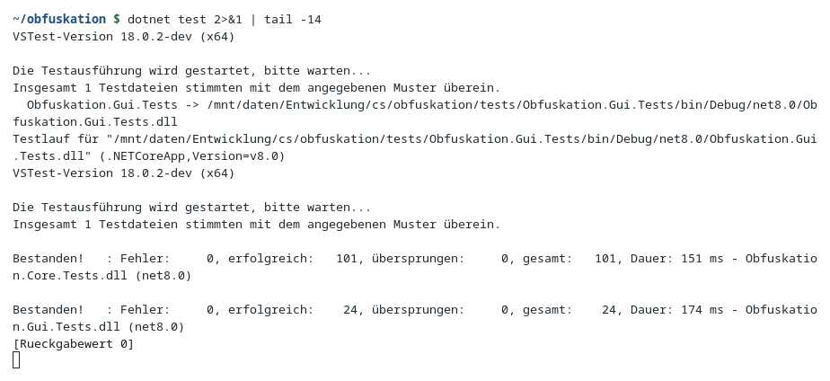
*Ausgabe von `dotnet test`: 101 Tests aus `Obfuskation.Core.Tests` und 24 aus
`Obfuskation.Gui.Tests`, keine Fehler.*

```
Bestanden!   : Fehler:     0, erfolgreich:   101, übersprungen:     0, gesamt:   101,
               Dauer: 121 ms - Obfuskation.Core.Tests.dll (net8.0)
Bestanden!   : Fehler:     0, erfolgreich:    24, übersprungen:     0, gesamt:    24,
               Dauer: 155 ms - Obfuskation.Gui.Tests.dll (net8.0)
```

**125 Tests, 0 Fehler.** Der Demo-Datenbestand verändert keinen Test — die
Testprojekte arbeiten mit eigenen, in Wegwerfverzeichnissen erzeugten
Beständen.

Die elf Testdateien von `Obfuskation.Core.Tests`, thematisch geordnet:

**Fachlogik der Ersetzung**

- `PseudonymTests.cs` — Eigenschaften der Pseudonym-Erzeugung: Beständigkeit,
  Trennung der Namensräume und das Verhalten bei Kollisionen.
- `GeneratorTests.cs` — Eigenschaften der einzelnen Generatoren: entscheidend
  ist, dass die Form des Originals erhalten bleibt, nicht ein bestimmter
  Wert.
- `RoundtripTests.cs` — der Roundtrip ist die Kernzusage des Werkzeugs: was
  ersetzt wurde, muss sich vollständig zurückholen lassen.

**Erkennung und Freitext**

- `DetectionTests.cs` — die beiden Fallen der Textersetzung: Kettenersetzung
  beim Hinweg und die Teilzeichenfolge beim Rückweg.
- `DefaultTextRuleTests.cs` — die Muster, die `init` vorgibt, geprüft auf
  beide Richtungen: nicht zu weit, nicht zu eng.

**Konfiguration und Voransicht**

- `InspectionTests.cs` — Struktur lesen, Behandlung zuordnen, Wert
  vorschauen: die drei Dinge, die eine Oberfläche braucht, bevor sie
  irgendetwas verarbeitet.
- `ScanAndConfigTests.cs` — die Nachprüfung und die Profilprüfung, beides
  Schutzwälle davor, dass Echtdaten unbemerkt hinausgehen.
- `GeneratorDescriptionTests.cs` — jeder Generator braucht eine deutsche
  Erklärung, damit er in der Oberfläche nicht als nacktes englisches Wort
  erscheint.

**Mehrere Dateien und Umfang**

- `MultiFileTests.cs` — mehrere Dateien mit gemeinsamen Schlüsselfeldern;
  würde eine Personennummer je Datei anders ersetzt, wären die Testdaten
  wertlos.
- `ProgressTests.cs` — Fortschritt und Abbruch, die erst bei großen Dateien
  zählen.

**Datenschutz**

- `SafetyTests.cs` — die Zusagen, auf die sich der Datenschutz stützt: fällt
  einer dieser Tests, können Echtdaten dorthin gelangen, wo sie nicht
  hingehören.

Die drei Dateien von `Obfuskation.Gui.Tests`:

- `EquivalenceTests.cs` — Oberfläche und Kommandozeile müssen dasselbe
  Ergebnis liefern, weil beide über dieselbe Engine und Ersetzungstabelle
  laufen.
- `MainViewModelTests.cs` — die Bedienlogik des Hauptfensters, geprüft ohne
  laufendes Fenster, weil Dateidialoge als Fabrik hereinkommen und
  Nebenfenster nur als Ereignis erbeten werden.
- `TestUmgebung.cs` — keine Testfälle, sondern ein `[ModuleInitializer]`, der
  `XDG_CONFIG_HOME` vor dem ersten Test auf ein Wegwerfverzeichnis lenkt.
  Ohne ihn schreibt der Testlauf in die echte `gui.json` des angemeldeten
  Benutzers (Befund D-8, in 1.0.1 behoben).

## 3. Testumgebung

| | |
|---|---|
| Betriebssystem | CachyOS (Arch-basiert), Kernel 7.2.0-1-cachyos |
| Sitzung | GNOME auf Wayland, Xwayland unter `DISPLAY=:0` |
| .NET | SDK 10.0, Laufzeiten `Microsoft.NETCore.App` 9.0.19 und 10.0.11 |
| Zielframework | `net8.0` mit `RollForward=Major` |
| Bildschirm | 5120×2880, Skalierung 2× (Fenster 1040×720 logisch = 2080×1440 Bildpunkte) |
| Arbeitsverzeichnis | Wegwerfverzeichnis außerhalb des Repositories |
| Ausgangszustand | `~/.local/share/obfuskation/demo/` vor Beginn gelöscht |

Geprüft wurden die veröffentlichten Binärdateien
(`publish/linux-x64/obfuskation` und `publish/linux-x64/obfuskation-gui`,
Fassung `1.0.1+cfec1d547a7f595a051f70353bde7992948d7585`), nicht `dotnet
run`.

**Datenbestand:** `docs/beispiel/` — 120 Stammdatensätze, 120 Konten, 2000
Buchungen, alle Werte frei erfunden. Die Oberflächen-Bilder entstanden auf
einem virtuellen Bildschirm (Xvfb, 1600×1000, Skalierung 1:1) mit eigenem
`XDG_CONFIG_HOME`, damit die Fenstergröße fest bleibt, die Bilder zwischen
zwei Läufen vergleichbar sind und ein gesperrter Bildschirm den Lauf nicht
aufhält (GNOME verweigert dann jede Aufnahme mit „Screenshot is not
allowed“ — der erste Versuch auf dem echten Bildschirm scheiterte genau
daran). Die Datei `~/.config/obfuskation/gui.json` des Benutzers wurde bei
der Bildaufnahme nicht angefasst; siehe dazu aber Befund D-8 zum
automatisierten Testlauf.

## 4. Testfallkatalog

### Kommandozeile positiv

#### P-01 — Regelgerüst aus einer Datei ableiten

**Vorbedingung:** Kein Profil vorhanden, `~/.local/share/obfuskation/demo/`
gelöscht.
**Schritte:**
```fish
obfuskation init --profile demo --from docs/beispiel/stammdaten.csv --config profil-demo.json
```
**Erwartetes Ergebnis:** Eine Konfigurationsdatei mit einer Regel je Spalte
entsteht, jede Regel steht auf `"action": "error"` samt Vorschlag im
Kommentar.
**Tatsächliches Ergebnis:**
```
profil-demo.json angelegt (Profil 'demo').
Ersetzungstabelle: /home/gregor/.local/share/obfuskation/demo/mapping.json
10 Felder uebernommen — alle stehen auf action "error".
Jedes Feld durchgehen und bewusst entscheiden: pseudonymize, passthrough, redact oder drop.
EXIT=0
```
Alle 10 Spalten wurden übernommen, jede mit `"action": "error"` und einem
Vorschlag im Kommentar (Personennummer→`numericId`, Nachname→`lastName`,
Vorname→`firstName`, Straße→`street`, PLZ→`postalCode`, Ort→`city`,
EMail→`email`, Telefon→`phone`, Geburtsdatum→`dateShift`,
Notiz→scanText-Hinweis). Die Spaltennamen mit Umlaut (`Straße`) wurden
korrekt gelesen.

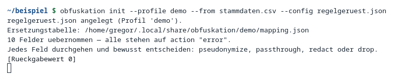
*`obfuskation init` legt `profil-demo.json` mit zehn Regeln an, alle auf
`action "error"`.*

#### P-02 — Pfad der Ersetzungstabelle

**Vorbedingung:** `profil-demo.json` vorhanden.
**Schritte:**
```fish
obfuskation mapping path --config docs/beispiel/profil-demo.json
```
**Erwartetes Ergebnis:** Ausgabe des Pfads der Ersetzungstabelle.
**Tatsächliches Ergebnis:**
```
/home/gregor/.local/share/obfuskation/demo/mapping.json
EXIT=0
```
Kein Screenshot vorhanden.

#### P-03 — Ersetzen, drei Dateien mit demselben Profil

**Vorbedingung:** `profil-demo.json` vorhanden, Ersetzungstabelle leer.
**Schritte:**
```fish
obfuskation obfuscate docs/beispiel/stammdaten.csv -o stammdaten.pseudo.csv --strict --config profil-demo.json
obfuskation obfuscate docs/beispiel/konten.csv     -o konten.pseudo.csv     --strict --config profil-demo.json
obfuskation obfuscate docs/beispiel/buchungen.csv  -o buchungen.pseudo.csv  --strict --config profil-demo.json
```
**Erwartetes Ergebnis:** Alle drei Dateien werden ersetzt, Zeichensatz und
Trennzeichen werden selbständig erkannt, die Ersetzungstabelle wächst über
die drei Läufe hinweg.
**Tatsächliches Ergebnis:**
```
obfuscate: .../stammdaten.csv [csv]
  Zeichensatz utf-8, Trennzeichen ';'
  Datensaetze: 120
  Ersetzungen: city=120, dateShift=120, email=120, firstName=120, lastName=120,
               numericId=120, phone=120, postalCode=120, redact=108, street=120
  Tabelle: 545 neu, 545 gesamt
  Dauer: 77 ms
EXIT=0

obfuscate: .../konten.csv [csv]
  Datensaetze: 120
  Ersetzungen: belegNummer=120, bic=120, dateShift=120, iban=120, numericId=120
  Tabelle: 236 neu, 781 gesamt
  Dauer: 69 ms
EXIT=0

obfuscate: .../buchungen.csv [csv]
  Datensaetze: 2000
  Ersetzungen: belegNummer=2000, dateShift=2000, email=250, iban=502, numericId=2000, phone=230
  Tabelle: 656 neu, 1437 gesamt
  Dauer: 105 ms
EXIT=0
```
Zeichensatz und Trennzeichen wurden in allen drei Läufen selbständig erkannt
(`utf-8`, `;`). `redact=108` bei den Stammdaten: 12 der 120 Notizen waren
leer, leere Werte bleiben leer.

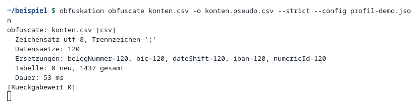
*`obfuskation obfuscate konten.csv`: 120 Datensätze, Ersetzungen je
Generator, Tabelle 0 neu (Wiederholung des Laufs für das Bild), 1437
gesamt.*

#### P-04 — Verknüpfung über Dateigrenzen

**Vorbedingung:** P-03 durchgeführt.
**Schritte:** Zeile 2 von `stammdaten.csv` und `stammdaten.pseudo.csv`
sowie `konten.pseudo.csv` vergleichen.
**Erwartetes Ergebnis:** Dieselbe Personennummer ergibt in beiden Dateien
dasselbe Pseudonym; Formtreue bleibt erhalten.
**Tatsächliches Ergebnis:**
```
10000;Grünwald;Dieter;Innsbrucker Ring 129;70173;Stuttgart;
      dieter.gruenwald@beispiel-firma.de;(079) 5540670;16.12.1973;Mailverkehr läuft über …
04745;Eschenbach;Monika;Am Anger 141;95661;Eisenach;
      anna.schuster398@example.invalid;(030) 1976441;01.08.1973;***
```
Personennummer in `stammdaten.pseudo.csv` Zeile 2: 04745. Personennummer in
`konten.pseudo.csv` Zeile 2: 04745 — identisch. Formtreue: 5 Stellen bleiben
5 Stellen, die Telefongliederung `(079) 5540670` bleibt `(095) 6310059`, die
E-Mail liegt unter `example.invalid`, das Geburtsdatum ist um denselben
Betrag verschoben wie alle anderen Daten. Kein Screenshot vorhanden.

#### P-05 — Eigener Namensraum trennt gleiche Zahlen

**Vorbedingung:** P-03 durchgeführt, Profil mit Eintrag `"belegNummer": {
"type": "numericId" }` unter `generators`.
**Schritte:** Die Zahl 10679 im Bestand aufsuchen (einmal als Belegnummer,
einmal als Personennummer) und die jeweiligen Pseudonyme vergleichen.
**Erwartetes Ergebnis:** Belegnummer und Personennummer bekommen
unterschiedliche Pseudonyme, obwohl der Klartext identisch ist.
**Tatsächliches Ergebnis:**
```
als Belegnummer     -> 04063
als Personennummer  -> 86724
```
Ohne den Eintrag `"belegNummer": { "type": "numericId" }` unter
`generators` hätten beide dasselbe Pseudonym bekommen. Kein Screenshot
vorhanden.

#### P-06 — Auskunft über die Ersetzungstabelle

**Vorbedingung:** P-03 durchgeführt.
**Schritte:**
```fish
obfuskation mapping list --config docs/beispiel/profil-demo.json
obfuskation mapping list --namespace iban --config docs/beispiel/profil-demo.json
```
**Erwartetes Ergebnis:** Anzahl der Einträge je Namensraum, kein einziger
Wert.
**Tatsächliches Ergebnis:**
```
Tabelle: /home/gregor/.local/share/obfuskation/demo/mapping.json
Profil : demo
  belegNummer: 767 Eintraege
  bic: 5 Eintraege
  city: 12 Eintraege
  email: 109 Eintraege
  firstName: 30 Eintraege
  iban: 120 Eintraege
  lastName: 23 Eintraege
  numericId: 120 Eintraege
  phone: 120 Eintraege
  postalCode: 12 Eintraege
  street: 119 Eintraege
Gesamt : 1437
EXIT=0
```
Mit `--namespace iban` beschränkt:
```
  iban: 120 Eintraege
Gesamt : 1437
EXIT=0
```
**Es wurde kein einziger Wert angezeigt, nur Zähler.**

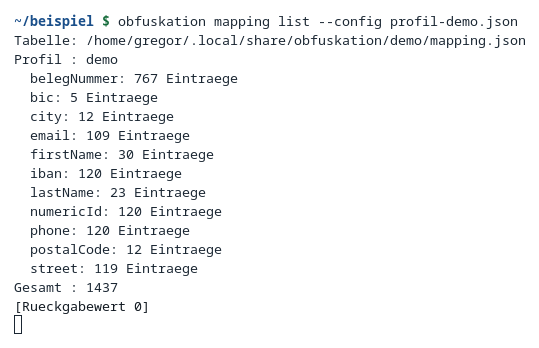
*`obfuskation mapping list` zeigt Anzahl je Namensraum, insgesamt 1437
Einträge, keine Werte.*

#### P-07 — Dateirechte der Ersetzungstabelle

**Vorbedingung:** P-03 durchgeführt.
**Schritte:**
```fish
stat -c '%A %n' ~/.local/share/obfuskation/demo/mapping.json
```
**Erwartetes Ergebnis:** Rechte `0600`, nur für den Eigentümer lesbar.
**Tatsächliches Ergebnis:**
```
-rw------- /home/gregor/.local/share/obfuskation/demo/mapping.json
```
Kein Screenshot vorhanden.

#### P-08 — Prüfen einer sauberen Datei

**Vorbedingung:** P-03 durchgeführt.
**Schritte:**
```fish
obfuskation scan stammdaten.pseudo.csv --config profil-demo.json
```
**Erwartetes Ergebnis:** Keine Restbestände.
**Tatsächliches Ergebnis:**
```
  Datensaetze: 120
  Tabelle: 0 neu, 1437 gesamt
  Dauer: 62 ms
Keine Restbestaende gefunden.
EXIT=0
```
Kein Screenshot vorhanden.

#### P-09 — Probelauf

**Vorbedingung:** P-03 durchgeführt.
**Schritte:**
```fish
obfuskation obfuscate docs/beispiel/konten.csv -o trocken.csv --strict --dry-run --config profil-demo.json
```
**Erwartetes Ergebnis:** Es wird nichts geschrieben, der Bericht entsteht
trotzdem vollständig.
**Tatsächliches Ergebnis:**
```
Probelauf: es wurde nichts geschrieben.
  Datensaetze: 120
  Ersetzungen: belegNummer=120, bic=120, dateShift=120, iban=120, numericId=120
  Tabelle: 0 neu, 1437 gesamt
EXIT=0
```
`trocken.csv` wurde **nicht** angelegt (`ls`: Datei nicht gefunden), und die
Tabelle meldet `0 neu` — der Probelauf hat nichts hinterlassen. Kein
Screenshot vorhanden.

#### P-10 — Bericht als JSON

**Vorbedingung:** P-03 durchgeführt.
**Schritte:**
```fish
obfuskation obfuscate docs/beispiel/konten.csv -o j.csv --strict --json --config profil-demo.json
```
**Erwartetes Ergebnis:** Der Bericht erscheint als JSON auf der
Standardausgabe und enthält keinen Eingabewert.
**Tatsächliches Ergebnis:**
```json
{
  "command": "obfuscate",
  "input": ".../konten.csv",
  "output": ".../j.csv",
  "format": "csv",
  "encoding": "utf-8",
  "delimiter": ";",
  "rowsProcessed": 120,
  "ruleHits": { "belegNummer": 120, "bic": 120, "dateShift": 120, "iban": 120, "numericId": 120 },
  "fieldActions": {
    "BIC": "pseudonymize (bic)",
    "Belegnummer": "pseudonymize (belegNummer)",
    "Eröffnungsdatum": "pseudonymize (dateShift)",
    "IBAN": "pseudonymize (iban)",
    "Kontostand": "passthrough",
    "Personennummer": "pseudonymize (numericId)"
  },
  "unhandledFields": [],
  "newMappings": 0,
  "totalMappings": 1437,
  "findings": [],
  "warnings": [],
  "durationMs": 60
}
EXIT=0
```
**Der Bericht enthält Feldnamen und Zähler, aber keinen einzigen
Eingabewert.** Er darf deshalb protokolliert werden. Kein Screenshot
vorhanden.

#### P-11 — Rückholen einer Datei

**Vorbedingung:** P-03 durchgeführt.
**Schritte:**
```fish
obfuskation deobfuscate stammdaten.pseudo.csv -o stammdaten.zurueck.csv --config profil-demo.json
diff <(cut -d';' -f1-9 stammdaten.csv) <(cut -d';' -f1-9 stammdaten.zurueck.csv)
```
**Erwartetes Ergebnis:** Spalten 1–9 stimmen wieder mit dem Original
überein; Spalte 10 (`Notiz`, `redact`) bleibt als nicht wiederherstellbar
gemeldet.
**Tatsächliches Ergebnis:**
```
  Datensaetze: 120
  Ersetzungen: city=120, dateShift=120, email=120, firstName=120, lastName=120,
               numericId=120, phone=120, postalCode=120, street=120
  BEFUNDE: 108
    Zeile 1, Spalte Notiz: redact (nichtWiederherstellbar)
    … und 88 weitere
EXIT=0
```
```
IDENTISCH (Spalten 1-9)
```
Spalte 10 weicht ab und wird 108 Mal als Befund `nichtWiederherstellbar`
gemeldet — genau so oft, wie beim Ersetzen `redact` gezählt wurde. **Das
ist kein Fehler, sondern die zugesagte Eigenschaft von `redact`.** Kein
Screenshot vorhanden.

#### P-12 — Rückübersetzung einer KI-Antwort von der Standardeingabe

**Vorbedingung:** P-03 durchgeführt, `docs/beispiel/antwort-der-ki.txt`
enthält die pseudonymisierte Fassung einer angenommenen KI-Antwort.
**Schritte:**
```fish
cat docs/beispiel/antwort-der-ki.txt | obfuskation deobfuscate --config profil-demo.json
```
**Erwartetes Ergebnis:** Namen, Kundennummern, IBAN, BIC, E-Mail,
Telefonnummer und Anschrift werden im Fließtext und im Quelltextblock
zurückübersetzt, der Betrag bleibt unverändert, die Codeformatierung bleibt
unversehrt.
**Tatsächliches Ergebnis:** Eingabe (Auszug):

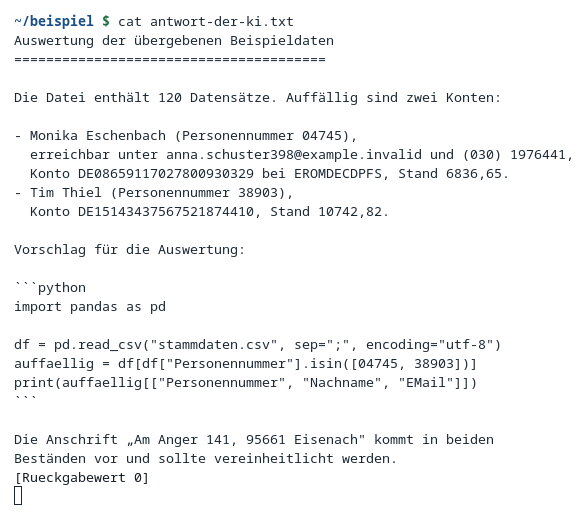
*Ausgabe von `cat antwort-der-ki.txt`: pseudonymisierte Namen, Kontodaten
und Kundennummern in Fließtext und Python-Codeblock.*

```
$ cat docs/beispiel/antwort-der-ki.txt | obfuskation deobfuscate --config profil-demo.json
- Dieter Grünwald (Personennummer 10000),
  erreichbar unter dieter.gruenwald@beispiel-firma.de und (079) 5540670,
  Konto DE12999999990000010000 bei MUSTDEFF001, Stand 6836,65.

auffaellig = df[df["Personennummer"].isin([10000, 10007])]

Die Anschrift „Innsbrucker Ring 129, 70173 Stuttgart" …

deobfuscate: (Standardeingabe) [text]
  Zeichensatz utf-8
  Datensaetze: 24
  Ersetzungen: freitext=16
  Dauer: 39 ms
EXIT=0
```

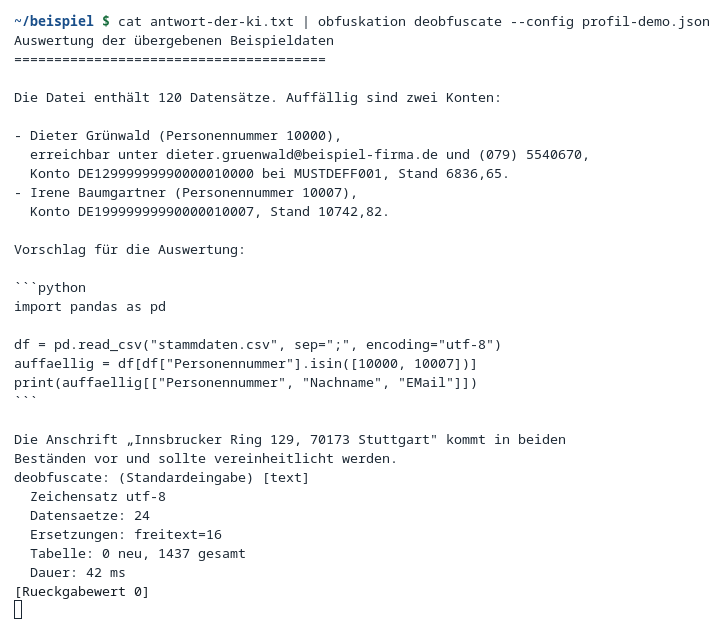
*`obfuskation deobfuscate` übersetzt die KI-Antwort von der Standardeingabe
zurück: Namen, Kontodaten und Kundennummern im Klartext, der Betrag
`6836,65` blieb unverändert.*

**Das ist der eigentliche Nutzen des Werkzeugs:** die Rückübersetzung wirkte
sowohl im Fließtext als auch im Quelltextblock, die Codeformatierung blieb
unversehrt.

### Oberfläche positiv

#### G-01 — Erststart ohne Profil

**Vorbedingung:** Kein Profil geöffnet.
**Schritte:** `obfuskation-gui` ohne Argumente starten.
**Erwartetes Ergebnis:** Leere Feldliste mit Anleitung, alle drei Vorgänge
abgeblendet.
**Tatsächliches Ergebnis:** Titelzeile „kein Profil“, leere Feldliste mit
dem Hinweis „Noch kein Profil geladen.“ und der Anleitung. `Ersetzen`,
`Zurückholen` und `Prüfen` sind abgeblendet. Statuszeile: „Bereit.“


*Erststart ohne Profil: leere Feldliste, alle drei Vorgänge abgeblendet.*

#### G-02 — Regelgerüst geladen, alle Felder offen

**Vorbedingung:** `profil-geruest.json` (aus `init` abgeleitet, alle Felder
auf `error`).
**Schritte:**
```fish
obfuskation-gui --config profil-geruest.json stammdaten.csv
```
**Erwartetes Ergebnis:** Alle zehn Felder stehen offen, Format, Zeichensatz
und Trennzeichen werden selbständig erkannt.
**Tatsächliches Ergebnis:** Kopfzeile `stammdaten.csv`, darunter `CSV ·
utf-8 · ';'`. Alle zehn Felder tragen einen roten offenen Kreis und rechts
das Wort „offen“. Unten rechts: „10 Felder offen“. Der Regelbereich listet
unter „Hinweise zur Konfiguration“ alle zehn Befunde mit Feldpfad
`fields[0].action` … `fields[9].action`.


*Regelgerüst geladen: alle zehn Felder offen, Hinweise zur Konfiguration
listen jeden Feldpfad.*

#### G-03 — Ersetzen bei offenen Feldern

**Vorbedingung:** G-02.
**Schritte:** Auf `Ersetzen` klicken.
**Erwartetes Ergebnis:** Kein Speichern-Dialog, Meldung über offene Felder,
nichts wird geschrieben.
**Tatsächliches Ergebnis:** Es erschien kein Speichern-Dialog; die
Statuszeile meldet „10 Felder offen — jedes Feld braucht eine Entscheidung,
bevor ersetzt werden kann.“ Die Auswahl sprang auf das erste offene Feld.
Es wurde nichts geschrieben. Entspricht N-01 auf der Kommandozeile (dort
Rückgabewert 3).

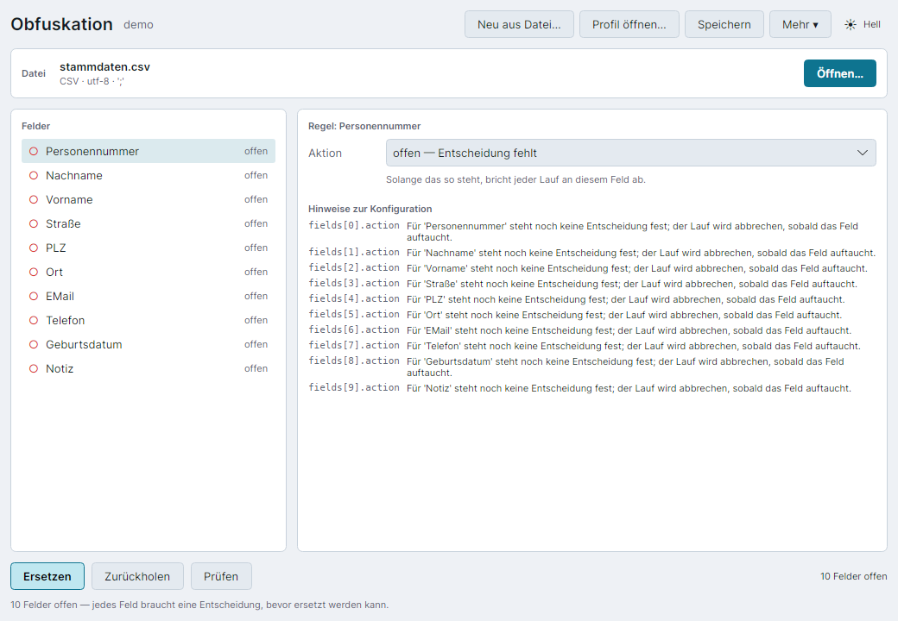
*Klick auf Ersetzen bei offenen Feldern: Statuszeile meldet die Anzahl
offener Felder, kein Speichern-Dialog erscheint.*

#### G-04 — Entschiedenes Profil, Feldregel und Vorschau

**Vorbedingung:** `profil-demo.json`, `stammdaten.csv` geöffnet.
**Schritte:** Feld `Nachname` auswählen.
**Erwartetes Ergebnis:** Alle Punkte türkis gefüllt, Vorschau zeigt
denselben Wert wie der spätere Lauf.
**Tatsächliches Ergebnis:** Alle zehn Punkte sind türkis gefüllt, rechts
steht statt „offen“ der Generatorname. Unten rechts: „alle Felder
entschieden“. Feld `Nachname`: Aktion „ersetzen“, Generator `lastName`
(„nur Nachname“), Vorschau: Grünwald → Eschenbach — derselbe Wert wie der
Lauf auf der Kommandozeile (P-04). **Die Vorschau lügt nicht.**


*Feld Nachname mit Generator `lastName`, Vorschau Grünwald → Eschenbach, alle
zehn Felder entschieden.*

#### G-05 — Auswahllisten

**Vorbedingung:** G-04.
**Schritte:** Auswahlliste „Aktion“ und „Generator“ öffnen.
**Erwartetes Ergebnis:** Alle Behandlungen beziehungsweise Generatoren mit
deutscher Erklärung, eigene Namensräume am Ende gekennzeichnet.
**Tatsächliches Ergebnis:** Aktionen in dieser Reihenfolge: ersetzen ·
durchlassen · Freitext durchsuchen · schwärzen · Feld entfernen · offen —
Entscheidung fehlt. Generatoren mit deutscher Erklärung: bic, city,
companyName, dateShift, email, firstName, iban, lastName, numericId,
personName, phone, postalCode, redact, street, token — und als letzter
Eintrag `belegNummer · eigener Namensraum, wie numericId`.

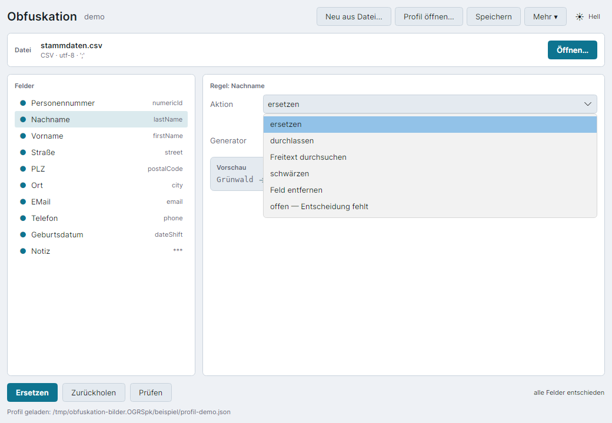
*Auswahlliste „Aktion“: ersetzen, durchlassen, Freitext durchsuchen,
schwärzen, Feld entfernen, offen.*


*Auswahlliste „Generator“: eingebaute Generatoren mit deutscher Erklärung,
unten `belegNummer` als eigener Namensraum.*

#### G-06 — Vorschau ohne bestehende Tabelle

**Vorbedingung:** Profil `frisch` mit einer Ablage, die es noch nicht gibt.
**Schritte:** Feld `Nachname` auswählen.
**Erwartetes Ergebnis:** Vorschau mit Hinweis, dass es sich nur um ein
Beispiel handelt.
**Tatsächliches Ergebnis:** Vorschau: Grünwald → Bramkamp, mit dem Hinweis
„Nur ein Beispiel — es gibt noch keine Ersetzungstabelle. Der erste echte
Lauf legt sie an und bestimmt die endgültigen Werte.“ Derselbe Klartext,
ein anderes Pseudonym als in G-04, weil das Salt flüchtig ist.


*Vorschau ohne bestehende Ersetzungstabelle: Grünwald → Bramkamp, mit
ausdrücklichem Hinweis auf den vorläufigen Charakter.*

#### G-07 — Ersetzen

**Vorbedingung:** G-04.
**Schritte:** Auf `Ersetzen` klicken, Speichern-Dialog bestätigen.
**Erwartetes Ergebnis:** Ergebniskarte mit denselben Zählern wie der Lauf
auf der Kommandozeile (P-03).
**Tatsächliches Ergebnis:** Im Speichern-Dialog war `stammdaten.pseudo.csv`
vorbelegt — der Zusatz `.pseudo` kommt vom Programm. Ergebniskarte:
„Ersetzt — 120 Datensaetze · 20 ms · 1437 in der Tabelle“, darunter city
120 · dateShift 120 · email 120 · firstName 120 · lastName 120 · numericId
120 · phone 120 · postalCode 120 · redact 108 · street 120 — **dieselben
Zähler wie P-03.** Neben den Schaltflächen erschien der Hinweis „↖ vor der
Weitergabe prüfen“. Statuszeile: „Geschrieben: …/stammdaten.pseudo.csv“.


*Ergebniskarte nach dem Ersetzen: 120 Datensätze, 20 ms, 1437 in der
Tabelle, dieselben Zähler wie auf der Kommandozeile.*

#### G-08 — Gleichwertigkeit Oberfläche und Kommandozeile

**Vorbedingung:** Dieselbe Eingabedatei einmal über die Oberfläche (G-07)
und einmal über die Kommandozeile (P-03) ersetzt, mit demselben Profil.
**Schritte:**
```fish
diff demo/stammdaten.pseudo.csv arbeit/stammdaten.pseudo.csv
```
**Erwartetes Ergebnis:** Beide Ausgaben sind identisch.
**Tatsächliches Ergebnis:**
```
GUI und CLI liefern dieselbe Datei
```
**Byteweise identisch.** Kein Screenshot vorhanden — dies ist ein
Kommandozeilenvergleich zweier zuvor erzeugter Dateien.

#### G-09 — Prüfen ohne Befund

**Vorbedingung:** `stammdaten.pseudo.csv` aus G-07 geöffnet.
**Schritte:** Auf `Prüfen` klicken.
**Erwartetes Ergebnis:** Keine Restbestände.
**Tatsächliches Ergebnis:** „Geprueft — 120 Datensaetze · 35 ms · 1437 in
der Tabelle“. Statuszeile: „Keine Restbestände gefunden.“ Der Hinweis „↖
vor der Weitergabe prüfen“ verschwand.


*Prüfen ohne Befund: 120 Datensätze, 35 ms, keine Restbestände gefunden.*

#### G-10 — Prüfen mit Verdachtsfällen

**Vorbedingung:** `buchungen.pseudo.csv` mit `Verwendungszweck` auf
`scanText` (siehe N-11).
**Schritte:** Auf `Prüfen` klicken.
**Erwartetes Ergebnis:** Verdachtsfälle werden gemeldet, dieselbe Anzahl
wie auf der Kommandozeile.
**Tatsächliches Ergebnis:** „Geprueft — 2000 Datensaetze · 375 ms“,
`fund:echtwert 1112`. Verdachtsfälle: Zeile 4, Spalte Verwendungszweck —
belegNummer — Echtwert aus der Tabelle … und 1062 weitere. Statuszeile:
„1112 Verdachtsfälle — die Datei nicht weitergeben, bevor sie geklärt
sind.“ **Dieselbe Zahl wie auf der Kommandozeile (N-11).** Die Oberfläche
zeigt 50 Fundstellen einzeln, die Kommandozeile 20.


*Prüfen mit Verdachtsfällen: 1112 Funde bei `buchungen.pseudo.csv`,
dieselbe Zahl wie auf der Kommandozeile.*

#### G-11 — Zurückholen

**Vorbedingung:** `stammdaten.pseudo.csv` aus G-07 geöffnet.
**Schritte:** Auf `Zurückholen` klicken, Vorschlag
`stammdaten.pseudo.klartext.csv` bestätigen.
**Erwartetes Ergebnis:** Spalten 1–9 wieder identisch mit dem Original,
Spalte 10 bleibt `***` mit Befund.
**Tatsächliches Ergebnis:** „Zurueckgeholt — 120 Datensaetze · 26 ms“, city
120 · dateShift 120 · email 120 · firstName 120 · lastName 120 · numericId
120 · phone 120 · postalCode 120 · street 120. Verdachtsfälle: Zeile 1–9,
Spalte Notiz — redact — nicht wiederherstellbar … und 58 weitere.
```fish
diff <(cut -d';' -f1-9 stammdaten.csv) <(cut -d';' -f1-9 stammdaten.pseudo.klartext.csv)
```
```
IDENTISCH
```
Spalte 10 bleibt `***`, 108 Meldungen „nicht wiederherstellbar“, so viele
wie `redact` beim Ersetzen gezählt hat.


*Zurückgeholt: 120 Datensätze, 26 ms, Notiz bleibt als nicht
wiederherstellbar gemeldet.*

#### G-12 — Fortschritt

**Vorbedingung:** Datei mit 100 000 Zeilen geöffnet.
**Schritte:** Auf `Prüfen` klicken.
**Erwartetes Ergebnis:** Fortschrittsbalken und Zählung erscheinen, die
Vorgangsschaltflächen sind währenddessen abgeblendet.
**Tatsächliches Ergebnis:** Während des Laufs erscheinen ein
Fortschrittsbalken, die Zählung „36000 Datensätze …“ und die Schaltfläche
`Abbrechen`; die drei Vorgangsschaltflächen sind abgeblendet. Statuszeile:
„Prüfen läuft …“. Der vollständige Lauf brauchte 9338 ms.


*Fortschritt bei 100 000 Zeilen: Balken, laufende Zählung, Schaltfläche
Abbrechen.*

#### G-13 — Abbruch

**Vorbedingung:** Derselbe Lauf wie G-12.
**Schritte:** Nach 3 s auf `Abbrechen` klicken.
**Erwartetes Ergebnis:** Statuszeile meldet den Abbruch, nichts wird
geschrieben, die Ersetzungstabelle bleibt unverändert.
**Tatsächliches Ergebnis:** Statuszeile: „Prüfen abgebrochen. Es wurde
nichts geschrieben.“ Es erschien keine Ergebniskarte. Die Ersetzungstabelle
stand danach unverändert bei 1437 Einträgen (`obfuskation mapping list`) —
der Abbruch hat nichts hinterlassen. Nebenbeobachtung: bleibt beim Abbruch
noch die Ergebniskarte eines früheren Laufs stehen, bleibt sie stehen; nur
die Statuszeile sagt, dass der neue Lauf abgebrochen wurde.


*Nach dem Abbruch: „Prüfen abgebrochen. Es wurde nichts geschrieben.“*

#### G-14 — Textregeln mit Erprobungsfeld

**Vorbedingung:** Profil mit vier Textregeln (iban 100, email 90, bic 85,
phone 80) über „Mehr → Textregeln…“ geöffnet.
**Schritte:** Beispieltext im Erprobungsfeld belassen, Treffer ansehen.
**Erwartetes Ergebnis:** Die drei tatsächlich passenden Muster werden
gefunden, harmlose Zahlen bleiben unberührt.
**Tatsächliches Ergebnis:** „3 Treffer“: iban → Zeile 1 →
`DE02120300000000202051`, email → Zeile 2 →
`max.mustermann@beispiel.de`, phone → Zeile 2 → `+49 30 12345678`. Die
Rechnungsnummer `2024-0815` und der Betrag `1.234,56` blieben unberührt.

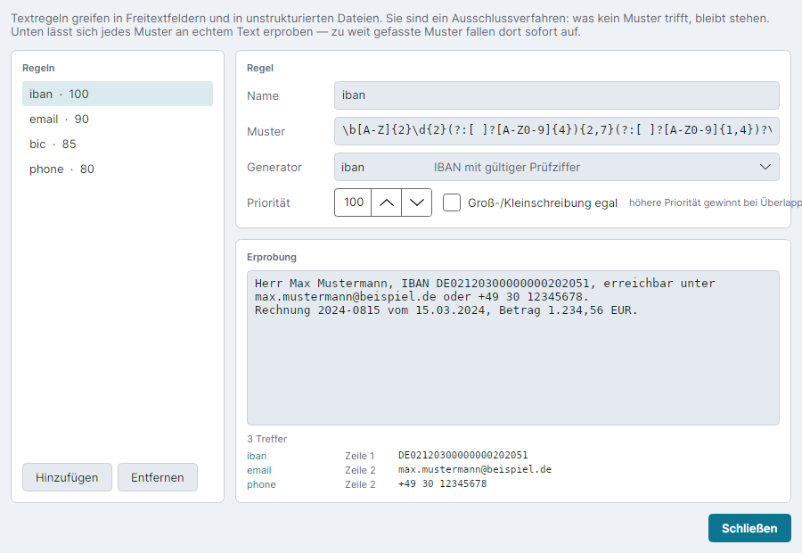
*Textregeln mit Erprobungsfeld: 3 Treffer für iban, email und phone am
Beispieltext.*

> Bei diesem Fenster wurde außerdem Befund D-6 beobachtet: der Hinweistext
> „höhere Priorität gewinnt bei Überlappung“ rechts neben der Prioritätsangabe
> ist am Fensterrand abgeschnitten (im Bild oben sichtbar).

#### G-15 — Ungültiges Muster

**Vorbedingung:** G-14.
**Schritte:** Muster der Regel `iban` auf `\b[A-Z]{2}\d{2}(` ändern.
**Erwartetes Ergebnis:** Eine Fehlermeldung mit der Fundstelle statt einer
leeren Trefferliste oder eines Absturzes.
**Tatsächliches Ergebnis:** Statt der Trefferliste erscheint: „Ungültiger
regulärer Ausdruck in der Textregel 'iban': Invalid pattern
'\b[A-Z]{2}\d{2}(' at offset 16. Not enough )'s.“ Kein Absturz, keine leere
Anzeige.

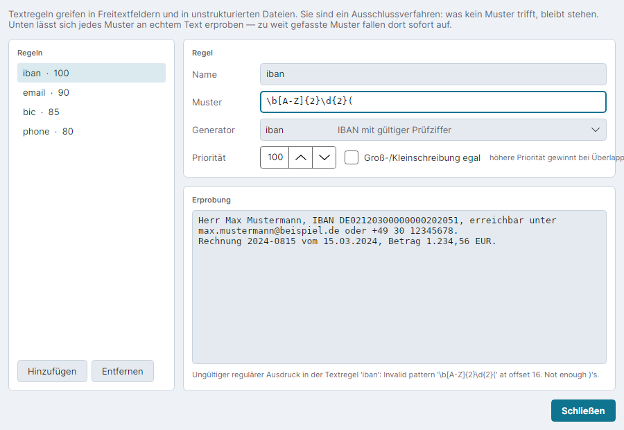
*Ungültiges Muster: Fehlermeldung mit Fundstelle statt Trefferliste.*

#### G-16 — Zu weit gefasstes Muster

**Vorbedingung:** G-14.
**Schritte:** Muster auf `\d{4}` ändern.
**Erwartetes Ergebnis:** Deutlich mehr Treffer als sinnvoll, darunter
Bruchstücke und harmlose Zahlen — das Erprobungsfeld deckt das sofort auf.
**Tatsächliches Ergebnis:** 10 Treffer statt 3, darunter die Bruchstücke
`0212`, `0300`, `0000`, `0020`, `2051` einer einzigen IBAN und die harmlose
Jahreszahl `2024` aus der Rechnungsnummer.

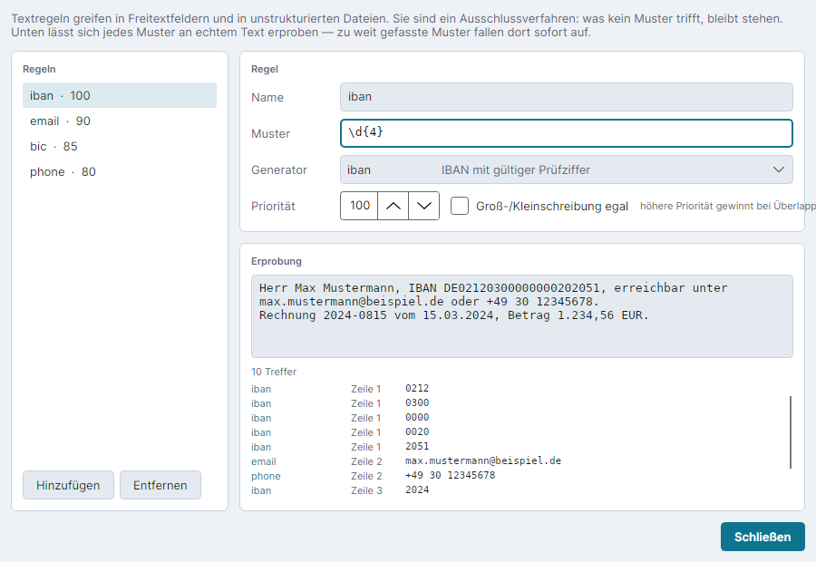
*Zu weit gefasstes Muster: 10 statt 3 Treffer, darunter IBAN-Bruchstücke
und eine harmlose Jahreszahl.*

#### G-17 — Ersetzungstabelle

**Vorbedingung:** Profil `demo` mit 1437 Einträgen (nach P-03), Fenster
über „Mehr → Ersetzungstabelle…“ geöffnet.
**Schritte:** Fenster ansehen.
**Erwartetes Ergebnis:** Pfad, Rechte und Anzahl je Namensraum, dieselben
Zahlen wie `mapping list`, kein einziger Wert.
**Tatsächliches Ergebnis:** Warnkasten oben: „Diese Datei enthält sämtliche
Echtdaten … Deshalb werden hier nur Anzahlen gezeigt, keine Werte.“ Profil
`demo`, Datei
`/home/gregor/.local/share/obfuskation/demo/mapping.json`, Rechte `0600
(nur für Sie lesbar)`. Darunter die Namensräume mit Anzahlen, unten „1437
Einträge insgesamt“ — dieselben Zahlen wie `mapping list` (P-06). **Kein
einziger Wert sichtbar.**


*Ersetzungstabelle: Pfad, Rechte 0600 und Anzahl je Namensraum, insgesamt
1437 Einträge.*

> Bei diesem Fenster wurde außerdem Befund D-5 beobachtet: die
> Bildlaufleiste überdeckt die rechtsbündigen Anzahlen teilweise (im Bild
> oben am rechten Rand der Zahlenspalte sichtbar).

#### G-18 — Über

**Vorbedingung:** Fenster über „Mehr → Über Obfuskation…“ geöffnet.
**Schritte:** Fenster ansehen.
**Erwartetes Ergebnis:** Fassung, die fünf Hinweise, die verwendeten
Pfade.
**Tatsächliches Ergebnis:** Fassung 1.0.1, „Erstellt von Gregor Stübner und
Claude (Anthropic)“, die fünf Hinweise im Wortlaut und die beiden benutzten
Pfade.


*Über-Fenster: Fassung 1.0.1, die fünf Hinweise und die verwendeten Pfade.*

#### G-19 — Dunkles Thema

**Vorbedingung:** G-04, Themenumschalter auf „Dunkel“ gestellt.
**Schritte:** Umschalter zweimal klicken (System → Dunkel).
**Erwartetes Ergebnis:** Vorschau und Statuspunkte bleiben lesbar, die
Akzentfarbe wechselt.
**Tatsächliches Ergebnis:** Zustand „Dunkel“. Vorschau und Statuspunkte
bleiben lesbar, die Akzentfarbe wechselt von Petrol auf Hellblau.


*Dunkles Thema: Vorschau und Statuspunkte bleiben lesbar, Akzentfarbe
Hellblau.*

#### G-20 — Fehlerhafte Konfiguration

**Vorbedingung:** `kaputt-profil.json` (fünf absichtliche Fehler, siehe
N-03).
**Schritte:**
```fish
obfuskation-gui --config kaputt-profil.json stammdaten.csv
```
**Erwartetes Ergebnis:** Die Oberfläche verweigert das Arbeiten mit der
Datei, es wird nichts geschrieben.
**Tatsächliches Ergebnis:** Statuszeile: „Die Konfiguration ist fehlerhaft
— siehe Hinweise.“ Die Kopfzeile nennt `stammdaten.csv`, die Feldliste sagt
aber „Keine Datei geöffnet.“ `Ersetzen` ist abgeblendet, es wurde nichts
geschrieben — das Schutzziel ist erreicht.

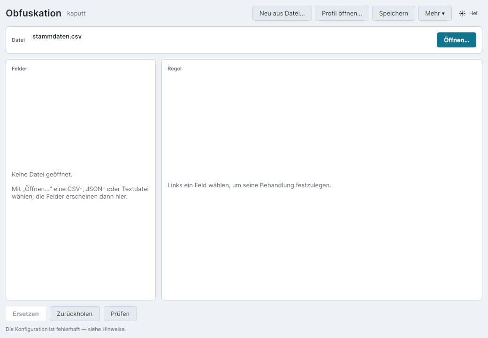
*Fehlerhafte Konfiguration: Statuszeile verweist auf Hinweise, Feldliste
bleibt leer, Ersetzen ist abgeblendet.*

> Befund D-3: die Statuszeile verweist auf Hinweise, die nirgends sichtbar
> sind — der Hinweisbereich hängt am ausgewählten Feld, und ohne gültige
> Konfiguration lässt sich kein Feld auswählen. Einzelheiten in
> `entwicklerdokumentation.md`, Abschnitt 11.

#### G-21 — Feld mit eigenem Namensraum (Fassung 1.0.0)

**Vorbedingung:** `konten.csv` mit Profil `demo` geöffnet, Fassung 1.0.0.
**Schritte:** Feld `Belegnummer` in der Feldliste anklicken. Sonst nichts.
**Erwartetes Ergebnis:** Die Generatorauswahl zeigt `belegNummer` als
gewählten Eintrag, die Regel bleibt unverändert.
**Tatsächliches Ergebnis:** Das Auswahlfeld „Generator“ ist **leer**. In der
Feldliste steht rechts nicht mehr `belegNummer`, sondern **`?`**, und im
Regelbereich erscheint der Befund `fields[12].generator: Bei 'pseudonymize'
muss ein Generator angegeben sein.`

**Das bloße Anklicken des Feldes hat den Generator aus der Regel entfernt.**


*Fassung 1.0.0: Das Auswahlfeld „Generator“ ist leer, die Feldliste zeigt
`?` statt `belegNummer`, und die Profilprüfung meldet den fehlenden
Generator — ausgelöst allein dadurch, dass das Feld angesehen wurde.*

> **Befund D-4.** Wird das Profil in diesem Zustand gespeichert, ist der
> Generator dauerhaft verloren und der nächste Lauf bricht ab. Wer ihn von
> Hand ergänzt und dabei `numericId` statt `belegNummer` wählt, hebt die
> Trennung der Namensräume auf: Belegnummer und Personennummer bekämen
> wieder dasselbe Pseudonym, und die Testdaten zeigten eine Verbindung, die
> es nie gab. Beides ohne Warnung.
>
> **In Fassung 1.0.1 behoben**, siehe G-22 und Abschnitt 6.

#### G-22 — Dasselbe Feld nach der Behebung (Fassung 1.0.1)

**Vorbedingung:** derselbe Aufbau wie G-21, aber Fassung 1.0.1.
**Schritte:** Feld `Belegnummer` anklicken, danach die Generatorauswahl
aufklappen; anschließend `Speichern` und das Profil auf der Platte vergleichen.
**Erwartetes Ergebnis:** Die Auswahl zeigt `belegNummer`, die Regel bleibt
unverändert.
**Tatsächliches Ergebnis:** Im Auswahlfeld steht `belegNummer · eigener
Namensraum, wie numericId`. Die Feldliste zeigt wieder `belegNummer`, es
erscheint kein Befund. Aufgeklappt ist derselbe Eintrag als gewählt markiert.
Die Regel in der Datei ist unverändert. Die Vorschau liefert `13535 → 84512`,
denselben Wert wie in G-21 — **die Behebung betrifft die Anzeige, nicht die
Ersetzung.**

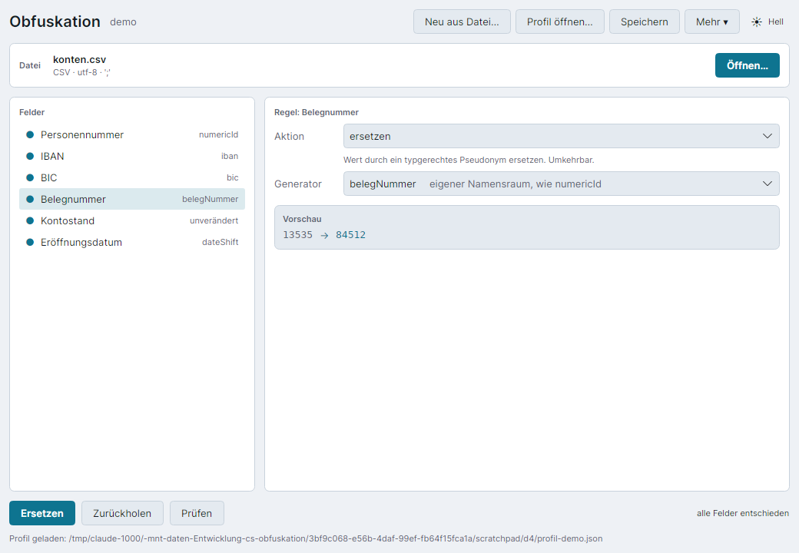
*Fassung 1.0.1: Der eigene Namensraum steht im Auswahlfeld, die Feldliste
zeigt ihn unverändert, kein Befund.*

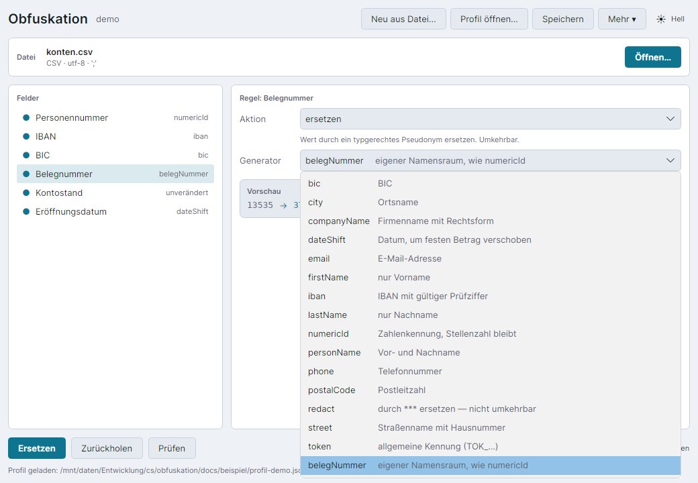
*Aufgeklappt ist `belegNummer` als gewählter Eintrag markiert — der Beleg
dafür, dass die Auswahl den Eintrag jetzt tatsächlich in ihrer eigenen Liste
findet.*

### Negativfälle

Die folgenden Fälle prüfen absichtlich falsche Eingaben, fehlerhafte
Konfigurationen und ungünstige Zeitpunkte. Das ist kein Selbstzweck: ein
Werkzeug, das Echtdaten verarbeitet, muss bei einer falschen Bedienung
sichtbar und nachvollziehbar scheitern, statt eine unvollständige oder
falsche Ausgabe stillschweigend zu erzeugen. Jeder Fall unten prüft genau
das — dass ein Fehler auch als Fehler erkannt wird, mit einer Meldung, die
zur Ursache führt, und ohne dass Echtdaten dabei nach außen gelangen.

#### N-01 — Ersetzen bei offenen Feldern

**Vorbedingung:** Regelgerüst aus `init`, alle Felder auf `error`.
**Schritte:**
```fish
obfuskation obfuscate stammdaten.csv -o n01.csv --config <Regelgeruest aus init>
```
**Erwartetes Ergebnis:** Abbruch mit allen offenen Feldern auf einmal
genannt, keine Ausgabedatei.
**Tatsächliches Ergebnis:**
```
Fehler: Für folgende Felder steht noch keine Entscheidung fest: Personennummer,
Nachname, Vorname, Straße, PLZ, Ort, EMail, Telefon, Geburtsdatum, Notiz
  Fuer jedes genannte Feld in 'fields' eine action setzen: pseudonymize,
  passthrough, redact oder drop. Solange das aussteht, wird bewusst nichts geschrieben.
EXIT=3
```
**Alle zehn offenen Felder werden auf einmal gemeldet**, nicht eines nach
dem anderen. `n01.csv` wurde nicht angelegt.

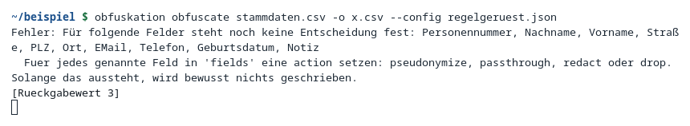
*Fehler: alle zehn offenen Felder werden auf einmal genannt, Rückgabewert
3.*

#### N-02 — Nachlässige Vorgabe, mit und ohne `--strict`

**Vorbedingung:** Profil mit `"unknownField": "passthrough"` und ohne
Regel für `EMail`.
**Schritte (ohne `--strict`):**
```fish
obfuskation obfuscate stammdaten.csv -o n02.csv --config profil-nachlaessig.json
sed -n '2p' n02.csv | cut -d';' -f7
```
**Erwartetes Ergebnis:** Lauf meldet das Feld ohne eigene Regel, bricht
aber nicht ab — die Profilprüfung hatte bereits vorher vor
`defaults.unknownField: passthrough` gewarnt.
**Tatsächliches Ergebnis:**
```
  Ersetzungen: city=120, dateShift=120, firstName=120, … (kein email)
  Ohne eigene Regel: EMail
EXIT=0
```
```
dieter.gruenwald@beispiel-firma.de
```
**Die echte E-Mail-Adresse steht unverändert in der Ausgabe.**
**Schritte (mit `--strict`):**
```fish
obfuskation obfuscate stammdaten.csv -o n02b.csv --strict --config profil-nachlaessig.json
```
**Tatsächliches Ergebnis:**
```
Fehler: Für folgende Felder steht noch keine Entscheidung fest: EMail
EXIT=3
```
`n02b.csv` wurde nicht angelegt. `--strict` übersteuert die nachlässige
Vorgabe. Kein Screenshot vorhanden.

#### N-03 — Fehlerhaftes Profil

**Vorbedingung:** `docs/beispiel/kaputt-profil.json`, enthält absichtlich
fünf Fehler.
**Schritte:**
```fish
obfuskation obfuscate stammdaten.csv -o n03.csv --config docs/beispiel/kaputt-profil.json
```
**Erwartetes Ergebnis:** Der Lauf startet nicht, alle fünf Fehler werden
mit Feldpfad genannt.
**Tatsächliches Ergebnis:**
```
Fehler: Die Konfiguration ist fehlerhaft:
  textRules[3].pattern: Ungültiger regulärer Ausdruck: Invalid pattern
      '(?<![\w-/])\(?(?:\+49|0)[' at offset 25. Unterminated [] set.
  fields[2].generator: Unbekannter Generator 'familienName'. Verfügbar: bic, city,
      companyName, dateShift, email, firstName, iban, lastName, numericId,
      personName, phone, postalCode, redact, street, token
  fields[3].generator: Bei 'pseudonymize' muss ein Generator angegeben sein.
  fields[6].match: Ungültiger regulärer Ausdruck: Invalid pattern '^(Ort|Wohnort'
      at offset 13. Not enough )'s.
  fields[18].textRules: Die Textregel 'telefon' ist nicht definiert.
EXIT=2
```
Alle fünf Fehler werden mit Feldpfad genannt, der Lauf startet gar nicht
erst.

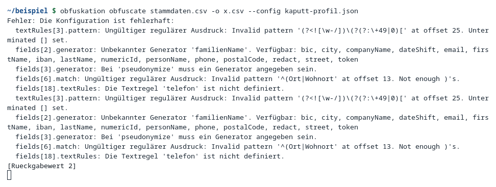
*Fehlerhaftes Profil: alle fünf Fehler mit Feldpfad genannt, Rückgabewert
2. Die Liste erscheint zweimal (Befund D-1).*

> Befund D-1: die Liste der fünf Befunde wird zweimal ausgegeben (im Bild
> oben sichtbar). Ursache und Behebungsvorschlag in
> `entwicklerdokumentation.md`, Abschnitt 11. Keine Auswirkung auf Ergebnis
> oder Rückgabewert.

#### N-04 — `deobfuscate` mit dem falschen Profil

**Vorbedingung:** `stammdaten.pseudo.csv` (mit Profil `demo` erzeugt),
zweites Profil `zweit` mit eigenem Namen und eigener Tabelle.
**Schritte:**
```fish
obfuskation deobfuscate stammdaten.pseudo.csv -o n04.csv --config profil-zweit.json
```
**Erwartetes Ergebnis:** Alle Pseudonyme werden als unbekannt gemeldet, es
entstehen keine falschen Klartexte.
**Tatsächliches Ergebnis:**
```
  Ersetzungen: dateShift=120
  BEFUNDE: 1068
    Zeile 1, Spalte Personennummer: numericId (unbekanntesPseudonym)
    Zeile 1, Spalte Nachname: lastName (unbekanntesPseudonym)
    …
EXIT=0
```
Ergebniszeile 2:
```
04745;Eschenbach;Monika;Am Anger 141;95661;Eisenach;
anna.schuster398@example.invalid;(030) 1976441;08.01.1974;***
```
Alle Pseudonyme bleiben stehen und werden als `unbekanntesPseudonym`
gemeldet — 1068 Befunde, keine falschen Klartexte. **Das Geburtsdatum
ändert sich trotzdem**: aus dem Pseudonym `22.02.1974` wird `01.08.1973`,
während der Echtwert `16.12.1973` lautet — `dateShift` rechnet ohne
Tabelleneintrag über den Offset des jeweiligen Profils zurück, mit dem
falschen Profil ist der Offset ein anderer. Der Rückgabewert bleibt 0. Kein
Screenshot vorhanden.

> Befund D-2: mit dem falschen Profil liefert `deobfuscate` bei
> Datumsspalten stillschweigend falsche Werte, während alle anderen
> Spalten als Befund gemeldet werden. Einzelheiten in
> `entwicklerdokumentation.md`, Abschnitt 11.

#### N-05 — Ersetzungstabelle im Git-Arbeitsverzeichnis

**Vorbedingung:** Profil mit einem Mapping-Store-Pfad innerhalb des
Repository-Arbeitsverzeichnisses.
**Schritte:**
```fish
obfuskation obfuscate stammdaten.csv -o n05.csv --config profil-imrepo.json
```
**Erwartetes Ergebnis:** Abbruch, keine Ersetzungstabelle im Repository.
**Tatsächliches Ergebnis:**
```
Fehler: Der Mapping-Store soll unter /mnt/daten/Entwicklung/cs/obfuskation/mapping.json
abgelegt werden, das liegt in einem Git-Arbeitsverzeichnis. Die Datei enthält sämtliche
Echtdaten und darf dort nicht liegen. Pfad in der Konfiguration ändern oder
--allow-unsafe-store setzen.
EXIT=5
```
Es wurde **keine** `mapping.json` im Repository angelegt.

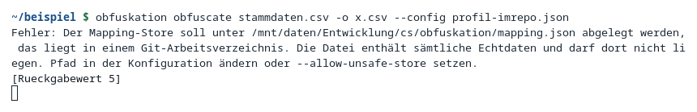
*Fehler: Mapping-Store würde in einem Git-Arbeitsverzeichnis liegen,
Rückgabewert 5.*

#### N-06 — Zwei gleichzeitige Läufe auf dieselbe Tabelle

**Vorbedingung:** Ein laufender `obfuscate`-Lauf über eine 200 000-Zeilen-
Datei (Laufzeit 864 ms).
**Schritte:** Nach 0,4 s einen zweiten Lauf auf dieselbe Ersetzungstabelle
starten.
**Erwartetes Ergebnis:** Der zweite Lauf bricht ab, der erste läuft
unbeeinträchtigt weiter.
**Tatsächliches Ergebnis:**
```
Fehler: Der Mapping-Store wird bereits verwendet:
/home/gregor/.local/share/obfuskation/demo/mapping.json.lock.
Laeuft ein anderer Vorgang, oder ist eine verwaiste Sperrdatei uebrig?
EXIT=5
```
Der erste Lauf lief unbeeinträchtigt zu Ende. Kein Screenshot vorhanden.

#### N-07 — Eingabedatei fehlt

**Vorbedingung:** Keine Datei `gibtesnicht.csv` vorhanden.
**Schritte:**
```fish
obfuskation obfuscate gibtesnicht.csv -o n06.csv --config profil-demo.json
```
**Erwartetes Ergebnis:** Klare, kurze Fehlermeldung.
**Tatsächliches Ergebnis:**
```
Fehler: Eingabedatei nicht gefunden: .../gibtesnicht.csv
EXIT=1
```
Eine Zeile, kein Stapelauszug. Kein Screenshot vorhanden.

#### N-08 — `--json` ohne `-o`

**Vorbedingung:** Keine.
**Schritte:**
```fish
obfuskation obfuscate stammdaten.csv --json --config profil-demo.json
```
**Erwartetes Ergebnis:** Abbruch, weil sich Bericht und Nutzdaten sonst auf
der Standardausgabe vermengen würden.
**Tatsächliches Ergebnis:**
```
Fehler: Mit --json muss die Ausgabedatei ueber -o angegeben werden, sonst
vermischen sich Bericht und Daten auf der Standardausgabe.
EXIT=1
```
Kein Screenshot vorhanden.

#### N-09 — Falsches Format erzwungen

**Vorbedingung:** Keine.
**Schritte:**
```fish
obfuskation obfuscate stammdaten.csv -o n08.csv --format json --config profil-demo.json
```
**Erwartetes Ergebnis:** Klare Fehlermeldung, die auf die eigentliche
Ursache zeigt.
**Tatsächliches Ergebnis:**
```
Fehler: Die Eingabe ist kein gültiges JSON: 'P' is an invalid start of a value.
LineNumber: 0 | BytePositionInLine: 0.
EXIT=2
```
Das `P` ist das erste Zeichen von `Personennummer` — die Meldung zeigt
genau, woran der JSON-Leser gescheitert ist. Kein Screenshot vorhanden.

#### N-10 — Falsches Trennzeichen erzwungen

**Vorbedingung:** Profil mit `"csvDelimiter": ","` auf einer
Semikolon-Datei.
**Schritte:**
```fish
obfuskation obfuscate stammdaten.csv -o n10.csv --config profil-komma.json
```
**Erwartetes Ergebnis:** Der Lauf bricht ab, statt die Datei falsch zu
verarbeiten.
**Tatsächliches Ergebnis:**
```
Fehler: Für folgende Felder steht noch keine Entscheidung fest:
Personennummer;Nachname;Vorname;Straße;PLZ;Ort;EMail;Telefon;Geburtsdatum;Notiz
EXIT=3
```
Die ganze Kopfzeile wurde zu einem einzigen Feldnamen. Der Lauf bricht ab
— das ist der gewünschte Ausgang, aber die Meldung ist der einzige Hinweis
auf die eigentliche Ursache. Ohne Zwang hätte die Erkennung `;` gefunden.
Kein Screenshot vorhanden.

#### N-11 — `scan` findet stehengebliebene Echtwerte

**Vorbedingung:** `buchungen.csv` mit `"action": "scanText"` auf
`Verwendungszweck` und den Mustern `iban`, `email`, `phone`.
**Schritte:**
```fish
obfuskation scan buchungen.pseudo.csv --config profil-demo.json
```
**Erwartetes Ergebnis:** Restbestände werden gefunden, weil Personennamen
und blanke Zahlen von den Mustern nicht erkannt werden.
**Tatsächliches Ergebnis:**
```
  Ersetzungen: fund:echtwert=1112
  BEFUNDE: 1112
    Zeile 4, Spalte Verwendungszweck: belegNummer (echtwertAusTabelle)
    Zeile 10, Spalte Verwendungszweck: lastName (echtwertAusTabelle)
    Zeile 10, Spalte Verwendungszweck: firstName (echtwertAusTabelle)
    … und 1092 weitere (siehe --json)
Fehler: 1112 Verdachtsfaelle. Die Datei nicht weitergeben, bevor sie geklaert sind.
EXIT=4
```
**Das sind echte Funde, keine Fehlalarme.** Die Verwendungszwecke enthalten
Sätze wie „Überweisung an Dieter Grünwald“ und „Beitrag Januar –
Kundennummer 10000“. Die drei Muster erkennen IBAN, E-Mail und
Telefonnummer — Personennamen und blanke Zahlen erkennen sie nicht.

**Behebung:** `Verwendungszweck` von `scanText` auf `redact` umgestellt
(`docs/beispiel/profil-streng.json`, gleicher Profilname und dieselbe
Tabelle):
```fish
obfuskation obfuscate buchungen.csv -o buchungen.streng.csv --strict --config profil-streng.json
obfuskation scan buchungen.streng.csv --config profil-streng.json
```
```
  Ersetzungen: belegNummer=2000, dateShift=2000, numericId=2000, redact=2000
  Tabelle: 0 neu, 1437 gesamt
EXIT=0

  Datensaetze: 2000
Keine Restbestaende gefunden.
EXIT=0
```
`Tabelle: 0 neu` belegt, dass der zweite Lauf dieselben Pseudonyme wie der
erste verwendet hat — die Verknüpfung zu den anderen Dateien bleibt
bestehen.

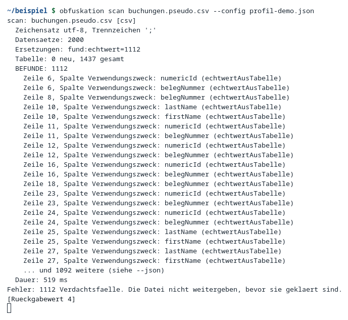
*Scan findet 1112 Verdachtsfälle bei `scanText` auf Verwendungszweck, mit
Fundstellen und Rückgabewert 4.*

#### N-12 — Verdachtsfall ohne Fund

**Vorbedingung:** `konten.pseudo.csv`, Spalte `Kontostand` auf
`passthrough`.
**Schritte:**
```fish
obfuskation scan konten.pseudo.csv --config profil-demo.json
```
**Erwartetes Ergebnis:** Ein Verdachtsfall ohne echten Personenbezug —
Beleg dafür, dass die Prüfung bewusst übervorsichtig ist.
**Tatsächliches Ergebnis:**
```
  BEFUNDE: 3
    Zeile 2, Spalte Kontostand: numericId (echtwertAusTabelle)
    Zeile 2, Spalte Kontostand: belegNummer (echtwertAusTabelle)
    Zeile 43, Spalte Kontostand: belegNummer (echtwertAusTabelle)
EXIT=4
```
`Kontostand` steht auf `passthrough`. Der Wert `13535,10` enthält die
Zeichenfolge `13535`, und die ist im Bestand als Belegnummer vergeben —
deshalb schlägt die Prüfung an, obwohl kein Personenbezug entsteht. Siehe
dazu auch Abschnitt 7. Kein Screenshot vorhanden.

#### N-13 — Profil aus der veröffentlichten Oberfläche speichern

**Vorbedingung:** `konten.csv` mit Profil `demo` in
`publish/linux-x64/obfuskation-gui` geöffnet.
**Schritte:** Auf `Speichern` klicken; anschließend die Profildatei auf der
Platte ansehen.
**Erwartetes Ergebnis:** Statuszeile „Gespeichert: …“, Datei geschrieben.
**Tatsächliches Ergebnis:** Die Statuszeile meldet

```
Could not load file or assembly 'System.IO.Pipelines, Version=9.0.0.0,
Culture=neutral, PublicKeyToken=cc7b13ffcd2ddd51'. The system cannot find
the file specified.
```

Die Datei bleibt unverändert. Eingegrenzt wurde:

| Weg | Speichern |
|---|---|
| `publish/linux-x64/obfuskation-gui` (Einzeldatei, framework-abhängig) | **schlägt fehl** |
| `dotnet src/Obfuskation.Gui/bin/Debug/net8.0/obfuskation-gui.dll` | funktioniert („Gespeichert: …“) |
| `obfuskation init` (schreibt über denselben `ProfileStore`) | funktioniert (P-01) |
| `ScanAndConfigTests.Profile_ueberstehen_das_Schreiben_und_Lesen_unveraendert` | besteht |

Der Fehler steckt also nicht in der Fachlogik, sondern in der Auslieferung als
Einzeldatei; Einzelheiten unter Befund D-9. **Auf einem Rechner mit der in der
README geforderten .NET-8-Laufzeit tritt er nicht auf** — der Prüfrechner hat
nur neuere Laufzeiten. Wer davon betroffen ist, ändert Profile bis auf Weiteres
im Texteditor oder mit `obfuskation init`. Kein Screenshot, weil die Meldung nur
als eine Zeile in der Statuszeile erscheint; ihr Wortlaut steht oben.

## 5. Durchführungsprotokoll

**Prüfer:** Gregor Stübner (Durchführung durch Claude Opus 5 im Auftrag)

Der Katalog wurde zweimal vollständig abgearbeitet:

| | Datum | Fassung | Ergebnis |
|---|---|---|---|
| 1 | 4. September 2026 | `1.0.0+cfec1d5` | alle Testfälle bestanden, neun Befunde (D-1 bis D-9) |
| 2 | 5. September 2026 | `1.0.1+cfec1d5` | Wiederholung nach Behebung von D-4 und D-8; alle Testfälle bestanden, kein neuer Befund |

Die folgende Tabelle gibt **Durchführung 2** wieder. Wo ein Befund in
Durchführung 1 auftrat und inzwischen behoben ist, steht das dabei.

Zwischen beiden Durchführungen wurde die Ersetzungstabelle neu angelegt. Die
Pseudonyme unterscheiden sich deshalb — das Salt entsteht mit jeder neuen
Tabelle zufällig neu. Alle Zähler blieben gleich bis auf einen: die Zahl der
Verdachtsfälle in `buchungen.pseudo.csv` ging von 1115 auf 1112 zurück, weil
sich Pseudonyme und Klartexte anders überschneiden. Wer den Katalog selbst
nachvollzieht, wird ebenfalls andere Pseudonyme sehen; die Zähler und alle
Meldungstexte müssen aber übereinstimmen.

| Testfall | Ergebnis | Bemerkung |
|---|---|---|
| Automatisierte Tests | bestanden | 125 Tests, 0 Fehler. In Durchführung 1 waren es 122 und der Lauf war nicht rückwirkungsfrei (D-8, behoben) |
| P-01 | bestanden | |
| P-02 | bestanden | |
| P-03 | bestanden | |
| P-04 | bestanden | |
| P-05 | bestanden | |
| P-06 | bestanden | |
| P-07 | bestanden | |
| P-08 | bestanden | |
| P-09 | bestanden | |
| P-10 | bestanden | |
| P-11 | bestanden | |
| P-12 | bestanden | |
| G-01 | bestanden | |
| G-02 | bestanden | |
| G-03 | bestanden | |
| G-04 | bestanden | |
| G-05 | bestanden | |
| G-06 | bestanden | |
| G-07 | bestanden | |
| G-08 | bestanden | |
| G-09 | bestanden | |
| G-10 | bestanden | |
| G-11 | bestanden | |
| G-12 | bestanden | |
| G-13 | bestanden | |
| G-14 | bestanden mit Befund | Befund D-6 |
| G-15 | bestanden | |
| G-16 | bestanden | |
| G-17 | bestanden mit Befund | Befund D-5 |
| G-18 | bestanden | |
| G-19 | bestanden | |
| G-20 | bestanden mit Befund | Befund D-3 |
| G-21 | bestanden | Befund D-4 aus Durchführung 1, in 1.0.1 behoben — Nachweis in Abschnitt 6 |
| G-22 | bestanden | Nachweis der Behebung von D-4, siehe Abschnitt 6 |
| N-01 | bestanden | |
| N-02 | bestanden | |
| N-03 | bestanden mit Befund | Befund D-1 |
| N-04 | bestanden mit Befund | Befund D-2 |
| N-05 | bestanden | |
| N-06 | bestanden | |
| N-07 | bestanden | |
| N-08 | bestanden | |
| N-09 | bestanden | |
| N-10 | bestanden | |
| N-11 | bestanden | |
| N-12 | bestanden | |
| N-13 | bestanden mit Befund | „Speichern“ in der veröffentlichten Oberfläche — Befund D-9 |

Kein Testfall gilt als „nicht bestanden“: in jedem Fall entsprach das
tatsächliche Verhalten dem, was für ein Werkzeug dieses Zwecks richtig ist
— auch dort, wo ein Befund festgestellt wurde, arbeitete die Kernfunktion
(Ersetzen, Zurückholen, Schutz der Tabelle) korrekt. Befund D-7 (`--help`
mischt Deutsch und Englisch) ist keinem eigenen Testfall zugeordnet,
sondern fiel beiläufig beim Ansehen der Hilfeausgabe auf.

**Neun Befunde bei 47 Testfällen sind kein schlechtes, sondern ein
erwartbares Ergebnis.** Eine Testdokumentation ohne einen einzigen Befund
belegt in aller Regel nicht die Fehlerfreiheit des Prüflings, sondern die
Oberflächlichkeit der Prüfung. Zwei der neun waren gewichtig genug, um sofort
behoben zu werden; das ist in Abschnitt 6 nachgewiesen.

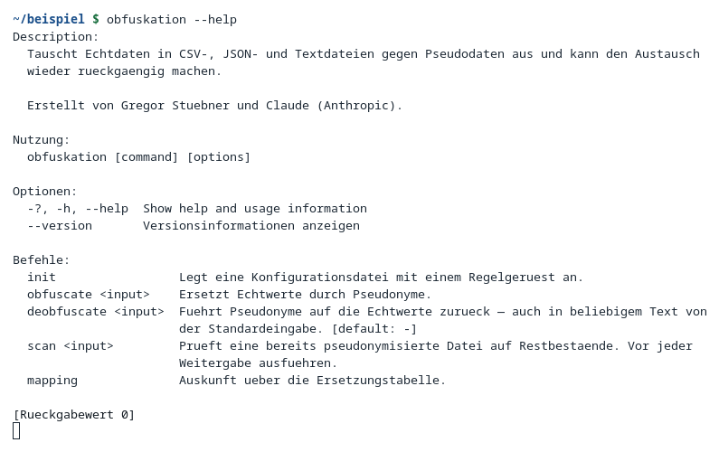
*Hilfeausgabe von `obfuskation --help`: Beschreibung und Befehle auf
Deutsch, „Description:“ und die Beschreibung der eingebauten Hilfeoption
auf Englisch (Befund D-7).*

## 6. Befunde

| Nr. | Art | Gegenstand | Einstufung | Auswirkung |
|---|---|---|---|---|
| D-1 | Fehler, kosmetisch | Die Befundliste eines fehlerhaften Profils wird auf der Kommandozeile doppelt ausgegeben | gering | Ausgabe doppelt so lang; Ergebnis und Rückgabewert richtig |
| D-2 | Eigenschaft | `deobfuscate` mit dem falschen Profil liefert bei Datumsspalten stillschweigend falsche Werte | mittel | Rückgabewert bleibt 0; nur die Befundzahl verrät es |
| D-3 | Bedienbarkeit | Bei fehlerhafter Konfiguration verweist die Oberfläche auf Hinweise, die nicht sichtbar sind | mittel | Anwender ist auf die Kommandozeile angewiesen |
| D-4 | Fehler, irreführend | Generatorauswahl bleibt leer bei einem eigenen Namensraum | mittel bis hoch | Gefahr, die Namensraumtrennung versehentlich aufzuheben |
| D-5 | Darstellung | Im Fenster „Ersetzungstabelle“ überdeckt die Bildlaufleiste die rechtsbündigen Anzahlen | gering | Zahlen teilweise angeschnitten |
| D-6 | Darstellung | Im Fenster „Textregeln“ wird der Hinweis „höhere Priorität gewinnt bei Überlappung“ rechts abgeschnitten | gering | Text unvollständig lesbar |
| D-7 | Sprache | `--help` mischt Deutsch und Englisch — Vorgaben von System.CommandLine | kosmetisch | keine |
| D-8 | Testhygiene | `dotnet test` überschreibt die echte `~/.config/obfuskation/gui.json` des Benutzers | gering | zuletzt geöffnete Profile und gewählte Ansicht gehen verloren |
| D-9 | Fehler, Auslieferung | „Speichern“ schlägt in der veröffentlichten Oberfläche mit einem Ladefehler für `System.IO.Pipelines` fehl | mittel | Profile lassen sich aus dem ausgelieferten Programm heraus nicht speichern; tritt auf der geforderten .NET-8-Laufzeit nicht auf |

Ursache, Fundstelle im Quelltext und Behebungsvorschlag zu jedem Befund
stehen in `entwicklerdokumentation.md`, Abschnitt 11.

**Kein Befund betrifft die Richtigkeit der Ersetzung, die Umkehrbarkeit
oder den Schutz der Ersetzungstabelle.** D-4 ist der einzige, der einen
Anwender zu einer falschen Handlung verleiten kann, wenn er das leere
Auswahlfeld für einen Fehler hält und ihn „korrigiert“.

### Nachweis der Behebungen in Fassung 1.0.1

Zwei Befunde wurden zwischen den beiden Durchführungen behoben. Ein Befund
gilt hier erst dann als erledigt, wenn dreierlei vorliegt: die Beobachtung
aus Durchführung 2, ein automatisierter Test, der den alten Zustand künftig
auffängt, und die Gewissheit, dass sich am Ergebnis der Ersetzung nichts
geändert hat.

**D-4 — Generatorauswahl bei eigenem Namensraum.**

| | |
|---|---|
| Ursache | `GeneratorOption.Find` suchte nur unter den eingebauten Generatoren und baute für einen eigenen Namensraum ersatzweise einen neuen Eintrag mit abweichender Erklärung. Als Datensatz mit Wertvergleich war der nicht derselbe wie der Eintrag in der Auswahlliste — das Auswahlfeld blieb leer und schrieb beim nächsten Zugriff `null` in die Regel zurück |
| Änderung | `src/Obfuskation.Gui/ViewModels/FieldRuleViewModel.cs`: `Find` bekommt das Profil und sucht in derselben Liste, die die Auswahl anzeigt |
| Beobachtung | G-22: Auswahlfeld zeigt `belegNummer · eigener Namensraum, wie numericId`, kein Befund, Profildatei unverändert |
| Automatisierter Test | `MainViewModelTests.Ein_Feld_mit_eigenem_Namensraum_zeigt_seinen_Generator_an` |
| Ergebnis unverändert | Vorschau `13535 → 84512` in G-21 wie in G-22 — die Behebung betrifft die Anzeige, nicht die Ersetzung |

**D-8 — Testlauf überschrieb die Einstellungen des Anwenders.**

| | |
|---|---|
| Ursache | `MainViewModel` ruft an mehreren Stellen `_settings.Save()`; `GuiSettings.FilePath` löst ohne gesetztes `XDG_CONFIG_HOME` auf `~/.config/obfuskation/gui.json` auf — also auf die echte Datei des angemeldeten Benutzers |
| Änderung | `tests/Obfuskation.Gui.Tests/TestUmgebung.cs`: ein `[ModuleInitializer]` lenkt `XDG_CONFIG_HOME` vor dem ersten Test auf ein Wegwerfverzeichnis und räumt es beim Beenden weg. Der Modulinitialisierer gilt für alle Testklassen der Baugruppe, anders als eine Änderung in einer einzelnen Testklasse |
| Beobachtung | Durchführung 2: `~/.config/obfuskation/gui.json` ist nach `dotnet test` unverändert |
| Automatisierter Test | `MainViewModelTests.Der_Testlauf_fasst_die_Einstellungen_des_Anwenders_nicht_an` |
| Ergebnis unverändert | Kein Eingriff in ausgelieferten Code — die Änderung liegt vollständig im Testprojekt |

Die Testzahl stieg dadurch von 122 auf 125. **D-9 bleibt offen**: er liegt
nicht im Quelltext, sondern in der Art der Auslieferung, und die Entscheidung
darüber (feste .NET-8-Laufzeit, `--self-contained` oder ein höheres
Zielframework) gehört zur Auslieferung, nicht zu diesem Testlauf. Die
Vorschläge stehen in `entwicklerdokumentation.md`, Abschnitt 11.

## 7. Bekannte Eigenschaften, die keine Fehler sind

- **Die Vorratsfrage bei engen Wertebereichen.** Ein formaterhaltender
  Generator schöpft aus demselben Wertevorrat wie die Echtdaten. Bei engem
  Vorrat — etwa fünfstelligen Kundennummern — kann ein früher vergebenes
  Pseudonym später selbst als Klartext auftauchen. Die Rückabbildung bleibt
  trotzdem eindeutig, weil der gleichlautende Klartext seinerseits durch
  sein eigenes Pseudonym ersetzt wurde. Sichtbar wird es nur daran, dass
  ein Wert im Bestand auf beiden Seiten vorkommt (README, Abschnitt „Wie
  die Umkehrbarkeit funktioniert“).
- **`dateShift` ist aus Freitext nicht rückholbar.** Ein verschobenes Datum
  bekommt bewusst keinen Tabelleneintrag (Einzelheiten in
  `entwicklerdokumentation.md`, Abschnitt 4); die Folge ist, dass sich
  Datumsangaben nur in CSV- und JSON-Spalten zurückholen lassen, nicht in
  freiem Text.
- **`scan` ist bewusst übervorsichtig.** N-12 zeigt einen Verdachtsfall, bei
  dem ein Kontostand zufällig eine im Bestand vergebene Belegnummer als
  Zeichenfolge enthält, ohne dass ein Personenbezug entsteht. Ein
  Verdachtsfall ist eine Aufgabe, kein Urteil: er ist zu klären, nicht zu
  ignorieren — hier besteht die Klärung darin, festzustellen, dass
  `Kontostand` ein Betrag ist. Wer den Verdacht dauerhaft ausräumen will,
  stellt die Spalte auf `drop`.

## 8. Wiederholung des Testlaufs

Ein Kollege, der diesen Katalog erneut abarbeitet, geht so vor:

1. **Frische Ersetzungstabelle.** Vor Beginn den Bestand des Demo-Profils
   löschen, damit die Zähler wieder bei null beginnen:
   ```fish
   rm -rf ~/.local/share/obfuskation/demo
   ```
2. **Demo-Bestand.** Die Dateien aus `docs/beispiel/` verwenden
   (`stammdaten.csv`, `konten.csv`, `buchungen.csv`,
   `antwort-der-ki.txt`, die Profile `profil-demo.json`,
   `profil-geruest.json`, `profil-streng.json`, `kaputt-profil.json`). Bei
   Bedarf lässt sich mit `docs/beispiel/daten-erzeugen.py` ein neuer,
   ebenso frei erfundener Bestand erzeugen.
3. **Veröffentlichte Binärdateien bauen.** `./build-release.sh --rid
   linux-x64` (oder die passende Laufzeit), damit dieselben Programme wie
   im Rohprotokoll geprüft werden, nicht `dotnet run`.
4. **Neue Bilder aufnehmen.** `docs/bilder/aufnehmen.sh` erzeugt alle
   Oberflächen- und Kommandozeilenbilder auf einem virtuellen Bildschirm neu
   und legt sie unter `docs/bilder/` ab. Voraussetzungen laut Kopf des
   Skripts: `xorg-server-xvfb`, `xdotool`, `imagemagick`, `alacritty`.
5. **Leere Protokollvorlage.** Für den eigenen Durchlauf eine Kopie von
   `docs/bilder/protokoll-roh.md` ohne die Abschnitte „Tatsächliches
   Ergebnis“ anlegen und Schritt für Schritt mit den neu beobachteten
   Ausgaben, Zahlen und Bildern füllen — nicht die Werte aus diesem
   Dokument übernehmen, sondern neu messen.

---

Erstellt von Gregor Stübner und Claude (Anthropic).
